[](https://classroom.github.com/a/1niUih_B)
| Name           | NRP        | Kelas     |
| ---            | ---        | ----------|
| Liem, Alfred Haryanto | 5025241100 | Jarkom C |


## Put your topology config image here!

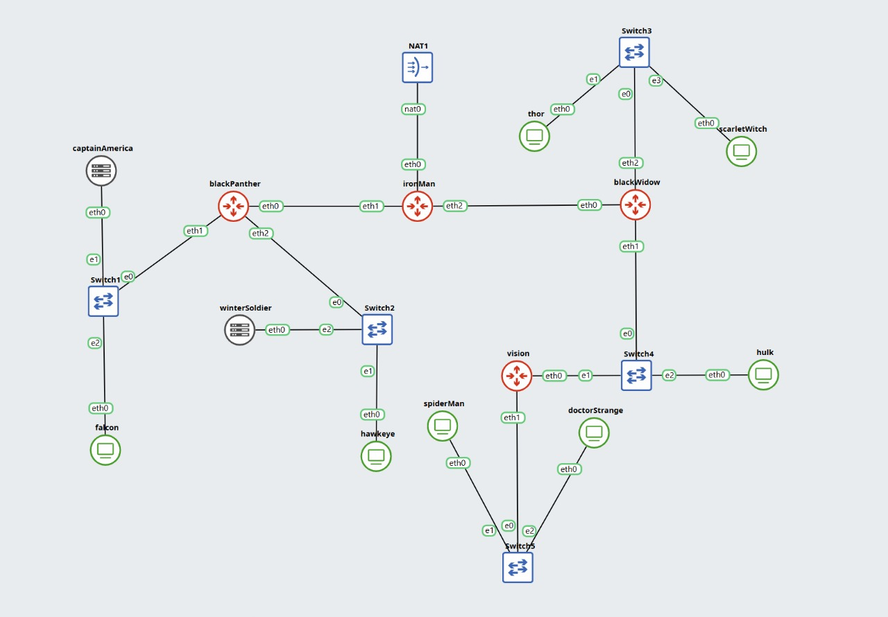

## Put your GNS3 Project file here!

`https://drive.google.com/file/d/1Gc6qW_pnFAzvV0YzdWbkmaxQo6kBO7Ok/view?usp=sharing`

<br>

## Soal 1

> Dokumentasikan hasil pengelompokan subnet yang telah dibuat.

> _Document the results of the subnet grouping that has been created._

**Answer:**

- Screenshot

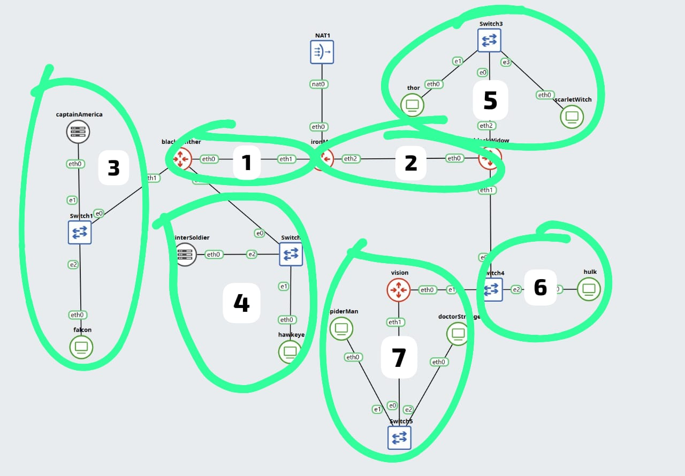

- Explanation

Berdasarkan modul pada google docs yang diberikan, sudah dituliskan tentang pembagian subnet sebagai berikut
* Falcon subnet 3.x
* Hawkeye subnet 4.x
* Thor dan Scarlett Witch subnet 5.x
* Hulk subnet 5.x
* Spiderman dan Doctor Strange subnet 6.x

Untuk membagi subnet dari router, maka dapat mengubah Network Config dari masing-masing router sebagai berikut : 

`Network Config blackPanther`
```sh
auto eth0
iface eth0 inet static
    address 10.202.1.2
    netmask 255.255.255.0
    gateway 10.202.1.1

auto eth1
iface eth1 inet static
    address 10.202.3.1
    netmask 255.255.255.0

auto eth2
iface eth2 inet static
    address 10.202.4.1
    netmask 255.255.255.0
```

`Network Config ironMan`
```sh
auto eth0
iface eth0 inet dhcp

auto eth1
iface eth1 inet static
    address 10.202.1.1
    netmask 255.255.255.0

auto eth2
iface eth2 inet static
    address 10.202.2.1
    netmask 255.255.255.0
```

`Network Config blackWidow`
```sh
auto eth0
iface eth0 inet static
    address 10.202.2.2
    netmask 255.255.255.0
    gateway 10.202.2.1

auto eth2
iface eth2 inet static
    address 10.202.5.1
    netmask 255.255.255.0

auto eth1
iface eth1 inet static
    address 10.202.6.1
    netmask 255.255.255.0
```

`Network Config vision`
```sh
auto eth0
iface eth0 inet static
    address 10.202.6.2
    netmask 255.255.255.0
    gateway 10.202.6.1

auto eth1
iface eth1 inet static
    address 10.202.7.1
    netmask 255.255.255.0
```

<br>

## Soal 2

> Lakukan konfigurasi routing agar setiap node dapat saling berkomunikasi. Pastikan setiap router dapat mengirimkan paket ke jaringan lain melalui tabel routing yang sesuai. Sertakan bukti bahwa Falcon bisa melakukan ping ke SpiderMan, DoctorStrange, dan ScarletWitch.

> _Configure routing so that each node can communicate with each other. Ensure each router can forward packets to other networks through the appropriate routing table. Include proof that Falcon can ping SpiderMan, Doctor Strange, and ScarletWitch._

**Answer:**

- Screenshot

Agar dapat melakukan ping, client butuh IP yang artinya harus menyiapkan DHCP Server dan relay.

1. DHCP Server

Setup
```sh
apt-get update
apt-get install -y isc-dhcp-server

vim /etc/dhcp/dhcpd.conf
```

Config
``` sh
# /etc/dhcp/dhcpd.conf
subnet 10.202.3.0 netmask 255.255.255.0 {
    range 10.202.3.10 10.202.3.50;
    option routers 10.202.3.1;
    option broadcast-address 10.202.3.255;
}

subnet 10.202.4.0 netmask 255.255.255.0 {
    range 10.202.4.10 10.202.4.50;
    option routers 10.202.4.1;
    option broadcast-address 10.202.4.255;
}

subnet 10.202.5.0 netmask 255.255.255.0 {
    range 10.202.5.10 10.202.5.50;
    option routers 10.202.5.1;
    option broadcast-address 10.202.5.255;
}

subnet 10.202.6.0 netmask 255.255.255.0 {
    range 10.202.6.10 10.202.6.50;
    option routers 10.202.6.1;
    option broadcast-address 10.202.6.255;
}

subnet 10.202.7.0 netmask 255.255.255.0 {
    range 10.202.7.10 10.202.7.50;
    option routers 10.202.7.1;
    option broadcast-address 10.202.7.255;
}
# range masih acak karena hanya untuk mengetes

# /etc/default/isc-dhcp-server
INTERFACESv4="eth0"
```

Inisiasi
``` sh
service isc-dhcp-server start
```

2. Relay

Setup
``` sh
apt-get update
apt-get install -y isc-dhcp-relay
```

Config
``` sh
# blackPanther
SERVERS="10.202.3.2"
INTERFACES="eth1 eth2"
OPTIONS=

# ironMan
SERVERS="10.202.3.2"
INTERFACES="eth1 eth2"
OPTIONS=

# blackWidow
SERVERS="10.202.3.2"
INTERFACES="eth0 eth1 eth2"
OPTIONS=

# vision
SERVERS="10.202.3.2"
INTERFACES="eth0 eth1"
OPTIONS=

# untuk semua router
#/etc/sysctl.conf
net.ipv4.ip_forward=1
```

Inisiasi
``` sh
service isc-dhcp-relay start
```


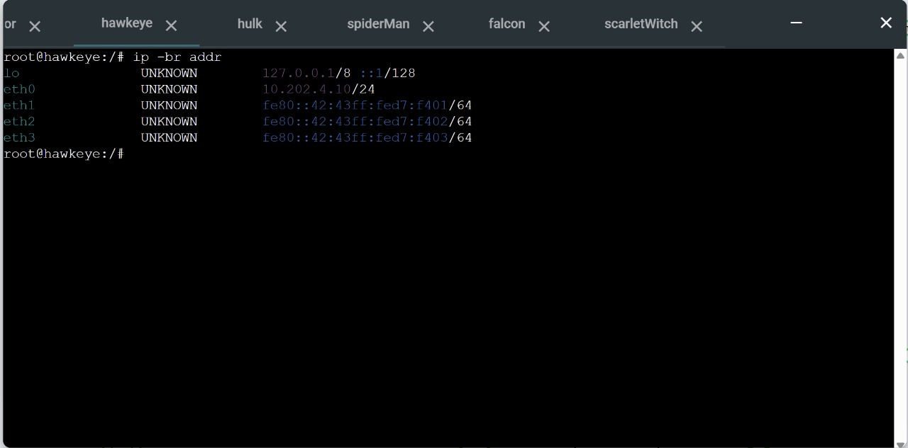
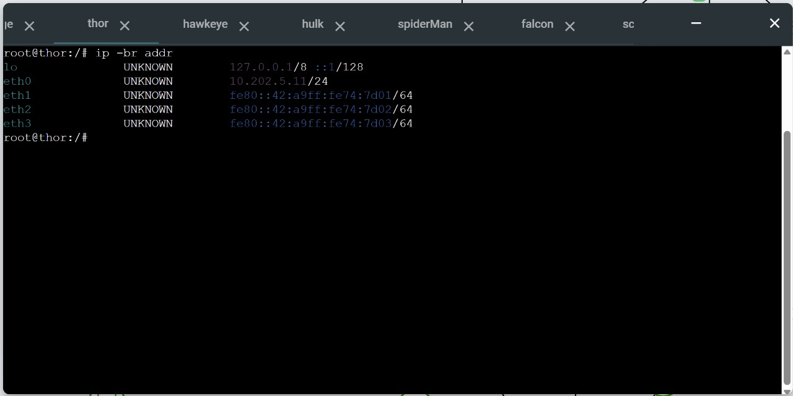
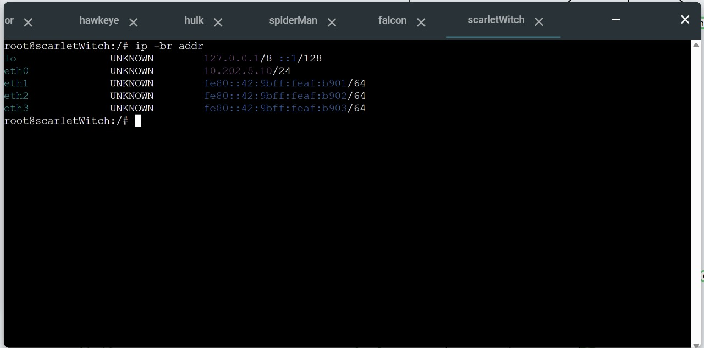
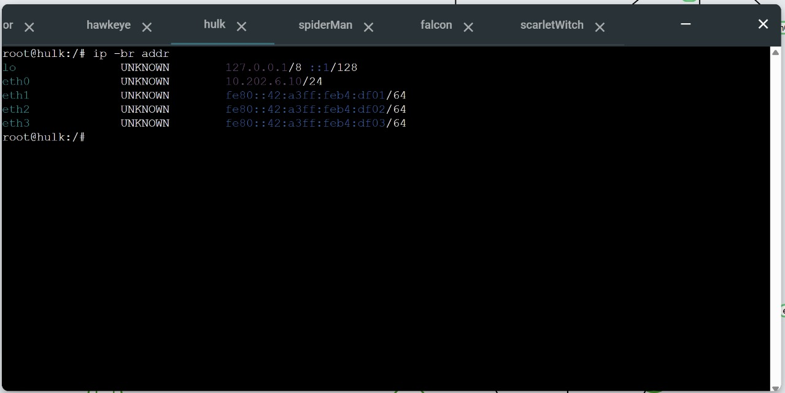

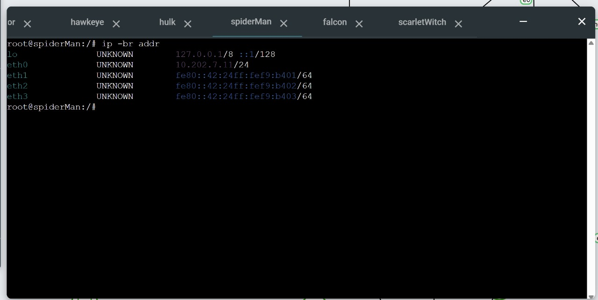

Bukti Ping : 

`Falcon to scarletWitch`
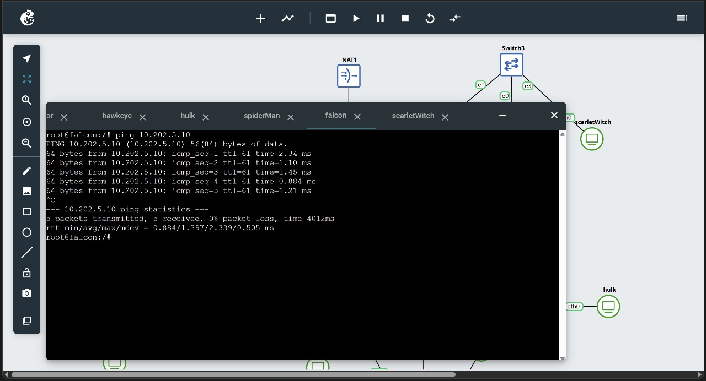
`Falcon to doctorStrange`
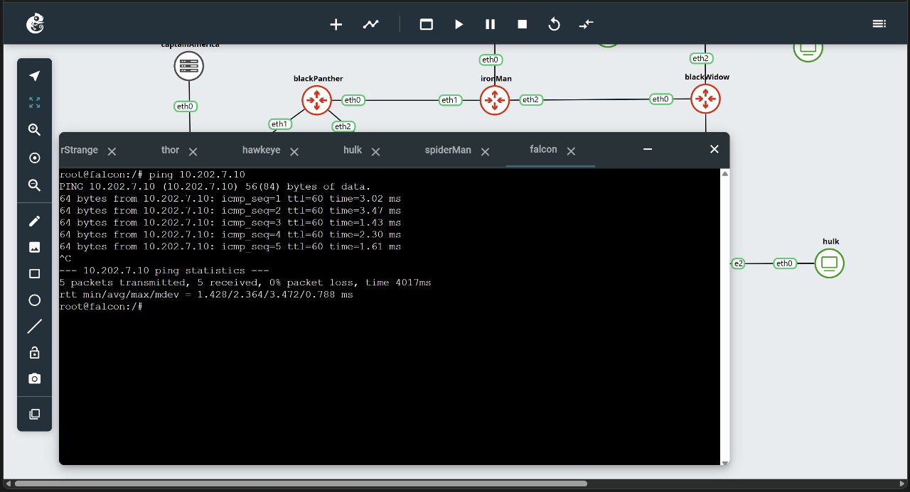
`Falcon to spiderman`
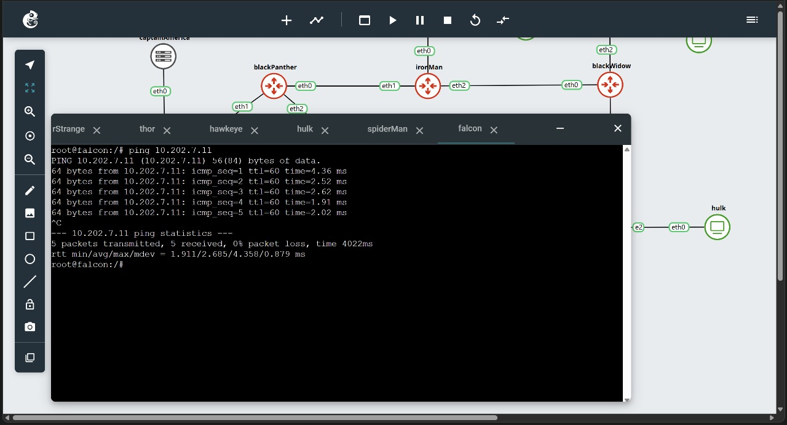

- Explanation

Agar dapat melakukan ping, client harus memiliki IP terlebih dahulu yang ditentukan dari server DHCP. Oleh karena itu, diperlukan setup untuk server DHCP dan juga Relay untuk menyalurkan sinyal dari DHCP server menuju ke router lainya. Setelah mendapatkan IP, client `falcon` kemudian dapat melakukan ping kepada client `scarletWitch`, `doctorStrange`, dan `spiderman` dengan command `ping <ip>`, dengan ip client target. Karena sudah dilakukan routing pada soal nomor 1 juga, maka sudah terdapat "jembatan" yang menghubungkan dari 1 route ke route yang lain, sehingga bisa client falcon ingin melakukan ping ke client diluar router blackPanther sudah bisa. 

Karena belum ditentukan rentang ip tertentu, maka di soal 2 ini saya menggunakan range acak untuk melakukan pengetesan. 

<br>

## Soal 3

> Lakukan konfigurasi agar semua node dapat terhubung ke internet. Sertakan hasil uji coba dengan melakukan ping ke google.com dari node Falcon, CaptainAmerica, SpiderMan, dan Thor.

> _Configure all nodes to connect to the internet. Include test results by pinging google.com from the Falcon, CaptainAmerica, SpiderMan, and Thor nodes._

**Answer:**

- Screenshot

Pada router ironMan
``` sh
sysctl -w net.ipv4.ip_forward=1 
post-up iptables -t nat -A POSTROUTING -o eth0 -j MASQUERADE -s 10.202.0.0/16
```

Pada router blackPanther, blackWidow, dan Vision
``` sh
up echo nameserver 192.168.122.1 >> etc/resolv.conf
up ip route add default via 10.202.x.1 #x menyesuaikan, 1 untuk blackPanther, 2 blackWidow, dan 6 untuk vision
```

Hasil : 
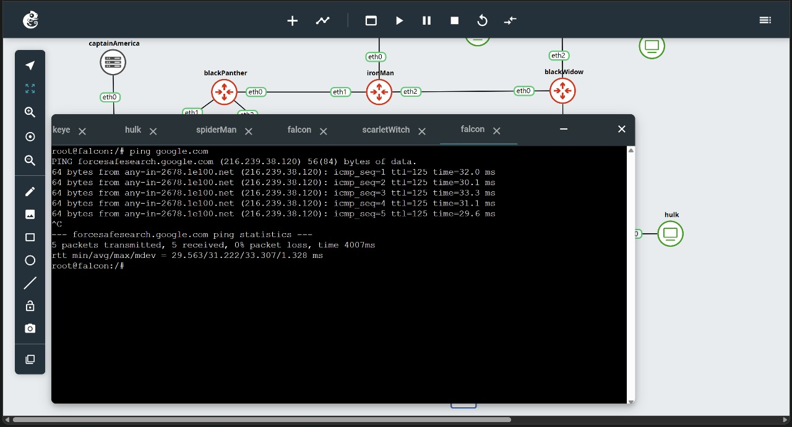

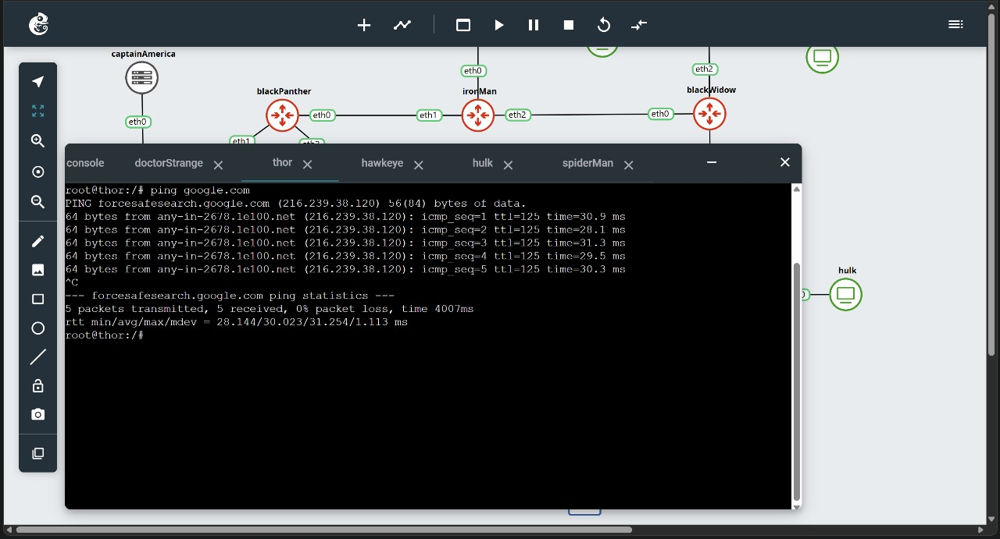
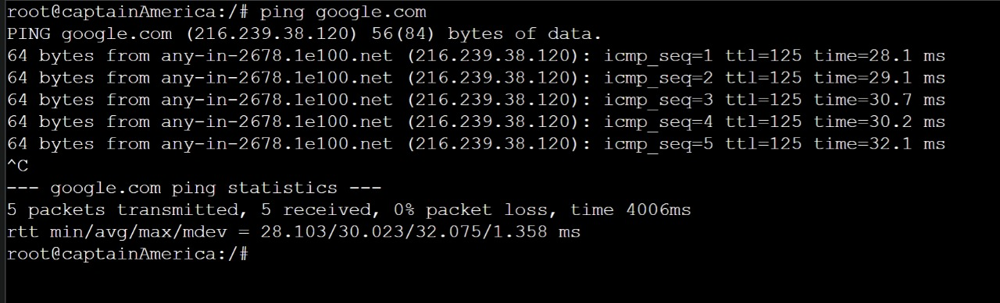

- Explanation

Untuk dapat terhubung ke internet serta mencoba untuk melakukan ping ke google.com, salah satu hal yang diperlukan adalah sebuah client memiliki ip yang mana hal tersebut sudah dikerjakan pada soal nomor 2. Untuk dapat menghubungkan semua client ke internet maka diperlukan konfigurasi pada router. 

`sysctl -w net.ipv4.ip_forward=1 `

Command ini berguna untuk seakan-akan mengubah fungsi dari computer menjadi router. Comman ini membuat sebuah node bisa memforward sebuah paket, menjadikanya seakan-seakan sebagai sebuah router. 

`post-up iptables -t nat -A POSTROUTING -o eth0 -j MASQUERADE -s 10.202.0.0/16`

Karena pada command sebelumnya sudah dikonfigurasi agar node dapat memforward packet, maka command ini yang berguna untuk menghubungkan node (router pada kasus ini) dengan akses internet external.  

`up echo nameserver 192.168.122.1 >> etc/resolv.conf`

Command ini berguna untuk menambahkan entry server DNS. Tanpa command ini, code/client bisa terhubung melalui ip address namun tidak bisa bila menggunakan nama seperti `google.com`

`up ip route add default via 10.202.x.1`

Command ini berfungsi untuk menetapkan default gateway. Artinya, bila ada paket yang tujuanya tidak ada di subnet/router lain, maka akan dikirimkan ke alamat gateway yang ditentukan command ini untuk dapat diteruskan ke route/jaringan lain. 

<br>

## Soal 4

> Berikan Falcon alamat IP dalam rentang [Prefix IP].3.20 - [Prefix IP].3.25
> <br> </br>
> Berikan Hawkeye alamat IP dalam rentang [Prefix IP].4.30 - [Prefix IP].4.35
> <br> </br>
> Berikan Hulk alamat IP dalam rentang [Prefix IP].6.50 - [Prefix IP].6.55

<br>

> _Give Falcon an IP address in the range [IP Prefix].3.20 - [IP Prefix].4.35_
> <br> </br>
> _Give Hawkeye an IP address in the range [IP Prefix].4.30 - [IP Prefix].4.35_
> <br> </br>
> _Give Hulk an IP address in the range [IP Prefix].6.50 - [IP Prefix].6.55_

**Answer:**

- Screenshot

``` sh
option domain-name-servers 192.168.122.1;

subnet 10.202.3.0 netmask 255.255.255.0 {
    range 10.202.3.20 10.202.3.25;
    option routers 10.202.3.1;
    option broadcast-address 10.202.3.255;
	option domain-name-servers 192.168.122.1;
}

subnet 10.202.4.0 netmask 255.255.255.0 {
    range 10.202.4.30 10.202.4.35;
    option routers 10.202.4.1;
    option broadcast-address 10.202.4.255;
	option domain-name-servers 192.168.122.1;
}

subnet 10.202.6.0 netmask 255.255.255.0 {
    range 10.202.6.50 10.202.6.55;
    option routers 10.202.6.1;
    option broadcast-address 10.202.6.255;
	option domain-name-servers 192.168.122.1;
}
```

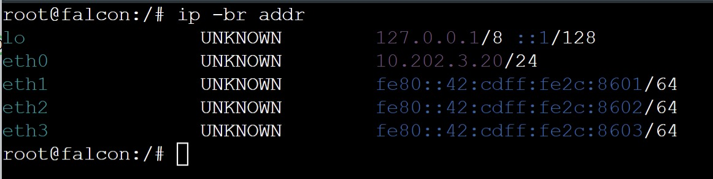
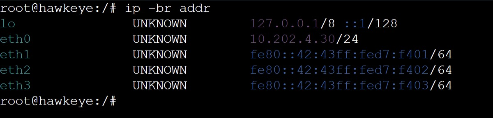
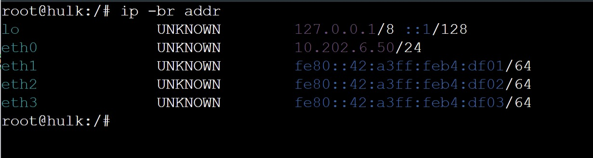

- Explanation

Dalam soal ini, diminta untuk memberikan alamat dalam range tertentu, sehingga dalam file `dhcpd.conf`, terdapat beberapa perubahan seperti pada apa yang diminta oleh soal. 

Format notasi konfigurasi untuk menentukan range ip address adalah sebagai berikut : 
```sh
subnet 'NID' netmask 'Netmask' {
    range 'IP_Awal' 'IP_Akhir';
    option routers 'iP_Gateway';
    option broadcast-address 'IP_Broadcast';
    option domain-name-servers 'DNS_yang_diinginkan';
    default-lease-time 'Waktu';
    max-lease-time 'Waktu';
}
```
Namun karena hanya diminta ip address terlebih dahulu, maka yang perlu diperhatikan adalah range, option routers, option broadcast-address, dan option domain-name-servers. 

<br>

## Soal 5

> Berikan ScarletWitch dan Thor alamat IP dalam rentang [Prefix IP].5.40 - [Prefix IP].5.45 dan [Prefix IP].5.100 - [Prefix IP].5.105

> _Give ScarletWitch and Thor IP addresses in the range [IP Prefix].5.40 - [IP Prefix].5.45 and [IP Prefix].5.100 - [IP Prefix].5.105_

**Answer:**

- Screenshot

``` sh
option domain-name-servers 192.168.122.1;

subnet 10.202.5.0 netmask 255.255.255.0 {
    range 10.202.5.40 10.202.5.45;
    range 10.202.5.100 10.202.5.105;
    option routers 10.202.5.1;
    option broadcast-address 10.202.5.255;
	option domain-name-servers 192.168.122.1;
}
```

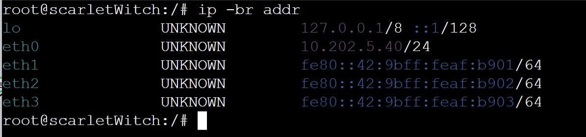
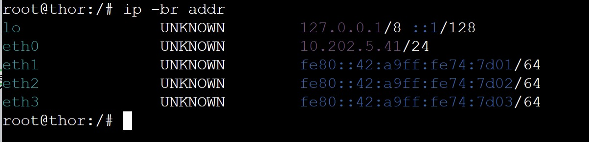

- Explanation

Pada soal ini hampir sama, yakni mengacu pada soal sebelumnya untuk memberikan alamat pada range tertentu. Namun yang membedakan adalah terdapat 2 range, sehingga command range perlu dideklarasikan 2 kali untuk mengakomodir hal tersebut. 

<br>

## Soal 6

> Berikan SpiderMan dan DoctorStrange alamat IP dalam rentang [Prefix IP].7.60 - [Prefix IP].7.65  dan [Prefix IP].7.110 - [Prefix IP].7.115

> _Give SpiderMan and DoctorStrange IP addresses in the ranges [IP Prefix].7.60 - [IP Prefix].7.65 and [IP Prefix].7.110 - [IP Prefix].7.115_

**Answer:**

- Screenshot
``` sh
subnet 10.202.7.0 netmask 255.255.255.0 {
    range 10.202.7.60 10.202.7.65;
    range 10.202.7.110 10.202.7.115;
    option routers 10.202.7.1;
    option broadcast-address 10.202.7.255;
	option domain-name-servers 192.168.122.1;
}
```

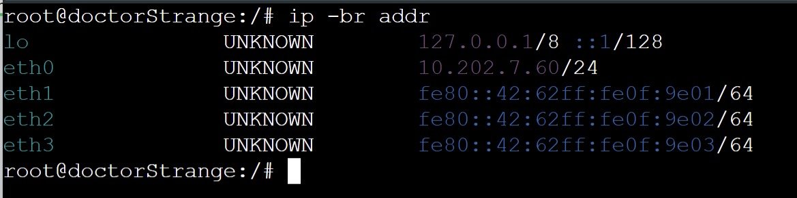
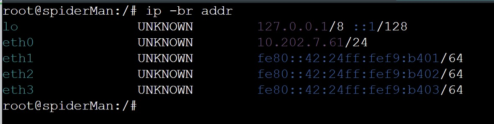

- Explanation

Untuk soal ini juga sama seperti soal nomor 5, hanya untuk subnet yang berbeda dan range yang berbeda juga. 

<br>

## Soal 7

> Tetapkan waktu peminjaman alamat IP pada DHCP server untuk client yang terhubung melalui Switch 2 selama 5 menit (Default), dan untuk client melalui Switch 5 selama 10 menit (Default). Tetapkan juga batas waktu peminjaman maksimal selama 2 jam.
> <br> </br>
> Tetapkan waktu peminjaman alamat IP pada DHCP server untuk client yang terhubung melalui Switch 1 dan Switch 3 selama 2 menit (Default). Tetapkan juga batas waktu peminjaman maksimal selama 100 menit.

<br>

> _Set the IP address lease period on the DHCP server for clients connected through Switch 2 to 5 minutes (default), and for clients connected through Switch 5 to 10 minutes (default). Also, set the maximum lease period to 2 hours._
> <br> </br>
> _Set the IP address lease time on the DHCP server for clients connected via Switch 1 and Switch 3 to 2 minutes (default). Also set the maximum lease time limit to 100 minutes._

**Answer:**

- Screenshot

``` sh
# Switch 1 = 2 menit, peminjaman 100 menit
subnet 10.202.3.0 netmask 255.255.255.0 { 
    range 10.202.3.20 10.202.3.25;
    option routers 10.202.3.1;
    option broadcast-address 10.202.3.255;
	option domain-name-servers 192.168.122.1;
    default-lease-time 120;  
    max-lease-time 6000; 
}

# Switch 2 = 5 menit, peminjaman 120 menit
subnet 10.202.4.0 netmask 255.255.255.0 {
    range 10.202.4.30 10.202.4.35;
    option routers 10.202.4.1;
    option broadcast-address 10.202.4.255;
	option domain-name-servers 192.168.122.1;
    default-lease-time 300;  
    max-lease-time 7200; 
}

# Switch 3 = 2 menit, peminjaman 100 menit
subnet 10.202.5.0 netmask 255.255.255.0 {
    range 10.202.5.40 10.202.5.45;
    range 10.202.5.100 10.202.5.105;
    option routers 10.202.5.1;
    option broadcast-address 10.202.5.255;
	option domain-name-servers 192.168.122.1;
    default-lease-time 120;  
    max-lease-time 6000; 
}

# Switch 5 = 10 menit, peminjaman 120 menit
subnet 10.202.7.0 netmask 255.255.255.0 {
    range 10.202.7.60 10.202.7.65;
    range 10.202.7.110 10.202.7.115;
    option routers 10.202.7.1;
    option broadcast-address 10.202.7.255;
	option domain-name-servers 192.168.122.1;
    default-lease-time 600;  
    max-lease-time 7200; 
}
```

Bukti Lease Time : 

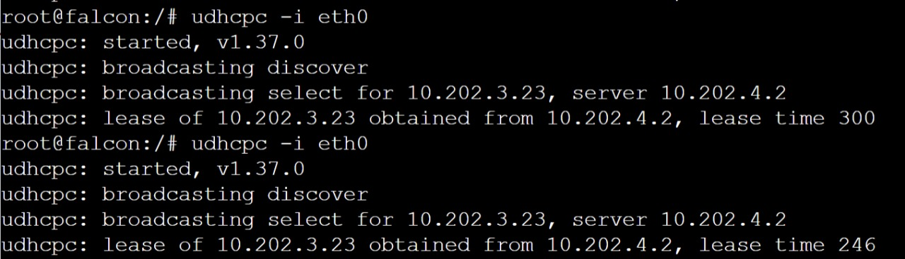

- Explanation

Untuk menambahkah waktu peminjaman dan batas waktu peminjaman, maka dapat menggunakan command `default-lease-time`, dan juga `max-lease-time` yang waktunya dapat ditulis dalam notasi detik. `defaut-lease-time` digunakan untuk mengatur waktu peminjaman, dan `max-lease-time` untuk maksimal waktu peminjaman. Bila client tidak meminta lama penggunaan ip, maka waktu peminjaman akan menggunakan durasi dari `default-lease-time`. `max-lease-time` akan membatasi waktu maksimal peminjaman ip yang boleh diminta client, walaupun client meminta lebih maka tidak akan bisa dan akan menggunakan `max-lease-time`.

<br>

## Soal 8

> Ubah konfigurasi DHCP Server agar Hawkeye, Thor, dan SpiderMan mendapatkan IP statis dengan [Prefix IP].x.5, namun masih menggunakan DHCP.

> _Change the DHCP Server configuration so that Hawkeye, Thor, and SpiderMan get static IPs with [Prefix IP].x.5, but still use DHCP._

**Answer:**

- Screenshot

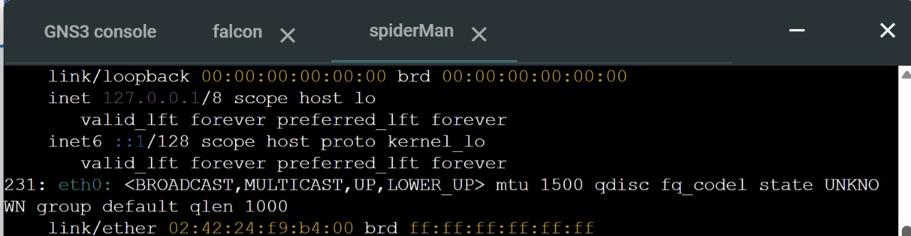
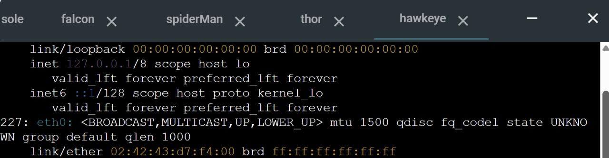
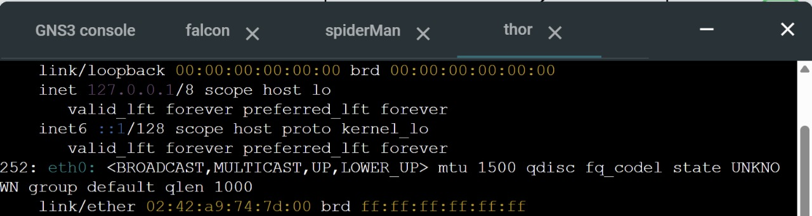

Menggunakan MAC address dari nodes tersebut, dan menggunakanya di kode berikut
``` sh
host Hawkeye {
    hardware ethernet 02:42:43:d7:f4:00; 
    fixed-address 10.202.4.5;             
}

host Thor {
    hardware ethernet 16:1c:1f:1a:15:05b0;  
    fixed-address 10.202.5.5;             
}

host SpiderMan {
    hardware ethernet 02:42:24:f9:b4:00;   
    fixed-address 10.202.7.5;             
}
```

Untuk menghindari MAC address yang berubah setiap restart, maka dapat menambahkan command `hwaddress ether <MAC address>` dalam network config : 
```sh
#hawkeye
auto eth0
iface eth0 inet dhcp
hwaddress ether  02:42:43:d7:f4:00

#spiderman
auto eth0
iface eth0 inet dhcp
hwaddress ether 02:42:24:f9:b4:00

#thor
auto eth0
iface eth0 inet dhcp
hwaddress ether 02:42:a9:74:7d:00
```

Hasil : 
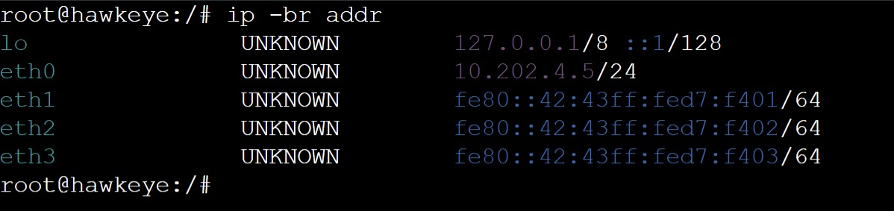
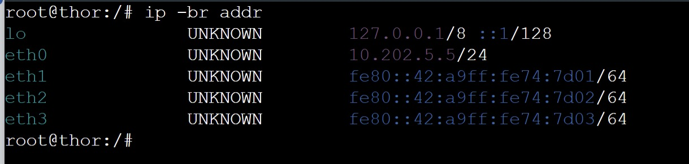
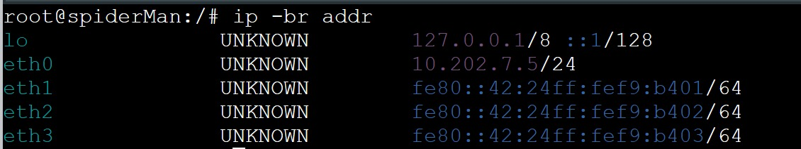

Hasil 

- Explanation

Karena diminta beberapa client dengan alamat akhir yang spesifik, maka dapat menggunakan MAC address dari client tersebut, sehingga client lain tidak terpengaruh. Subnet harus sesuai dengan subnet client, karena apabila tidak sesuai maka ip yang didapatkan client invalid dan client tidak bisa melakukan ping ataupun berkomunikasi dengan client lain.

<br>

## Soal 9

> Buatlah konfigurasi DHCP Failover dengan WinterSoldier sebagai DHCP server backup untuk CaptainAmerica.

> _Create a DHCP Failover configuration with WinterSoldier as the backup DHCP server for CaptainAmerica._

**Answer:**

- Screenshot

captainAmerica
```sh
failover peer "failover-partner" {
     primary;
     address 10.202.3.2;
     peer address 10.202.4.2;
     max-response-delay 60;
     max-unacked-updates 10;
     mclt 3600;
     split 255;	
     load balance max seconds 0;
}

subnet 10.202.3.0 netmask 255.255.255.0 {
    option routers 10.202.3.1;
    option broadcast-address 10.202.3.255;
    default-lease-time 120;  
    max-lease-time 6000; 
    pool {
        failover peer "failover-partner";
        range 10.202.3.20 10.202.3.25;
    }
}

subnet 10.202.4.0 netmask 255.255.255.0 {
    option routers 10.202.4.1;
    option broadcast-address 10.202.4.255;
    default-lease-time 300;  
    max-lease-time 7200; 
    pool {
        failover peer "failover-partner";
        range 10.202.4.30 10.202.4.35;
    }
}

subnet 10.202.5.0 netmask 255.255.255.0 {
    option routers 10.202.5.1;
    option broadcast-address 10.202.5.255;
    default-lease-time 120;  
    max-lease-time 6000; 
    pool {
        failover peer "failover-partner";
        range 10.202.5.40 10.202.5.45;
    }
    pool {
        failover peer "failover-partner";
        range 10.202.5.100 10.202.5.105;
    }
}

subnet 10.202.6.0 netmask 255.255.255.0 {
    option routers 10.202.6.1;
    option broadcast-address 10.202.6.255;
    pool {
        failover peer "failover-partner";
        range 10.202.6.50 10.202.6.55;
    }
}

subnet 10.202.7.0 netmask 255.255.255.0 {
    option routers 10.202.7.1;
    option broadcast-address 10.202.7.255;
    default-lease-time 600;  
    max-lease-time 7200; 
    pool {
        failover peer "failover-partner";
	      range 10.202.7.60 10.202.7.65;
    }
    pool {
        failover peer "failover-partner";
	      range 10.202.7.110 10.202.7.115;
    }
}
```

winterSoldier
``` sh
failover peer "failover-partner" {
     secondary;
     address 10.202.4.2;
     peer address 10.202.3.2;
     max-response-delay 60;
     max-unacked-updates 10;
     mclt 3600;
}

subnet 10.202.3.0 netmask 255.255.255.0 {
    option routers 10.202.3.1;
    option broadcast-address 10.202.3.255;
    default-lease-time 120;  
    max-lease-time 6000; 
    pool {
        failover peer "failover-partner";
        range 10.202.3.20 10.202.3.25;
    }
}

subnet 10.202.4.0 netmask 255.255.255.0 {
    option routers 10.202.4.1;
    option broadcast-address 10.202.4.255;
    default-lease-time 300;  
    max-lease-time 7200; 
    pool {
        failover peer "failover-partner";
        range 10.202.4.30 10.202.4.35;
    }
}

subnet 10.202.5.0 netmask 255.255.255.0 {
    option routers 10.202.5.1;
    option broadcast-address 10.202.5.255;
    default-lease-time 120;  
    max-lease-time 6000; 
    pool {
        failover peer "failover-partner";
        range 10.202.5.40 10.202.5.45;
    }
    pool {
        failover peer "failover-partner";
        range 10.202.5.100 10.202.5.105;
    }
}

subnet 10.202.6.0 netmask 255.255.255.0 {
    option routers 10.202.6.1;
    option broadcast-address 10.202.6.255;
    pool {
        failover peer "failover-partner";
        range 10.202.6.50 10.202.6.55;
    }
}

subnet 10.202.7.0 netmask 255.255.255.0 {
    option routers 10.202.7.1;
    option broadcast-address 10.202.7.255;
    default-lease-time 600;  
    max-lease-time 7200; 
    pool {
        failover peer "failover-partner";
	      range 10.202.7.60 10.202.7.65;
    }
    pool {
        failover peer "failover-partner";
	      range 10.202.7.110 10.202.7.115;
    }
}

```

Bukti Failover : 

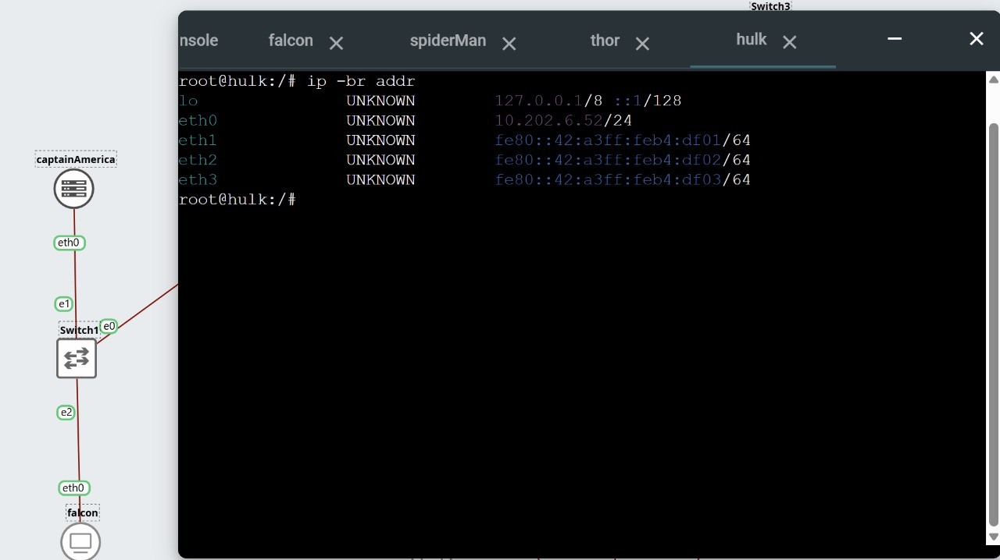
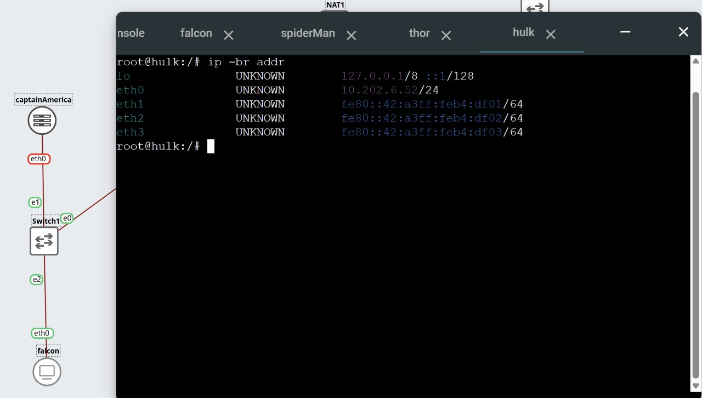

- Explanation

Karena terdapat DHCP server secondary yakni `winterSoldier`, maka harus di setup terlebih dahulu seperti pada soal kedua. Untuk mengakomodir fitur `backup` nya, maka dapat ditambahkan function `failover` yang berguna untuk `mendeklarasikan` relasi kedua server tersebut.

Parameter `primary` digunakan untuk menandakan server utama, dan `secondary` untuk server cadangan. `pool` digunakan untuk membagi alamat ip agar dapat dikelola bersama, sehingga bisa server utama mati, server candangan dapat mengambil alih tugas server utama. 

<br>

## Soal 10

> Buatlah konfigurasi agar CaptainAmerica dan WinterSoldier berjalan dengan mode Load Balancing.

> _Create a configuration so that CaptainAmerica and WinterSoldier run in Load Balancing mode._

**Answer:**

- Screenshot

captainAmerica
``` sh
failover peer "failover-partner" {
     primary;
     address 10.202.3.2;
     peer address 10.202.4.2;
     max-response-delay 60;
     max-unacked-updates 10;
     mclt 3600;
     split 128; #split diubah	
     load balance max seconds 3;
}
```

- Explanation

Untuk mengkonfigurasi agar bekerja pada mode Load Balancing, maka dapat mengubah split pada function `failover` di primary server untuk "membagi tugas" antara kedua server tersebut. Bila split bernilai 255 (full), maka server primary akan bekerja secara penuh mengatur request client. Dengan menjadikanya 128 atau membagi dua dengan server secondary, maka beban bekerjaan menjadi terdistribusi (50% pekerjaan ditangani server utama, dan 50% sisanya ditangani server cadangan), sehingga dapat masuk ke mode Load Balancing. 

<br>
  
## Problems
Hanya ada beberapa kendala seperti pada awalnya NAT yang tidak bisa terhubung ke internet, namun setelah network adapter 1 VMWare saya ubah dari local host menjadi NAT kemudian bisa. 

## Revisions (if any)
