[](https://classroom.github.com/a/e_s827HM)
| Name           | NRP        | Kelas     |
| ---            | ---        | ----------|
| Liem, Alfred Haryanto | 5025241100 | Jarkom C |


## Put your topology config image here!

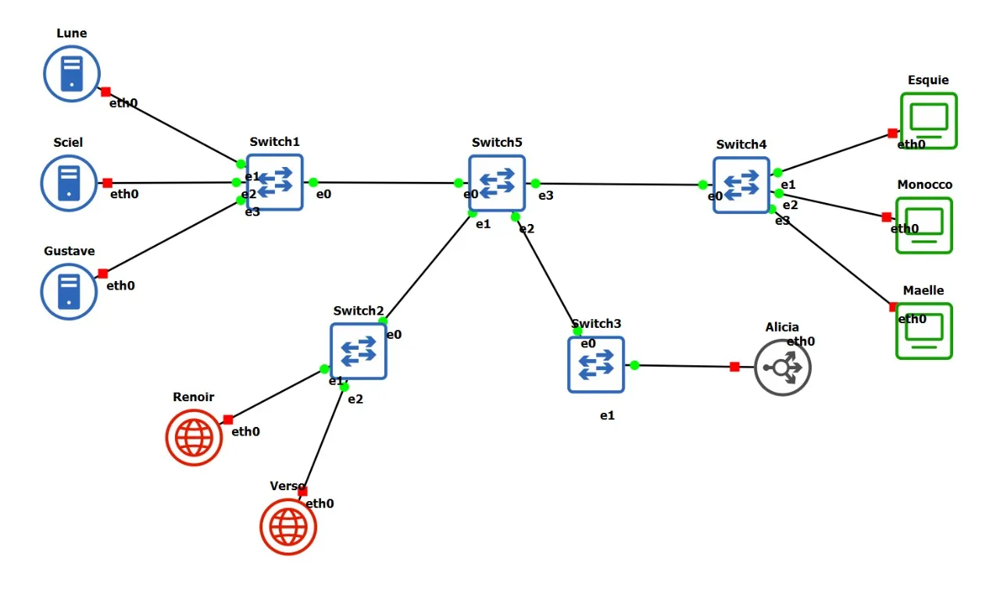

## Put your GNS3 Project file here!

`https://drive.google.com/file/d/1hGuBJ5LjqDPwDEUeOJhKhaVDuKwxLLvA/view?usp=sharing`

<br>

## Soal 1

> Setup Topo

> _Document the results of the subnet grouping that has been created._

**Answer:**

- Screenshot

  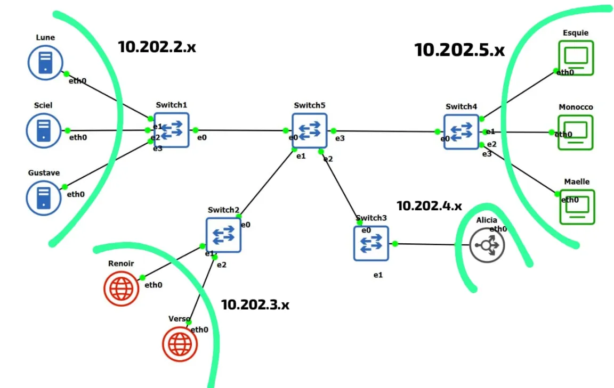

- Explanation

  Berdasarkan soal yang diberikan di gdocs, grouping subnet seperti yang tertera pada gambar. Untuk Lune, Sciel, dan Gustave berada di subnet 10.202.2.x, untuk Renoir dan Verso berada di subnet 10.202.3.x, untuk Alicia berada di subnet 10.202.4.x, dan Esquie, Monocco, Maelle berada di subnet 10.202.5.x.

<br>

## Soal 2

> Buatlah konfigurasi untuk domain 
> **lune33.com** → ke IP node Lune , 
> **sciel33.com** → ke IP node Sciel ,
> **gustave33.com** → ke IP node Gustave 
> pada DNS Master Renoir. Kemudian konfigurasikan node Verso sebagai DNS Slave yang bekerja untuk DNS Master Renoir.

> _Dns Configuration , on  the DNS Master (Renoir)_
> _lune33.com → IP of node Lune ,_
> _sciel33.com → IP of node Sciel ,_
> _gustave33.com → IP of node Gustave_
> _Configure Verso as the DNS Slave that works with DNS Master Renoir._

**Answer:**

- Screenshot

  `Renoir`
  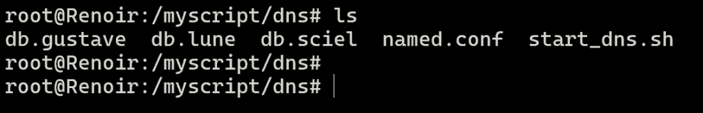
  
  `Verso`
  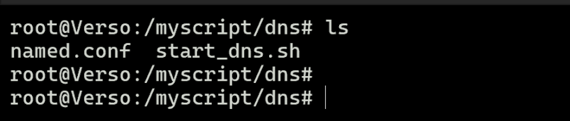

  `Test ping from Esquie`
  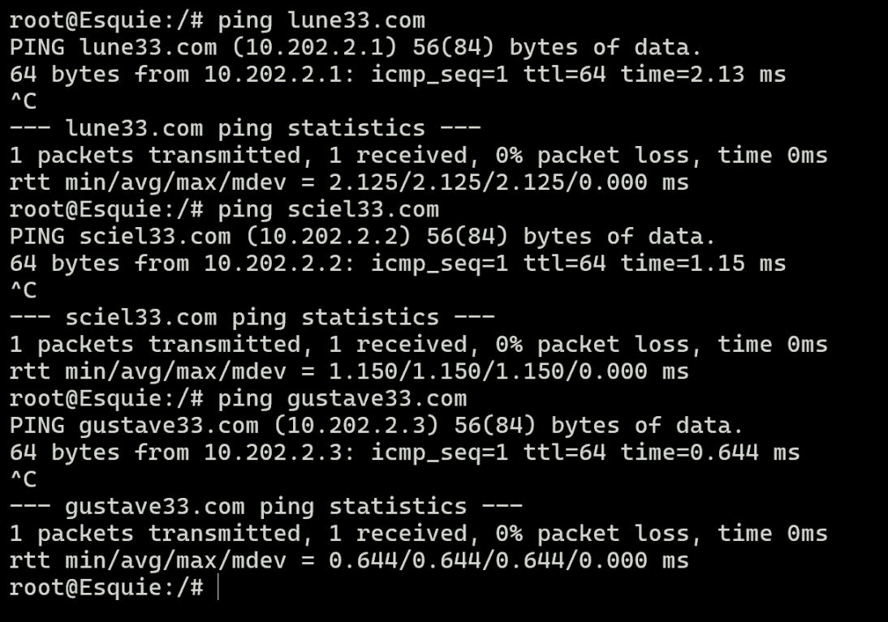

  `Test ping from Maelle`
  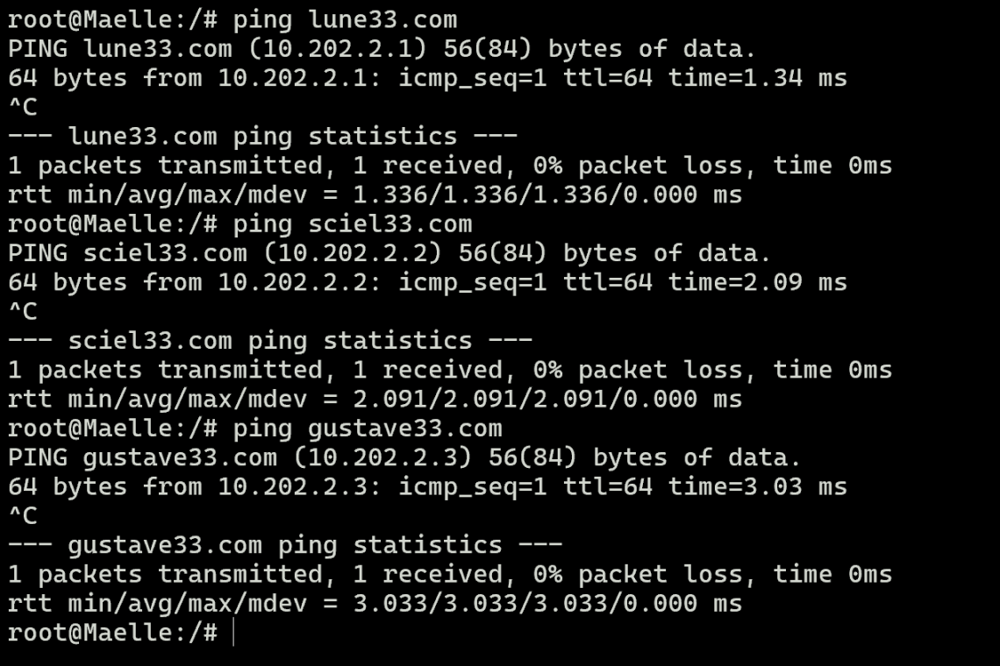

  `Test ping from Monocco`
  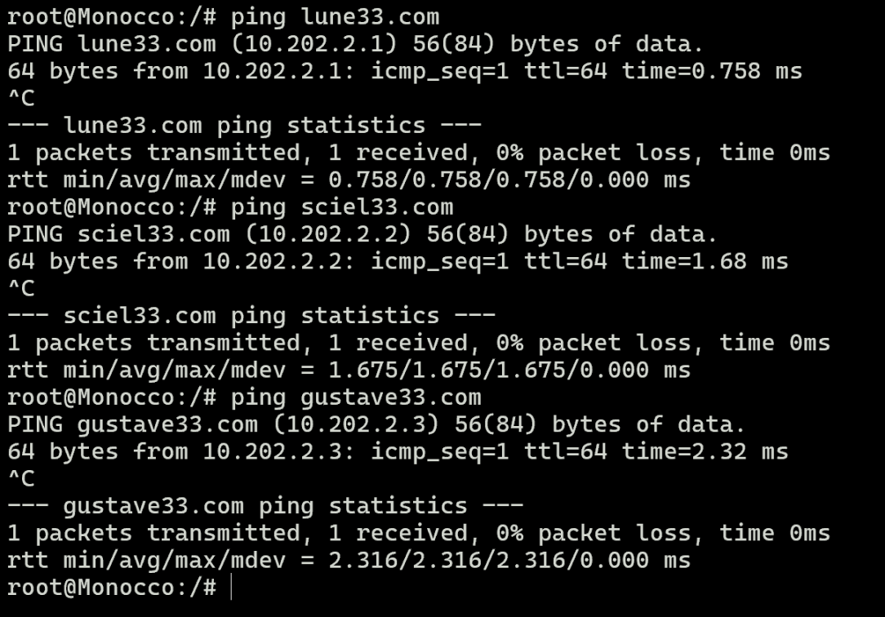


- Explanation

  - Untuk membuat konfigurasi domain dari setiap server maka dapat melakukan setup terlebih dahulu pada DNS server, yakni Renoir sebagai DNS Master dan Verso sebagai DNS Slave.
  - Untuk konfigurasi nama atau `named.conf` pada kedua DNS Server sebagai berikut : 

  `DNS Master (Renoir)`
  ```sh
  options {
      directory "/myscript/dns";
      listen-on { any; };
      allow-query { any; };
  };

  zone "lune33.com" {
      type master;
      file "db.lune";
      allow-transfer { 10.202.3.2; };
  };

  zone "sciel33.com" {
      type master;
      file "db.sciel";
      allow-transfer { 10.202.3.2; };
  };

  zone "gustave33.com" {
      type master;
      file "db.gustave";
      allow-transfer { 10.202.3.2; };
  };
  ```

  `DNS Slave (Verso)`
  ```sh
  options {
      directory "/myscript/dns";
      listen-on { any; };
      allow-query { any; };
  };

  zone "lune33.com" {
      type slave;
      masters {10.202.3.1;};
      file "db.lune";
  };

  zone "sciel33.com" {
      type slave;
      masters {10.202.3.1;};
      file "db.sciel";
  };

  zone "gustave33.com" {
      type slave;
      masters {10.202.3.1;};
      file "db.gustave";
  };
  ```

  Config tersebut berfungsi sebagai "buku telepon" dimana ketika ada client yang meminta request, maka akan melihat dari 
  `named.conf` yang kemudian men-translate dari domain menjadi ip address agar bisa mengakses sebuah server. Pada DNS Master dan DNS Slave terdapat perbedaan dimana DNS Master memiliki command `allow-transfer` yang artinya DNS Master akan mengirimkan zone file kepada DNS Slave agar DNS Slave bisa membackup apabila tiba-tiba DNS Master mati. 

  Setelah konfigurasi `named.conf` pada DNS Server, maka membuat zone file pada DNS Master Renoir sebagai berikut : 

  `db.lune`
  ```sh
  $TTL 86400
  @   IN  SOA ns1.lune33.com. admin.lune33.com. (
          1       ; serial
          3600    ; refresh
          1800    ; retry
          604800  ; expire
          86400 ) ; minimum

      IN  NS  ns1.lune33.com.
      IN  NS  ns2.lune33.com.
      
      
  ns1 IN  A   10.202.3.1
  ns2 IN  A   10.202.3.2
  www IN  A   10.202.2.1
  @ IN  A   10.202.2.1
  ```

  `db.sciel`
  ```sh
  $TTL 86400
  @   IN  SOA ns1.sciel33.com. admin.sciel33.com. (
          1       ; serial
          3600    ; refresh
          1800    ; retry
          604800  ; expire
          86400 ) ; minimum

      IN  NS  ns1.sciel33.com.
      IN  NS  ns2.sciel33.com.
      
  ns1 IN  A   10.202.3.1
  ns2 IN  A   10.202.3.2
  www IN  A   10.202.2.2
  @ IN  A   10.202.2.2
  ```

  `db.gustave`
  ```sh
  $TTL 86400
  @   IN  SOA ns1.gustave33.com. admin.gustave33.com. (
          1       ; serial
          3600    ; refresh
          1800    ; retry
          604800  ; expire
          86400 ) ; minimum

      IN  NS  ns1.gustave33.com.
      IN  NS  ns2.gustave33.com.
      
  ns1 IN  A   10.202.3.1
  ns2 IN  A   10.202.3.1
  www IN  A   10.202.2.3
  @ IN  A   10.202.2.3
  ```

  Zone file ini hanya akan berada di DNS Master, karena nantinya akan di "transfer" atau diduplikat di DNS Slave. 


<br>

## Soal 3

> Tambahkan subdomain alias berupa exp.lune33.com yang mengarah ke alamat lune33.com dan exp.sciel33.com yang mengarah ke alamat sciel33.com (HINT: CNAME). Selain itu, tambahkan konfigurasi untuk melakukan reverse DNS lookup untuk domain gustave33.com

> _Subdomain Configuration,_ 
> _Add alias subdomains (HINT: CNAME)._
> _exp.lune33.com → alias to lune33.com_
> _exp.sciel33.com → alias to sciel33.com_
> _Also, configure reverse DNS lookup for the domain gustave33.com._

**Answer:**

- Screenshot

  `Test ping from Esquie`
  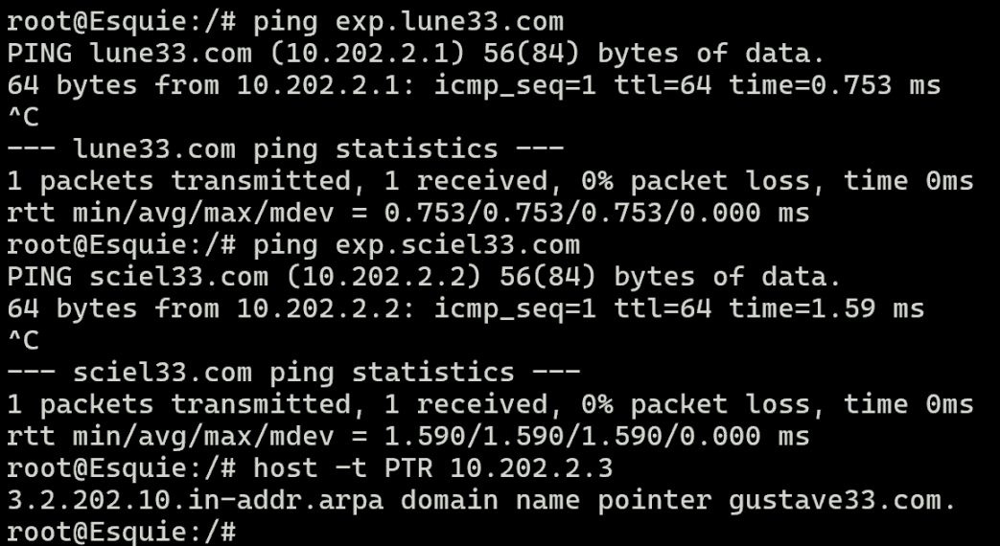

  `Test ping from Maelle`
  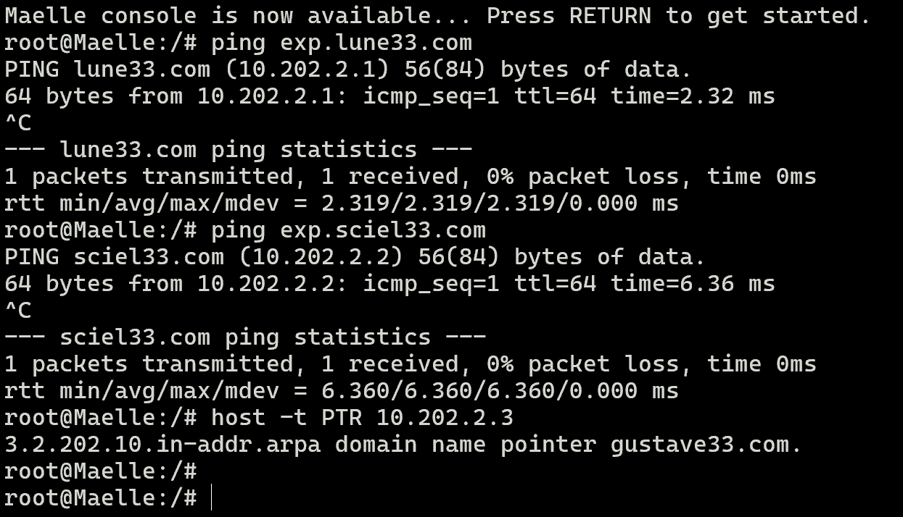

  `Test ping from Monocco`
  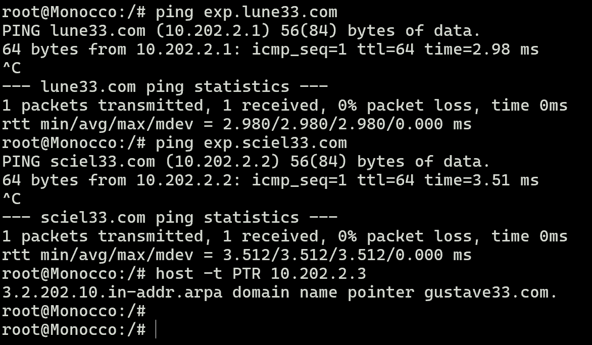

- Explanation

  Untuk menambahkan subdomain alias, maka dapat menggunakan `CNAME` sesuai dengan hint yang sudah diberikan. Berikut merupakan contoh implementasinya pada zone file milik Lune dan Sciel. 

  `db.lune`
  ```sh
  $TTL 86400
  @   IN  SOA ns1.lune33.com. admin.lune33.com. (
          1       ; serial
          3600    ; refresh
          1800    ; retry
          604800  ; expire
          86400 ) ; minimum

      IN  NS  ns1.lune33.com.
      IN  NS  ns2.lune33.com.
      
      
  ns1 IN  A   10.202.3.1
  ns2 IN  A   10.202.3.2
  www IN  A   10.202.2.1
  @ IN  A   10.202.2.1

  exp IN CNAME lune33.com. --> Menambahkan ini
  ```

  `db.sciel`
  ```sh
  $TTL 86400
  @   IN  SOA ns1.sciel33.com. admin.sciel33.com. (
          1       ; serial
          3600    ; refresh
          1800    ; retry
          604800  ; expire
          86400 ) ; minimum

      IN  NS  ns1.sciel33.com.
      IN  NS  ns2.sciel33.com.
      
  ns1 IN  A   10.202.3.1
  ns2 IN  A   10.202.3.2
  www IN  A   10.202.2.2
  @ IN  A   10.202.2.2

  exp IN CNAME sciel33.com. --> Menambahkan ini
  ```

  CNAME atau Canonical Name Record memiliki fungsi untuk memberi alias dari sebuah domain atau subdomain ke yang lainya. Syntaxnya adalah `<alias> IN CNAME <nama domain>` dengan alias bisa diubah dengan nama subdomain yang diinginkan, dan nama domain sesuai dengan domainnya. Dalam kasus ini karena subdomain yang diminta ada exp, maka aliasnya diubah dengan exp dan nama domain sesuai dengan domain yang diminta, yakni lune33.com dan sciel33.com.

  Untuk konfigurasi reverse DNS adalah sebagai berikut : 

  `named.conf Master Server` 
  ```sh
  zone "2.202.10.in-addr.arpa" {
    type master;
    file "db.gustaveReversed";
    allow-transfer { 10.202.3.2; };
  };
  ```

  `2.202.10.in-addr.arpa` Berfungsi sebagai reverse zone dari IP address Gustave dan `.in-addr.arpa` berguna untuk menandakan bahwa zone ini hanya untuk reverse lookup.

  `named.conf Slave Server` 
  ```sh
  zone "2.202.10.in-addr.arpa" {
    type slave;
    masters { 10.202.3.1; };
    file "db.gustaveReversed";
  };
  ```

  `db.gustaveReserved`
  ```sh
  $TTL 86400
  @   IN  SOA ns1.gustave33.com. admin.gustave33.com. (
          1       ; serial
          3600    ; refresh
          1800    ; retry
          604800  ; expire
          86400 ) ; minimum

      2.202.10.in-addr.arpa. IN NS gustave33.com.

  3   IN  PTR gustave33.com.
  ```

  Zone file untuk reverse DNS sedikit berbeda di bagian `2.202.10.in-addr.arpa. IN NS gustave33.com.` yang berguna untuk menandakan bahwa zona reverse dari 10.202.2.x adalah gustave33.com. `3   IN  PTR gustave33.com.` Ini adalah inti dari reverse DNS dimana 3 berguna untuk menadai bila melakukan reverse DNS lookup dengan ip 10.202.2.3 akan memunculkan gustave33.com. 


<br>

## Soal 4

> Buatlah subdomain berupa expedition.gustave33.com dan delegasikan subdomain tersebut dari Renoir ke Verso dengan alamat IP tujuan adalah node Gustave. Kemudian, matikan Renoir dan coba lakukan ping ke semua domain dan subdomain yang telah dikonfigurasikan pada nomor 2, 3, dan 4.

> _Create a subdomain expedition.gustave33.com and delegate it from Renoir to Verso, with the target IP being node Gustave.Then, turn off Renoir and try pinging all domains and subdomains configured in tasks 2, 3, and 4 to verify delegation works correctly._

**Answer:**

- Screenshot

  `Put your screenshot in here`
  `Test ping from Esquie`
  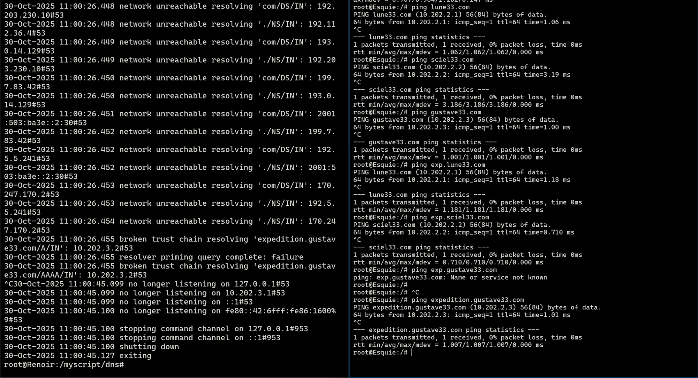

  `Test ping from Maelle`
  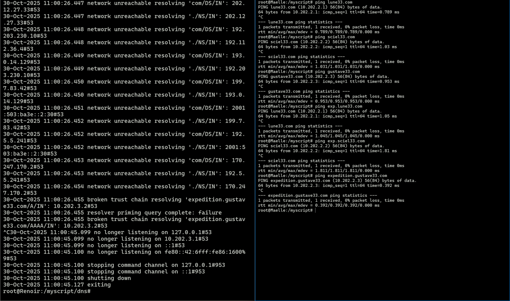

  `Test ping from Monocco`
  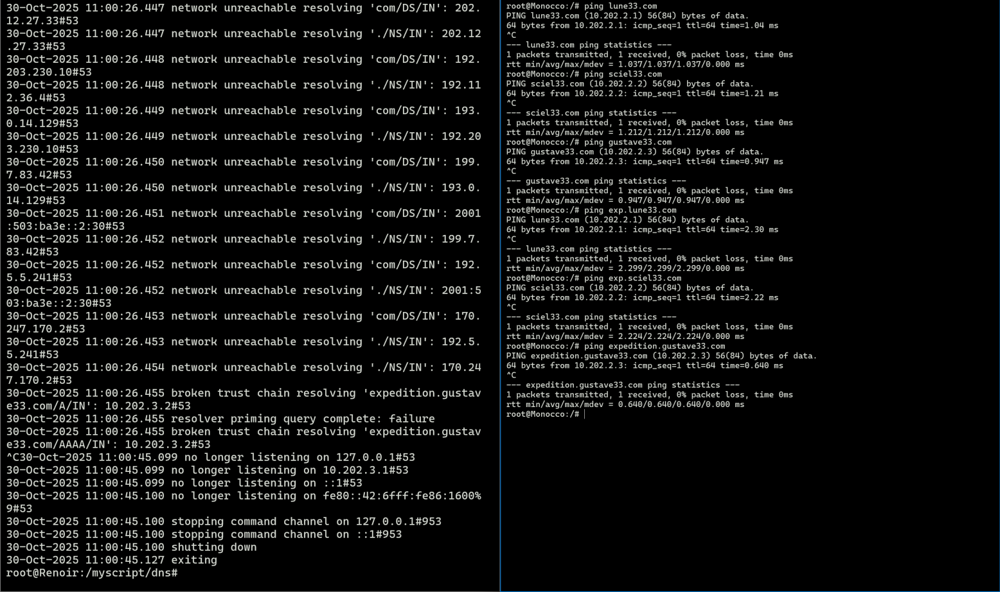

- Explanation

  Untuk mendelegasikan subdomain maka diperlukan beberapa perubahan pada konfigurasi seperti berikut.

  `db.gustave (Renoir)`
  ```sh
  $TTL 86400
  @   IN  SOA ns1.gustave33.com. admin.gustave33.com. (
          2       ; serial --> update ini
          3600    ; refresh
          1800    ; retry
          604800  ; expire
          86400 ) ; minimum

      IN  NS  ns1.gustave33.com.
      IN  NS  ns2.gustave33.com.

  ns1 IN  A   10.202.3.1
  ns2 IN  A   10.202.3.2
  www IN  A   10.202.2.3
  @   IN  A   10.202.2.3

  expedition      IN  NS  ns.expedition.gustave33.com. --> menambahkan ini 
  ns.expedition   IN  A   10.202.3.2 --> menambahkan ini 
  ```

  `db.expedition.gustave (Verso)`
  ```sh
  $TTL 86400
  @   IN  SOA ns.expedition.gustave33.com. admin.gustave33.com. (
          1       ; serial
          3600    ; refresh
          1800    ; retry
          604800  ; expire
          86400 ) ; minimum

      IN  NS  ns.expedition.gustave33.com.
  ns.expedition   IN  A   10.202.3.2

  www IN  A   10.202.2.3
  @   IN  A   10.202.2.3
  ns IN A 10.202.2.3
  ```

  Setelah itu, zone file juga ditambah blok code berikut.

  `named.conf (Verso)`
  ``` sh
  zone "expedition.gustave33.com" {
    type master;
    file "db.expedition.gustave";
  };
  ```

  Bila Renoir dimatikan, maka tetap dapat melakukan ping seperti pada screenshot yang dilampirkan. 

<br>

## Soal 5

> Konfigurasi node Lune, Sciel, dan Gustave agar berfungsi sebagai web server Nginx yang akan menyajikan halaman profil, dimana halaman profil akan berbeda untuk setiap node. Dari folder berikut, gunakan profile_lune.html untuk menyajikan halaman profil di node Lune, profile_sciel.html untuk menyajikan halaman profil di node Sciel, dan profile_gustave.html untuk menyajikan halaman profil di node Gustave. Konfigurasikan Nginx di setiap node untuk menyimpan custom access log ke file /tmp/access.log dan error log ke file /tmp/error.log. 

> _Configure Lune, Sciel, and Gustave as Nginx web servers serving profile pages, where each node has a unique profile page:_
> _- Use profile_lune.html for Lune_
> _- Use profile_sciel.html for Sciel_
> _- Use profile_gustave.html for Gustave_
> _In each web server, Configure Nginx to store custom logs:_
> _- Access log: /tmp/access.log_
> _- Error log: /tmp/error.log_

**Answer:**

- Screenshot

  `lune33.com test`
  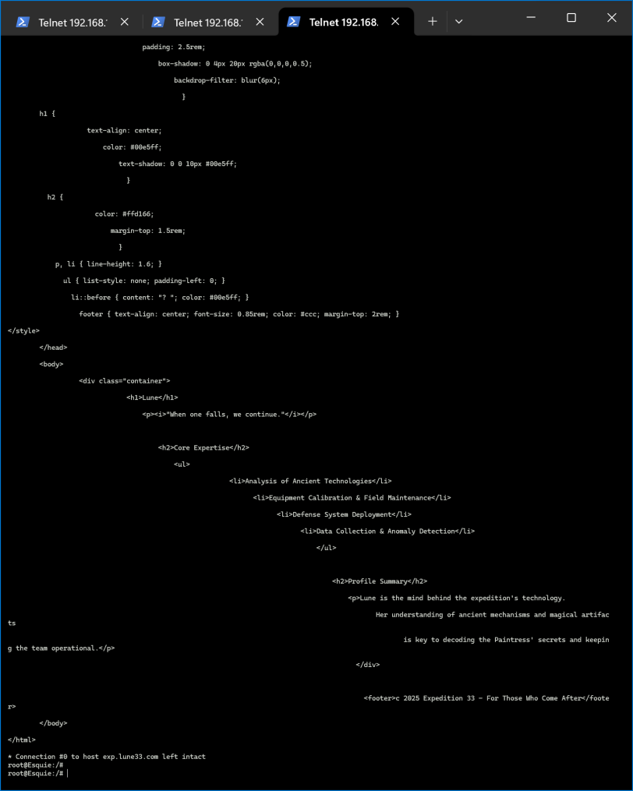

  `sciel33.com test`
  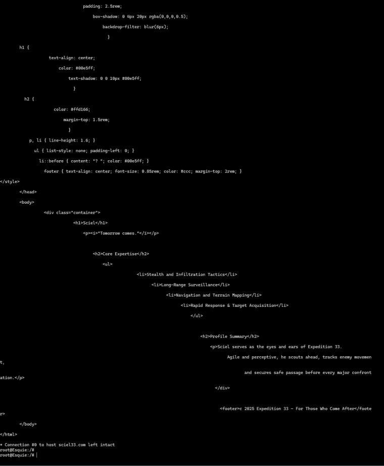

  `gustave33.com test`
  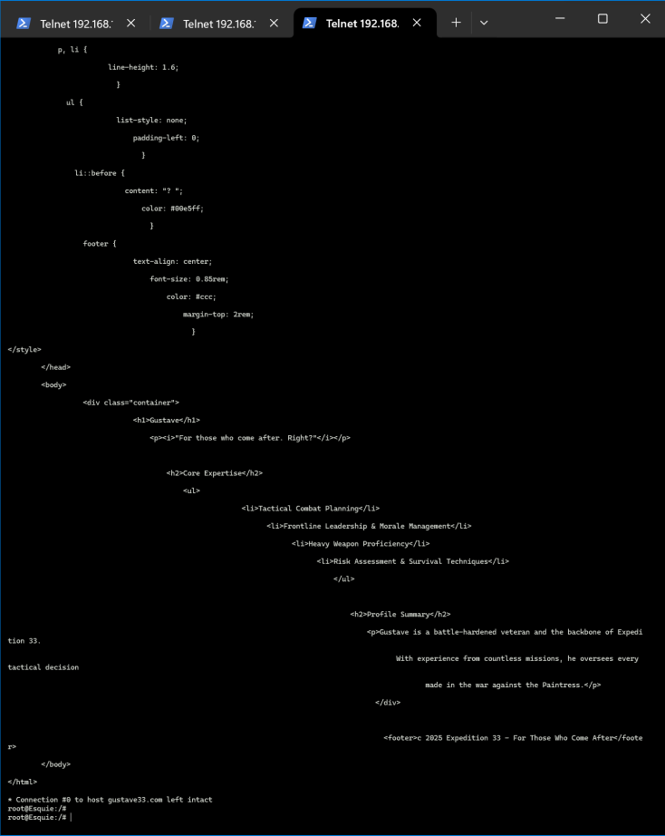

  `exp.lune33.com test`
  

  `exp.sciel33.com test`
  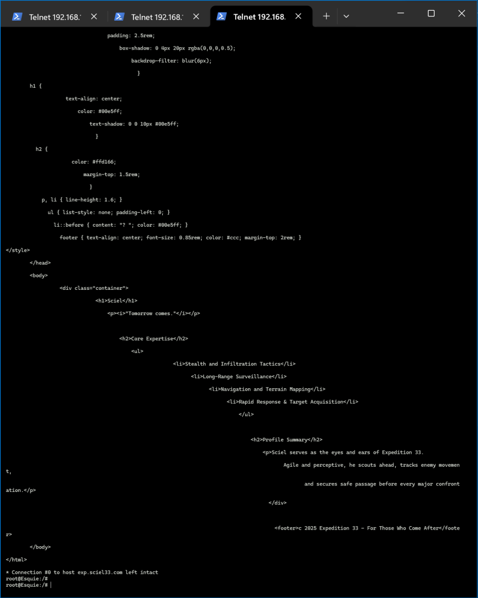

  `expedition.gustave33.com test`
  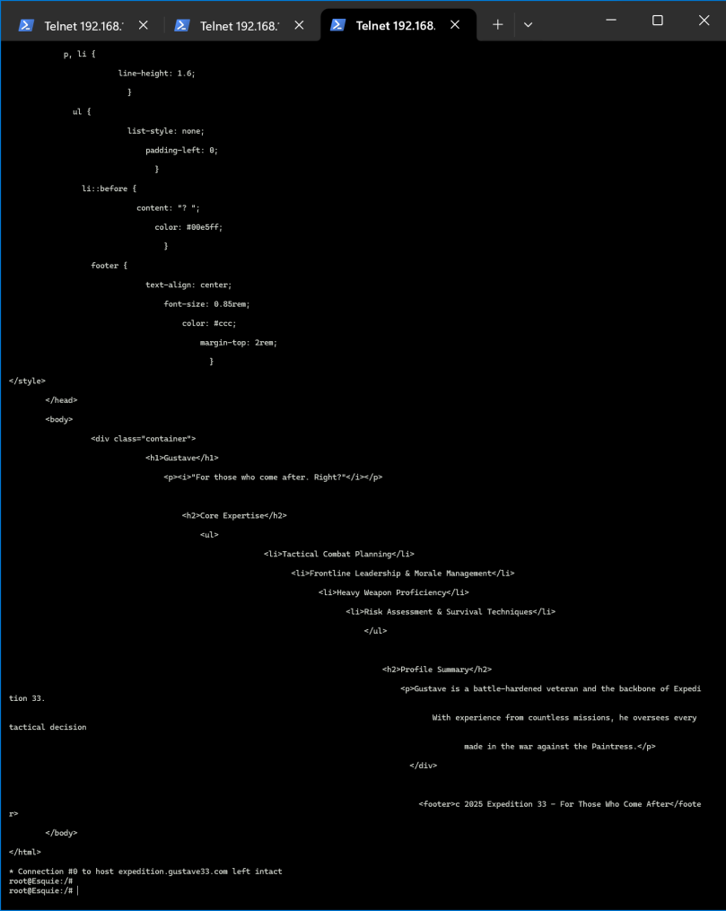

- Explanation

  Langkah-langkah melakukan setup website dan nginx ada pada PPT handson Modul 3, sehingga saya mengikuti langkah-langkah yang ada. Berikut merupakan beberapa konfigurasi untuk nginx.conf di berbagai server.

  `nginx.conf (Lune)`
  ```sh
  user www-data;
  worker_processes auto;
  worker_cpu_affinity auto;
  pid /tmp/nginx.pid;

  events {
      worker_connections 768;
  }

  http {

    access_log /tmp/access.log;
    error_log /tmp/error.log;
    
    server {
        listen 80;
        server_name lune33.com exp.lune33.com;

        root /myscript/myweb;
        index index.html;

        location / {
            try_files $uri $uri/ =404;
        }
    }
  }
  ```

  `nginx.conf (Sciel)`
  ```sh
  user www-data;
  worker_processes auto;
  worker_cpu_affinity auto;
  pid /tmp/nginx.pid;

  events {
      worker_connections 768;
  }

  http {

    access_log /tmp/access.log;
    error_log /tmp/error.log;
    
    server {
        listen 80;
        server_name sciel33.com exp.sciel33.com;

        root /myscript/myweb;
        index index.html;

        location / {
            try_files $uri $uri/ =404;
        }
    }
  }
  ```

  `nginx.conf (Gustave)`
  ```sh
  user www-data;
  worker_processes auto;
  worker_cpu_affinity auto;
  pid /tmp/nginx.pid;

  events {
      worker_connections 768;
  }

  http {

    access_log /tmp/access.log;
    error_log /tmp/error.log;
    
    server {
        listen 80;
        server_name gustave33.com expedition.gustave33.com;

        root /myscript/myweb;
        index index.html;

        location / {
            try_files $uri $uri/ =404;
        }
    }
  }
  ```

  Untuk melakukan start pada nginx dapat menggunakan script bash berikut : 
  ```sh
  #!/bin/bash

  nginx -c /myscript/myconf/nginx.conf -g 'daemon off;'
  ```

<br>

## Soal 6

> Setelah website berhasil dideploy pada masing-masing node web server dan halaman dapat menampilkan profil yang sesuai,  buatlah custom access log ke file /tmp/access.log di masing-masing node web server menggunakan format log tertentu seperti di bawah:
> - Tanggal dan waktu akses dalam format standar log.
> - Nama node yang sedang diakses.
> - Alamat IP klien yang mengakses website.
> - Metode HTTP dan URI yang diakses oleh klien.
> - Status respons HTTP yang diberikan oleh server.
> - Jumlah byte yang dikirimkan dalam respons.
> - Waktu yang dihabiskan oleh server untuk menangani permintaan.
> - Contoh format log yang sesuai:
>   [01/Oct/2024:11:30:45 +0000] Jarkom Node Lune Access from 192.168.1.15 using method "GET /resep/bayam HTTP/1.1" returned status 200 with 2567 bytes sent in 0.038 seconds

> _After successfully deploying each website and verifying the correct profile page is displayed, create a custom access log in /tmp/access.log on each web server using the following format:_
> _- Date and time of access (standard log format)_
> _- Name of the node being accessed_
> _- IP address of the client accessing the website_
> _- HTTP method and URI accessed by the client_
> _- HTTP response status code_
> _- Number of bytes sent in the response_
> _- Time taken by the server to process the request_
> _- Example Log Format:_
> _[01/Oct/2024:11:30:45 +0000] Jarkom Node Lune Access from 192.168.1.15 using method "GET /resep/bayam HTTP/1.1" returned status 200 with 2567 bytes sent in 0.038 seconds_

**Answer:**

- Screenshot

  `Lune`
  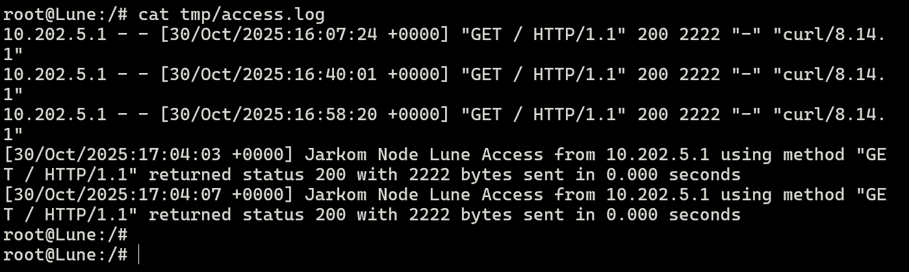

  `Sciel`
  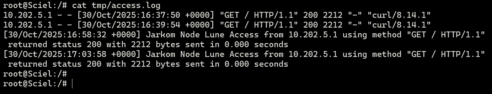

  `Gustave`
  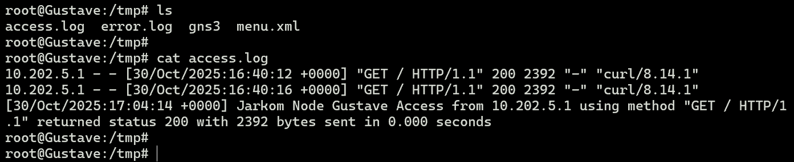

- Explanation

  Untuk membuat custom log notation maka dapat menambahkan sebuah template untuk log pada setiap file config nginx di setiap website seperti berikut.

  `nginx.conf (Lune)`
  ```sh
  user www-data;
  worker_processes auto;
  worker_cpu_affinity auto;
  pid /tmp/nginx.pid;

  events {
      worker_connections 768;
  }

  http {

    log_format customLune '[$time_local] Jarkom Node Lune Access from $remote_addr using method "$request" returned status $status with $body_bytes_sent bytes sent in $request_time seconds'; --> menambah ini

    access_log /tmp/access.log customLune; --> mengubah ini
    error_log /tmp/error.log;
    
    server {
        listen 80;
        server_name lune33.com exp.lune33.com;

        root /myscript/myweb;
        index index.html;

        location / {
            try_files $uri $uri/ =404;
        }
    }
  }
  ```

  `nginx.conf (Sciel)`
  ```sh
  user www-data;
  worker_processes auto;
  worker_cpu_affinity auto;
  pid /tmp/nginx.pid;

  events {
      worker_connections 768;
  }

  http {
    log_format customSciel '[$time_local] Jarkom Node Sciel Access from $remote_addr using method "$request" returned status $status with $body_bytes_sent bytes sent in $request_time seconds'; --> menambah ini
    
    access_log /tmp/access.log customSciel; --> mengubah ini
    error_log /tmp/error.log;
    
    server {
        listen 80;
        server_name sciel33.com exp.sciel33.com;

        root /myscript/myweb;
        index index.html;

        location / {
            try_files $uri $uri/ =404;
        }
    }
  }
  ```

  `nginx.conf (Gustave)`
  ```sh
  user www-data;
  worker_processes auto;
  worker_cpu_affinity auto;
  pid /tmp/nginx.pid;

  events {
      worker_connections 768;
  }

  http {

    log_format customGustave '[$time_local] Jarkom Node Gustave Access from $remote_addr using method "$request" returned status $status with $body_bytes_sent bytes sent in $request_time seconds'; --> menambah ini
    
    access_log /tmp/access.log customGustave; --> mengubah ini
    error_log /tmp/error.log;
    
    server {
        listen 80;
        server_name gustave33.com expedition.gustave33.com;

        root /myscript/myweb;
        index index.html;

        location / {
            try_files $uri $uri/ =404;
        }
    }
  }
  ```

  Notasi tersebut akan menghasilkan output seperti : 

  `[31/Oct/2025:16:38:03 +0000] Jarkom Node Sciel Access from 10.202.4.1 using method "GET / HTTP/1.0" returned status 200 with 3237 bytes sent in 0.000 seconds`

<br>

## Soal 7

> Gustave merupakan web server yang tidak disarankan untuk dilihat oleh publik. Maka dari itu, ubahlah konfigurasi nginx sehingga halaman profil Gustave menjadi hanya bisa di akses melalui port 8080 dan 8888.

> _The Gustave web server should not be publicly accessible.
Modify the Nginx configuration so that Gustave’s profile page can only be accessed through ports 8080 and 8888._

**Answer:**

- Screenshot

  `gustave33.com test curl`
  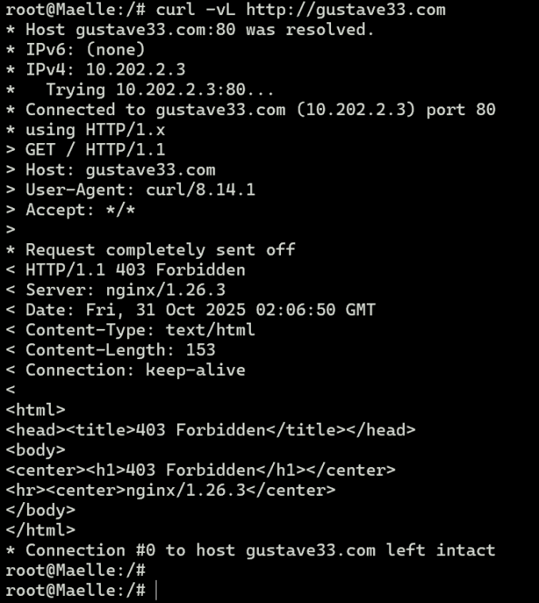

  `expedition.gustave33.com test curl`
  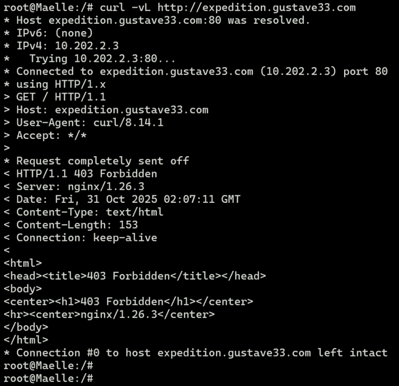

- Explanation

  Untuk membuat sebuah server hanya bisa diakses pada port tertentu, maka dapat mengubah konfigurasi pada file nginx.conf, dengan mengganti bagian listen di blok server, dimana nantinya server hanya akan bisa diakses dari port yang sudah ditentukan oleh listen tersebut. 

  `nginx.conf (Gustave)`
  ```sh
  user www-data;
  worker_processes auto;
  worker_cpu_affinity auto;
  pid /tmp/nginx.pid;

  events {
      worker_connections 768;
  }

  http {

    log_format customGustave '[$time_local] Jarkom Node Gustave Access from $remote_addr using method "$request" returned status $status with $body_bytes_sent bytes sent in $request_time seconds';
    
    access_log /tmp/access.log customGustave;
    error_log /tmp/error.log;
    
    server {
        listen 8080; --> ubah ini untuk port 8080
        server_name gustave33.com expedition.gustave33.com;

        root /myscript/myweb;
        index index.html;

        location / {
            try_files $uri $uri/ =404;
        }
    }
    
    server {
        listen 8888; --> ubah ini untuk port 8888
        server_name gustave33.com expedition.gustave33.com;

        root /myscript/myweb;
        index index.html;

        location / {
            try_files $uri $uri/ =404;
        }
    }
    
    server {
        listen 80; --> ubah ini agar port selain 8888 dan 8080 tidak dapat mengakses
        return 403;
    }
  }
  ```

  Pada blok terakhir, port default adalah 80 dan karena server tidak boleh diakses selain port `8888` dan `8080`, maka bila mengakses secara normal (melalui port default 80), maka akan diberikan return 403 forbidden.

<br>

## Soal 8

> Untuk mempermudah program ekspedisi, maka node Lune, Sciel, Gustave sepakat untuk membuat halaman informasi dengan konten yang sama. Maka dari itu, buatlah lagi 1 server block di dalam konfigurasi nginx yang akan menyajikan file HTML ini. Namun, mereka ingin menyajikan halaman informasi tersebut di port yang berbeda-beda, yaitu Lune menggunakan port 8000, Sciel menggunakan port 8100, dan Gustave menggunakan port 8200.

> _To simplify coordination for the expedition program, Lune, Sciel, and Gustave agree to create a shared information page with the same content. Add one more server block in each node’s Nginx configuration that serves this HTML file 
Each node should serve the information page on a different port:_
> _- Lune → port 8000_
> _- Sciel → port 8100_
> _- Gustave → port 8200_

**Answer:**

- Screenshot

  `lune33.com:8000 test ping`
  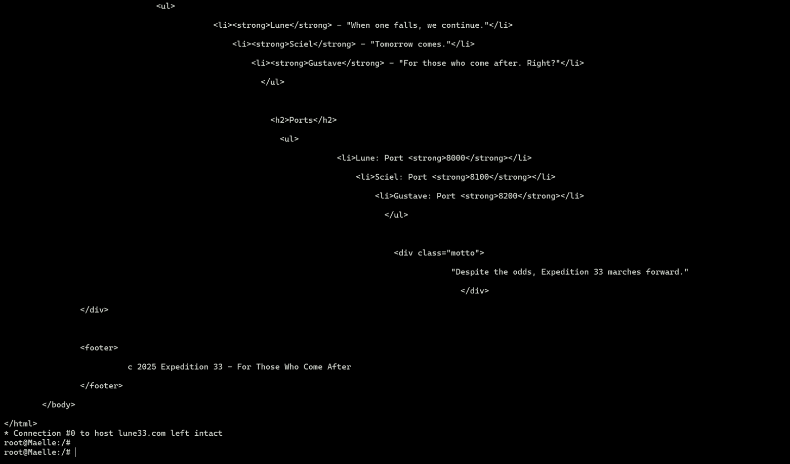

  `sciel33.com:8100 test ping`
  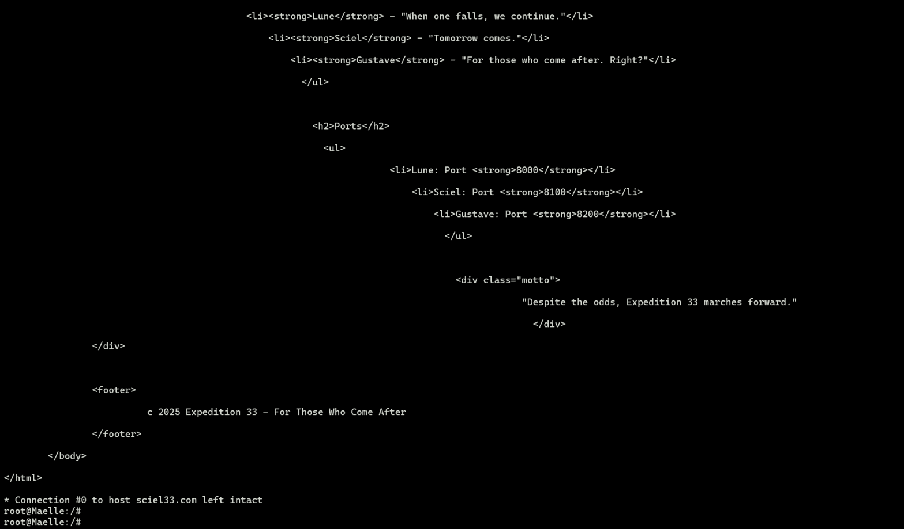

  `gustave33.com:8200 test ping`
  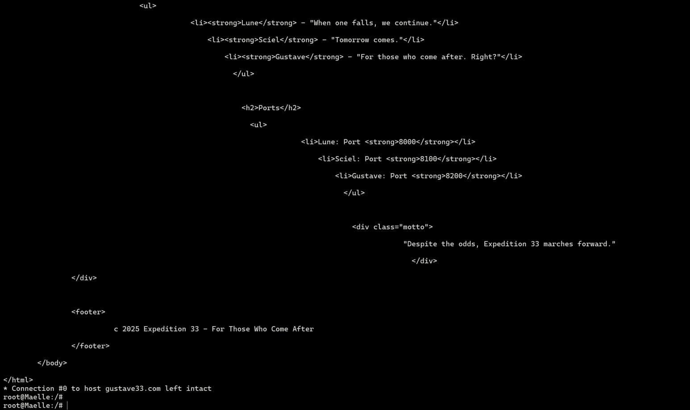

- Explanation

  Soal ini hampir mirip dengan soal sebelumnya, namun pada soal ini untuk port tertentu akan mengarahkan ke page yang berbeda. 

  `nginx.conf (Lune)`
  ```sh
  user www-data;
  worker_processes auto;
  worker_cpu_affinity auto;
  pid /tmp/nginx.pid;

  events {
      worker_connections 768;
  }

  http {

    log_format customLune '[$time_local] Jarkom Node Lune Access from $remote_addr using method "$request" returned status $status with $body_bytes_sent bytes sent in $request_time seconds';

    access_log /tmp/access.log customLune;
      error_log /tmp/error.log;
      
      server {
          listen 8000; --> menambah ini
          server_name lune33.com exp.lune33.com;

          root /myscript/myweb;
          index shared.html; --> file HTML bersama

          location / {
              try_files $uri $uri/ =404;
          }
      }
      
      server {
          listen 80;
          server_name lune33.com exp.lune33.com;

          root /myscript/myweb;
          index index.html;

          location / {
              try_files $uri $uri/ =404;
          }
      }
  }
  ```

  `nginx.conf (Sciel)`
  ```sh
  user www-data;
  worker_processes auto;
  worker_cpu_affinity auto;
  pid /tmp/nginx.pid;

  events {
      worker_connections 768;
  }

  http {
    log_format customSciel '[$time_local] Jarkom Node Sciel Access from $remote_addr using method "$request" returned status $status with $body_bytes_sent bytes sent in $request_time seconds';
    
    access_log /tmp/access.log customSciel;
      error_log /tmp/error.log;
      
      server {
          listen 8100; --> menambah ini
          server_name sciel33.com exp.sciel33.com;

          root /myscript/myweb;
          index shared.html; --> file HTML bersama

          location / {
              try_files $uri $uri/ =404;
          }
      }
      
      server {
          listen 80;
          server_name sciel33.com exp.sciel33.com;

          root /myscript/myweb;
          index index.html;

          location / {
              try_files $uri $uri/ =404;
          }
      }
  }
  ```

  `nginx.conf (Gustave)`
  ```sh
  user www-data;
  worker_processes auto;
  worker_cpu_affinity auto;
  pid /tmp/nginx.pid;

  events {
      worker_connections 768;
  }

  http {

    log_format customGustave '[$time_local] Jarkom Node Gustave Access from $remote_addr using method "$request" returned status $status with $body_bytes_sent bytes sent in $request_time seconds';
    
    access_log /tmp/access.log customGustave;
      error_log /tmp/error.log;
      
      server {
          listen 8080;
          server_name gustave33.com expedition.gustave33.com;

          root /myscript/myweb;
          index index.html;

          location / {
              try_files $uri $uri/ =404;
          }
      }
      
      server {
          listen 8888;
          server_name gustave33.com expedition.gustave33.com;

          root /myscript/myweb;
          index index.html;

          location / {
              try_files $uri $uri/ =404;
          }
      }
      
      server {
          listen 8200; --> menambah ini
          server_name gustave33.com expedition.gustave33.com;

          root /myscript/myweb;
          index shared.html; --> file HTML bersama

          location / {
              try_files $uri $uri/ =404;
          }
      }
      
      server {
          listen 80;
          return 403;
      }
  }
  ```

  Bila sudah, maka bila mengakses lune33 dengan port 8000, sciel33 dengan port 8100, dan gustave33 dengan port 8200 akan diarahkan ke halaman informasi.


<br>

## Soal 9

> Untuk mempermudah akses ke profil tiap anggota ekspedisi, buatlah 1 domain lagi yaitu "expeditioners.com" yang akan mengarah ke Alicia. Lalu, untuk mencegah overload dari salah satu web server, konfigurasikan reverse proxy Alicia agar bisa forward request ke server yang sesuai berdasarkan URL profile yang diminta oleh klien dengan ketentuan sebagai berikut:
> -  Request untuk “expeditioners.com/profil_lune” harus dialihkan ke halaman profil web server Lune.
> -  Request untuk “expeditioners.com/profil_sciel” harus dialihkan ke halaman profil web server Sciel.
> -  Request untuk “expeditioners.com/profil_gustave” harus dialihkan ke halaman profil web server Gustave.
> Jika terdapat request ke URL selain profil yang ditentukan, reverse proxy akan mengalihkan ke halaman informasi pada web server Lune.

> _To make it easier to access each member’s profile, create a new domain “expeditioners.com” that points to Alicia. "
Configure Alicia’s reverse proxy (Nginx) to forward requests to the correct web server based on the requested URL, with the following rules:_
> _- Request URL expeditioners.com/profil_lune, Forward To Lune’s profile page_
> _- Request URL expeditioners.com/profil_sciel, Forward To Sciel’s profile page_
> _- Request URL expeditioners.com/profil_gustave, Forward To Gustave’s profile page_
> _- Any other URL, Forward To Lune’s information page_

**Answer:**

- Screenshot

  `expeditioner.com/profil_lune`
  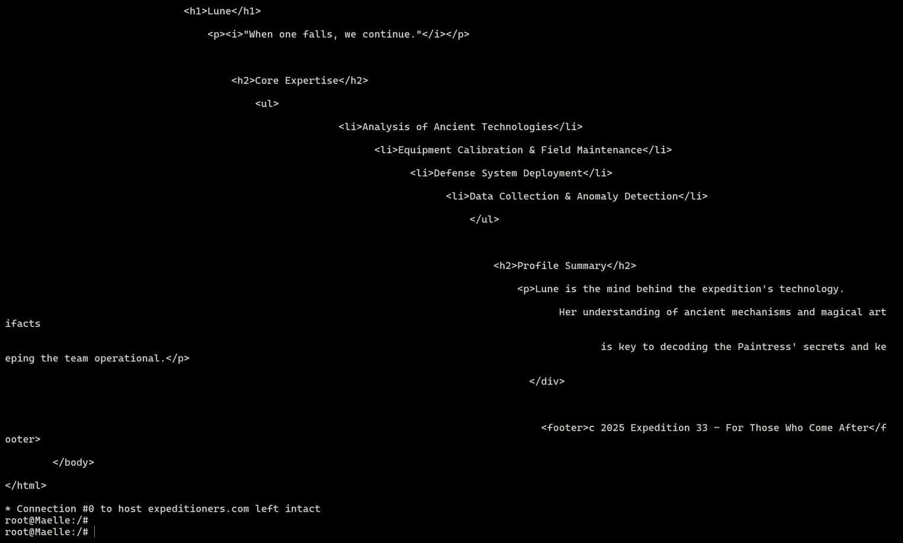

  `expeditioner.com/profil_sciel`
  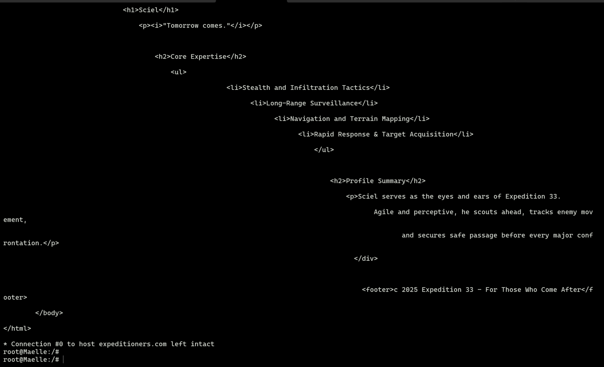

  `expeditioner.com/profil_gustave`
  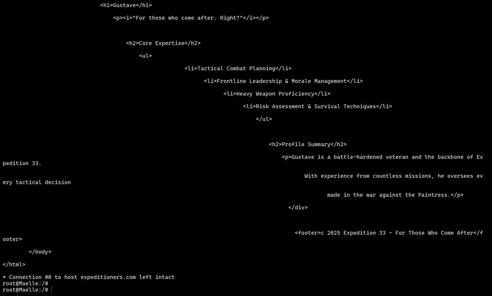

  `expeditioner.com`
  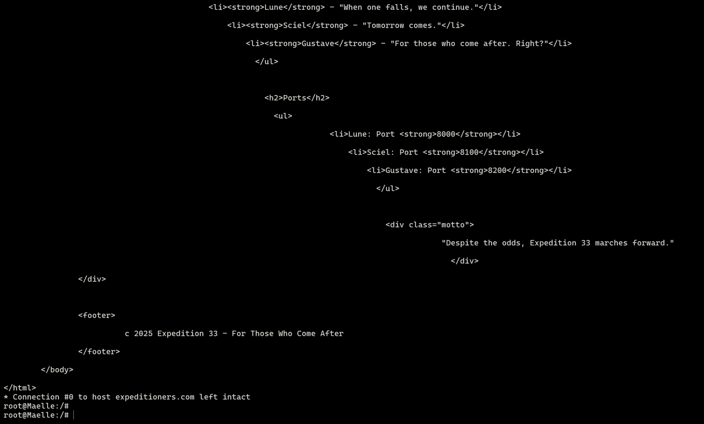

- Explanation

  Karena diminta pada domain expeditioners.com diarahkan ke `Alicia`, maka diperlukan untuk membuat domain tersebut terlebih dahulu. 

  `named.conf DNS Master`
  ```sh
  options {
      directory "/myscript/dns";
      listen-on { any; };
      allow-query { any; };
  };

  zone "lune33.com" {
      type master;
      file "db.lune";
      allow-transfer { 10.202.3.2; };
  };

  zone "sciel33.com" {
      type master;
      file "db.sciel";
      allow-transfer { 10.202.3.2; };
  };

  zone "gustave33.com" {
      type master;
      file "db.gustave";
      allow-transfer { 10.202.3.2; };
  };

  zone "200.202.10.in-addr.arpa" {
      type master;
      file "db.gustaveReversed";
      allow-transfer { 10.202.3.2; };
  };

  zone "expedition.gustave33.com" {
      type master;
      file "db.expedition.gustave";
      allow-transfer { 10.202.3.2; };
  };
  ```

  `named.conf DNS Slave`
  ```sh
  options {
      directory "/myscript/dns";
      listen-on { any; };
      allow-query { any; };
  };

  zone "lune33.com" {
      type slave;
      masters {10.202.3.1;};
      file "db.lune";
  };

  zone "sciel33.com" {
      type slave;
      masters {10.202.3.1;};
      file "db.sciel";
  };

  zone "gustave33.com" {
      type slave;
      masters {10.202.3.1;};
      file "db.gustave";
  };

  zone "2.202.10.in-addr.arpa" {
      type slave;
      masters { 10.202.3.1; };
      file "db.gustaveReversed";
  };

  zone "expedition.gustave33.com" {
      type slave;
      file "db.expedition.gustave";
      master { 10.202.3.1; };
  };
  ```

  Setelah membuat domain expeditioners.com, maka kemudian melakukan konfigurasi untuk reverse proxy pada `Alicia`, dengan menggunakan proxy pass, dan mengarahkan `profil_lune`, `profil_sciel`, dan `profile_gustave` ke halaman profil masing-masing. Untuk expeditioners.com biasa akan diarahkan ke halaman informasi pada server Lune. 

  `nginx.conf (Alicia)`
  ```sh
  user www-data;
  worker_processes auto;
  worker_cpu_affinity auto;
  pid /tmp/nginx.pid;
  error_log /tmp/error.log;

  events { worker_connections 768; }

  http {
  server {
      listen 80 default_server;
      server_name expeditioners.com;

      location / {
          proxy_pass http://10.202.2.1:8000/;
      }

      location /profil_lune {
          proxy_pass http://10.202.2.1/;
      }

      location /profil_sciel {
          proxy_pass http://10.202.2.2/;
      }

      location /profil_gustave {
          proxy_pass http://10.202.2.3:8080/;
      }
  }
  }
  ```

<br>

## Soal 10

> Untuk mendistribusikan traffic halaman informasi, atur Reverse Proxy Alicia agar dapat membagi pekerjaan kepada web server Lune, Sciel, dan Gustave secara optimal menggunakan algoritma Round-robin. Pastikan target pembagian load merupakan halaman informasi, bukan halaman profil masing-masing web server.

> _To distribute traffic for the information page, configure the reverse proxy (Alicia) to use Round-robin load balancing between the three web servers: Lune, Sciel, and Gustave.
Ensure that only the information page is included in the load-balancing configuration - not the profile pages._

**Answer:**

- Screenshot

  `Round Robin Test`

  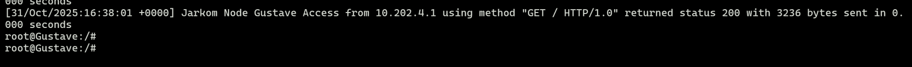
  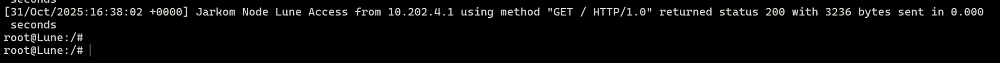
  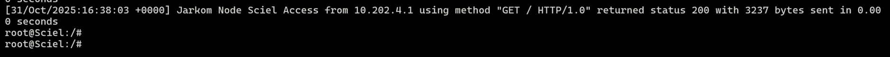

- Explanation

  Cara untuk mengaplikasikan round robin ada pada modul 3 di repository jarkom Arsitektur Jaringan Komputer. Pertama diperlukan untuk menyiapkan upstream yang berisi server-server mana saja yang ingin diberikan pembagian secara merata. 

  `nginx.conf (Alicia)`
  ```sh
  user www-data;
  worker_processes auto;
  worker_cpu_affinity auto;
  pid /tmp/nginx.pid;
  error_log /tmp/error.log;

  events { worker_connections 768; }

  http {
    upstream roundRoobin {
        server 10.202.2.1:8000;  
        server 10.202.2.2:8100; 
        server 10.202.2.3:8200;  
    }
    
    server {
        listen 80 default_server;
        server_name expeditioners.com;
    
      location / {
            proxy_pass http://roundRoobin/;
        }
    
        location /profil_lune {
            proxy_pass http://10.202.2.1/;
        }
    
        location /profil_sciel {
            proxy_pass http://10.202.2.2/;
        }
    
        location /profil_gustave {
            proxy_pass http://10.202.2.3:8080/;
        }
    }
  }
  ```

  Setelah itu, maka pada bagian `location /` atau ketika mengakses `expeditioners.com` akan diarahkan ke website yang terdaftar di upstream (round robin akan langsung diaplikasikan seperti pada screenshot yang terlampir), sehingga load akan terdistribusi merata.

<br>
  
## Problems
Waktu pelaksanaan praktikum pada minggu ETS, dan juga banyaknya kegiatan diluar perkuliahan serta time management yang sedikit keteteran membuat saya mengerjakan praktikum ini sedikit mepet deadline sehingga menurut saya hasilnya kurang maksimal. 

## Revisions (if any)
