[](https://classroom.github.com/a/oYnIPZ_t)
| Name           | NRP        | Kelas     |
| ---            | ---        | ----------|
| Liem, Alfred Haryanto | 5025241100 | Jarkom C |


## Put your topology config image here!

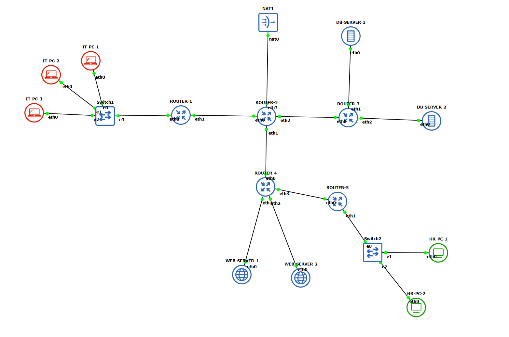

## Put your GNS3 Project file here!

`https://drive.google.com/file/d/1r98zwYeRFplDmMZ_58lv6DXBuHUbFfIR/view?usp=sharing`

<br>

## Soal 1

> Lakukan subnetting pada topologi diatas menggunakan metode VLSM: [Referensi](https://github.com/arsitektur-jaringan-komputer/Modul-Jarkom/tree/master/Modul-4/Subnetting#2-vlsm-variable-length-subnet-masking)  
*Cantumkan juga tabel dan diagram pembagian subnet pada laporan praktikum*.


> _Subnet the topology above using the VLSM method: [Reference](https://github.com/arsitektur-jaringan-komputer/Modul-Jarkom/tree/master/Modul-4/Subnetting#2-vlsm-variable-length-subnet-masking)_  
_Also include the subnet table and diagram in the lab report._

**Answer:**

- Screenshot

  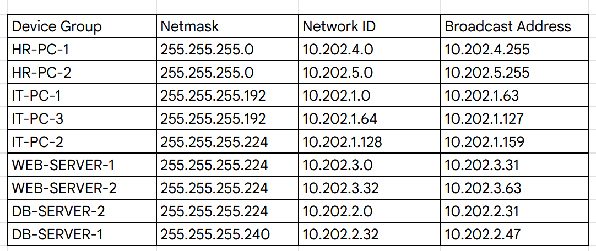

- Explanation

  Subnetting ini berdasarkan pada metode VLSM atau Variable Length Subnet Mask, dimana netmask dibagi berdasarkan netmask terbesar terlebih dahulu baru yang kecil agar bisa memaksimalkan penggunaan IP. Berbeda dengan FLSM atau Fixed-Length Subnet Mask yang besar dari setiap netmask akan menggunakan netmask terbesar sebagai acuan (membuat banyak IP tidak terpakai), metode VLSM cenderung lebih hemat IP karena bisa menyesuaikan besar netmask dari setiap kebutuhan node.

  Berdasarkan kebutuhan IP yang diberikan pada google docs dengan kriteria sebagai berikut : 
  ```
  IT-PC-1 = 50 Host / PC
  IT-PC-2 = 25 Host / PC
  IT-PC-3 = 40 Host / PC
  HR-PC-1 = 250 Host / PC
  HR-PC-2= 200 Host / PC
  DB-Server-1 = 12 Host / PC
  DB-Server-2 = 18 Host / PC
  Web-Server-1 = 25 Host / PC
  Web-Server-2 = 20 Host / PC
  ```

  Maka pembagian netmask sejumlah dengan jumlah netmask yang paling mendekati untuk dapat mengakomodir kriteria tersebut. Contohnya pada IT-PC-1 yang membutuhkan 50 host, sehingga subnet terdekat adalah 255.255.255.192 atau `/26` yang bisa menyediakan sebanyak 62 IP Address, lalu untuk `DB-SERVER-1` yang membutuhkan 12 host maka subnet terdekat adalah 255.255.255.240 atau `/28` yang bisa menyediakan hingga 14 IP Address. Berlaku seterusnya. 

<br>

## Soal 2

> Buatlah agar router-2 dapat melakukan koneksi ke internet. [Dapat menggunakan static routing].

> _Make sure router-2 can connect to the internet. [Can use static routing]._

**Answer:**

- Screenshot

  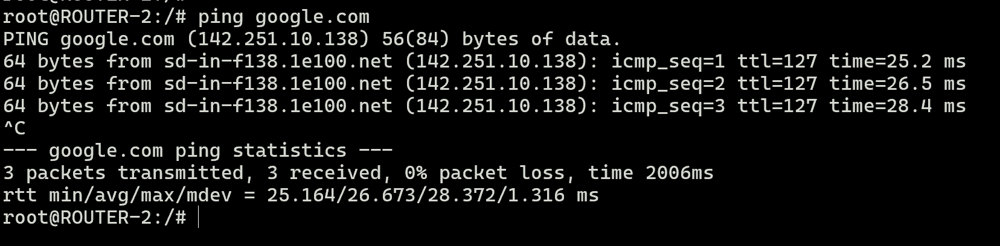

- Explanation

  ``` sh
  auto eth3
  iface eth3 inet dhcp
  ```

  Dengan menambahkan command ini di network configuration `Router 2`, `Router 2` akan meminta alamat IP kepada NAT. Ketika mendapat IP, maka `Router 2` akan menerima default gateway, dns server, dan juga subnet mask yang memungkinkan `Router 2` untuk mengakses internet tanpa harus menambahkan static route secara manual. 

<br>

## Soal 3

> Setelah mengimplementasi subnetting, buatlah agar seluruh topologi dapat terhubung. Lakukan Dynamic Routing pada topologi tersebut.
*Pastikan seluruh node yang ada dapat mengakses internet*.

> _After implementing subnetting, ensure the entire topology is connected. Perform dynamic routing on the topology._  
_Ensure all existing nodes can access the internet._

**Answer:**

- Screenshot

  `Put your screenshot in here`

- Explanation

  Untuk melakukan dynamic routing maka dapat menggunakan command berikut sebagaimana yang juga tercantum pada modul 4.

  ``` zsh
  cd /usr/lib/frr

  ./zebra -d
  ./ripd -d
  ./mgmtd -d

  vtysh

  conf t
  router rip
  ```

  Input akan berupa `network <NID>/<NETMASK>`, yang mana frr akan secara otomatis melakukan routing sehingga kita hanya perlu menginput node mana yang ingin dihubungkan, berikut konfigurasi untuk setiap router : 

  `Router1`
  ``` C
  network 10.202.0.0/30
  network 10.202.1.0/26
  network 10.202.1.64/26
  network 10.202.1.128/27
  ```

  `Router 2`
  ``` C
  network 10.202.0.0/30
  network 10.202.0.4/30
  network 10.202.0.8/30
  network 10.202.4.0/24
  network 10.202.5.0/24
  ```

  `Router 3`
  ``` C
  network 10.202.0.4/30
  network 10.202.2.0/27
  network 10.202.2.32/28
  ```

  `Router 4`
  ``` C
  network 10.202.0.8/30
  network 10.202.0.12/30
  network 10.202.3.32/27
  network 10.202.3.0/27
  ```

  `Router 5`
  ``` C
  network 10.202.0.12/30
  network 10.202.5.0/24
  network 10.202.4.0/24
  ```

  Pada setiap router diberikan juga command ini agar setiap client bisa mendapat akses internet.

  ``` sh
  sysctl -w net.ipv4.ip_forward=1 
  ```

  Konfigurasi ini merupakan realisasi dari subnet yang sudah 

<br>

## Soal 4

> Lakukan setup web server dengan file html di attachment berikut: [ Attachment ](https://drive.google.com/file/d/199qwfTNJCkxDV7mdO-MsaDdApkmKsnAG/view?usp=sharing)  menggunakan nginx pada “Web-Server-1” dan “Web-Server-2”.  
*Config dibebaskan kepada praktikkan dengan catatan menggunakan port 80*.

> _Set up a web server with the HTML file in the following attachment: [ Attachment ](https://drive.google.com/file/d/199qwfTNJCkxDV7mdO-MsaDdApkmKsnAG/view?usp=sharing) using nginx on “Web-Server-1” and “Web-Server-2”._
_Configuration is free to practice, but note that it uses port 80._

**Answer:**

- Screenshot

  
  
  

- Explanation

  Script `nginx.conf` untuk kedua web server node : 

  ``` sh
  user www-data;
  worker_processes auto;
  worker_cpu_affinity auto;
  pid /tmp/nginx.pid;
  error_log /myscript/mylogs/error.log;

  events { worker_connections 768; }

  http {
      server {
          listen 80;
          server_name _;

          root /myscript/myconfig;
          index index.html;

          location / {
              try_files $uri $uri/ =404;
          }
      }
  }
  ```

  Dengan file `index.html` yang diberikan pada soal yang berisi : 

  ``` html
  <!DOCTYPE html>
  <html lang="en">
  <head>
      <meta charset="UTF-8">
      <meta name="viewport" content="width=device-width, initial-scale=1.0">
      <title>Simple Page</title>
      <style>
          body {
              margin: 0;
              padding: 0;
              font-family: Arial, sans-serif;
              background: #f5f5f5;
              display: flex;
              justify-content: center;
              align-items: center;
              height: 100vh;
              color: #333;
          }
          .container {
              text-align: center;
              padding: 20px 30px;
              background: white;
              border-radius: 8px;
              box-shadow: 0 2px 10px rgba(0,0,0,0.1);
          }
          h1 {
              margin-bottom: 10px;
              font-size: 24px;
              font-weight: 600;
          }
          p {
              margin: 0;
              font-size: 14px;
              color: #555;
          }
      </style>
  </head>
  <body>
      <div class="container">
          <h1>Hello!</h1>
          <p>Web Server | Jarkom Praktikum Modul 4 </p>
      </div>
  </body>
  </html>
  ```

  Dan script `start_http.sh` untuk menjalankan service nginx : 

  ``` sh
  #!/bin/bash
  nginx -c /myscript/myconfig/nginx.conf -g 'daemon off;'
  ```

  Setelah melakukan setup `nginx` dan juga `index.html`, maka dilakukan test ping seperti pada gambar yang tertera, menunjukan bahwa setup web server sudah berhasil. 

<br>

## Soal 5

> Kalian diminta untuk melakukan drop semua paket TCP yang masuk  ke subnet HR dengan port 1337 dan 4444. Lakukan testing dengan netcat.

> _You are asked to drop all incoming TCP packets to the HR subnet with ports 1337 and 4444. Test with netcat._

**Answer:**

- Screenshot

  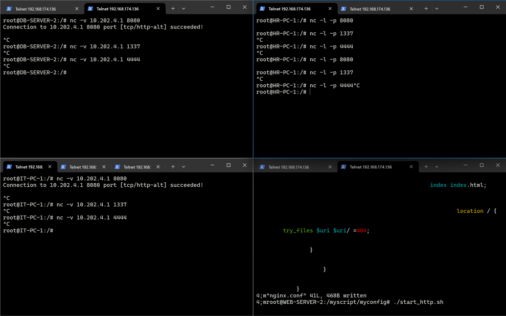
  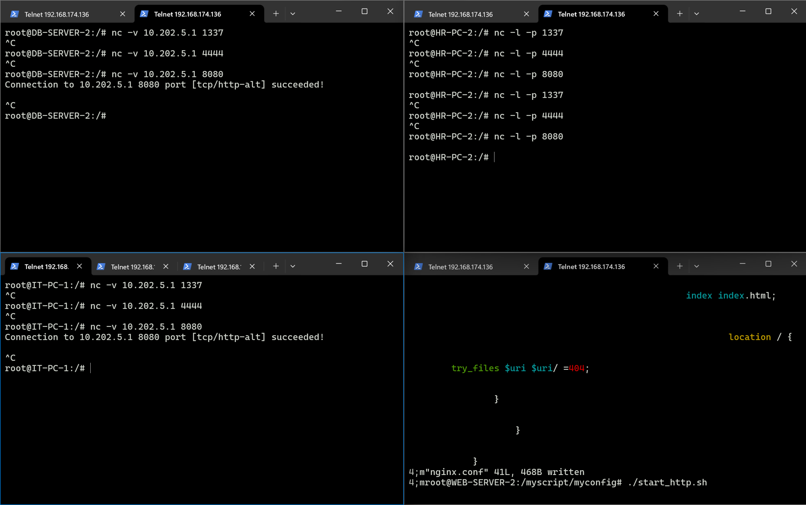

- Explanation

  ``` c
  iptables -t mangle -A PREROUTING -d 10.202.4.0/24 -p tcp -m multiport --dports 1337,4444 -j DROP

  iptables -t mangle -A PREROUTING -d 10.202.5.0/24 -p tcp -m multiport --dports 1337,4444 -j DROP
  ```

  `-t mangle` memilih tabel mangle yang biasanya digunakan untuk mengatur izin routing. `-A PREROUTING` berguna untuk "memprioritaskan" aturan ini, sehingga ketika sebuah packet diterima, config tersebut langsung ter-apply. `-d 10.202.x.0/24` merupakan target tempat dimana packet akan di cek (mencakup HR-1 dan HR-2). `-p tcp` hanya akan memfilter packet TCP, dan `-m multiport --dports 1337,4444` untuk menandai port yang diinginkan. `-j DROP` artinya semua packet yang terfilter sesuai dengan kriteria akan di drop.

<br>

## Soal 6

> Lakukan pembatasan sehingga koneksi SSH pada semua Web Server hanya dapat dilakukan oleh user yang berada pada node IT-PC-1, IT-PC-2, dan IT-PC-3. 

> _Implement restrictions so that SSH connections to all Web Servers can only be made by users on nodes IT-PC-1, IT-PC-2, and IT-PC-3._

**Answer:**

- Screenshot
  Test ping dari `IT-PC-1`, `IT-PC-2`, dan `IT-PC-3`
  
  
  
  
  
  

  Test ping dari node `DB-SERVER` dan `HR-PC`
  
  

- Explanation

  ``` c
  iptables -A INPUT -m state --state ESTABLISHED,RELATED -j ACCEPT
  iptables -A INPUT -p tcp -s 10.202.1.0/26 --dport 22 -j ACCEPT
  iptables -A INPUT -p tcp -s 10.202.1.128/27 --dport 22 -j ACCEPT
  iptables -A INPUT -p tcp -s 10.202.1.64/26 --dport 22 -j ACCEPT
  iptables -A INPUT -p tcp --dport 22 -j DROP
  ```

  Config tersebut diaplikasikan pada `WEB-SERVER` 1 dan 2, karena hanya diperbolehkan dilakukan oleh user dari node `IT-PC` 1, 2, dan 3, maka untuk ip dalam range yang ada dalam config tersebut diperbolehkan (karena merupakan ip yang masih berada dibawah naungan `IT-PC`). IP selain pada config akan di DROP.

<br>

## Soal 7

> Semua subnet hanya dapat mengakses semua DB-Server pada port 80 dan 443 (DB-Server-1 dan DB-Server-2) pada hari Senin-Sabtu, pukul 07:00- 22:00.

> _All subnets can only access all DB-Servers on ports 80 and 443 (DB-Server-1 and DB-Server-2) on Monday-Saturday, 07:00-22:00._

**Answer:**

- Screenshot

  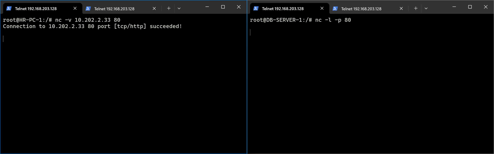
  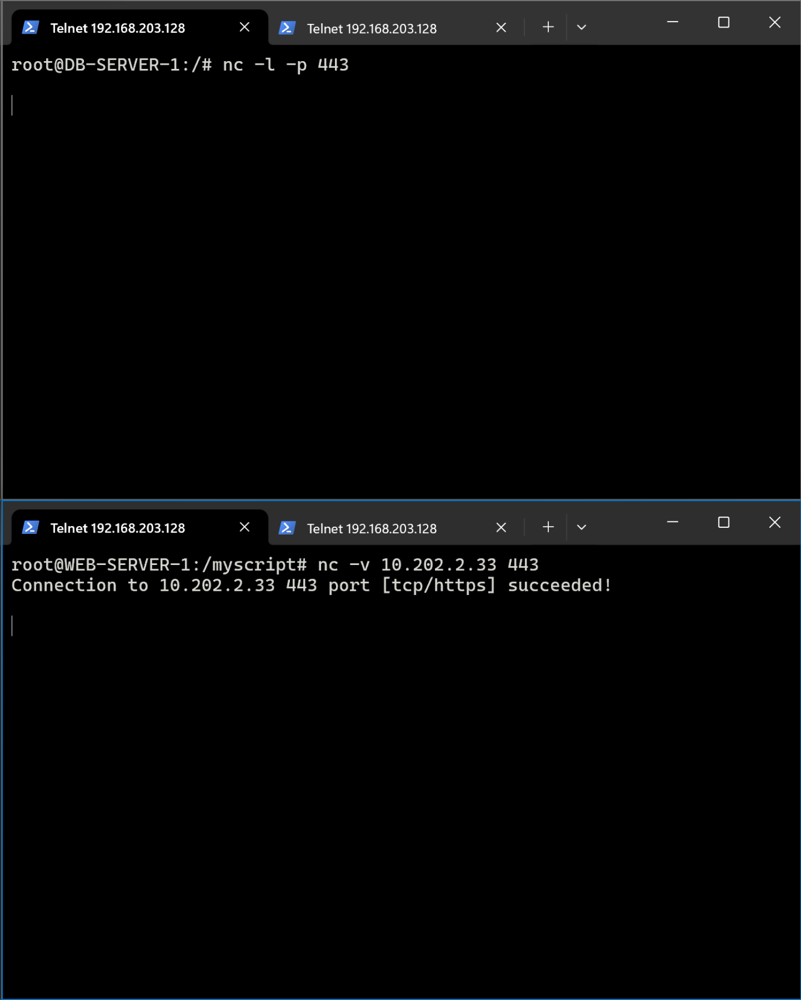
  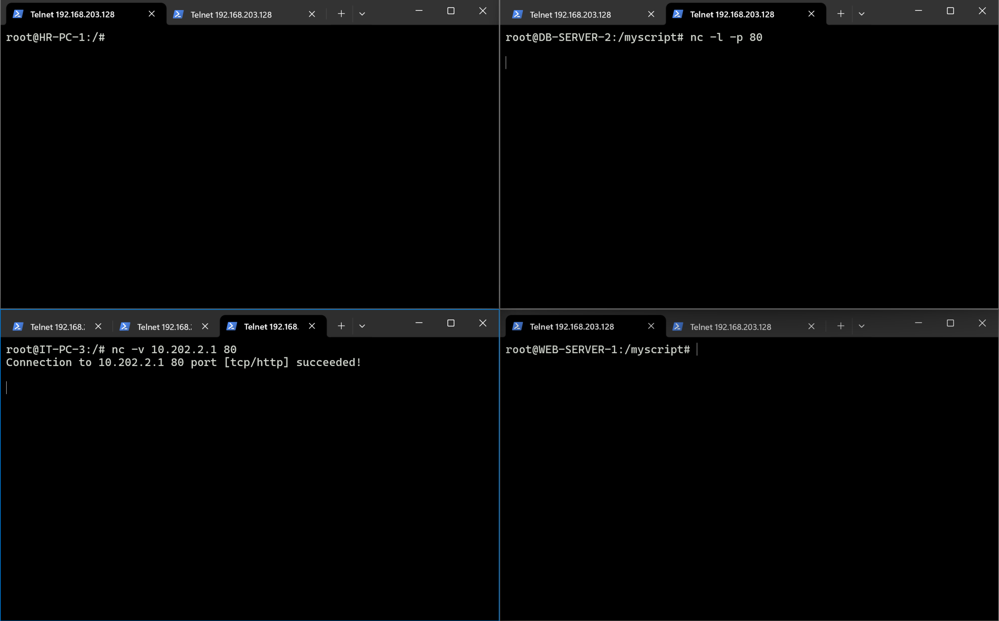
  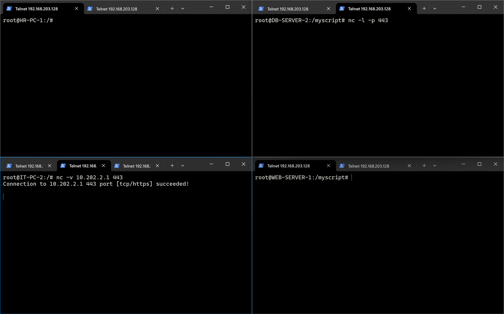
  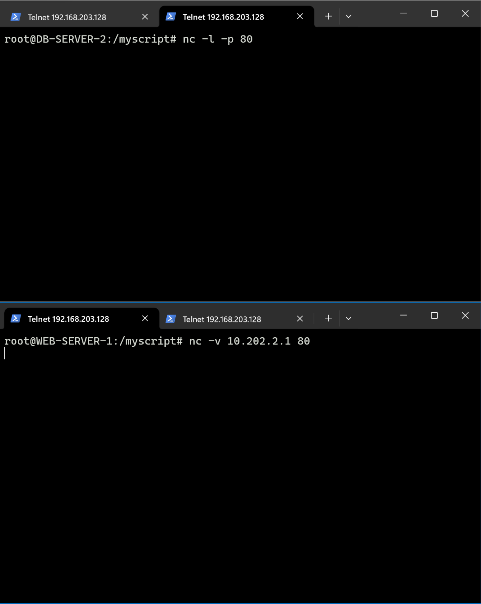
  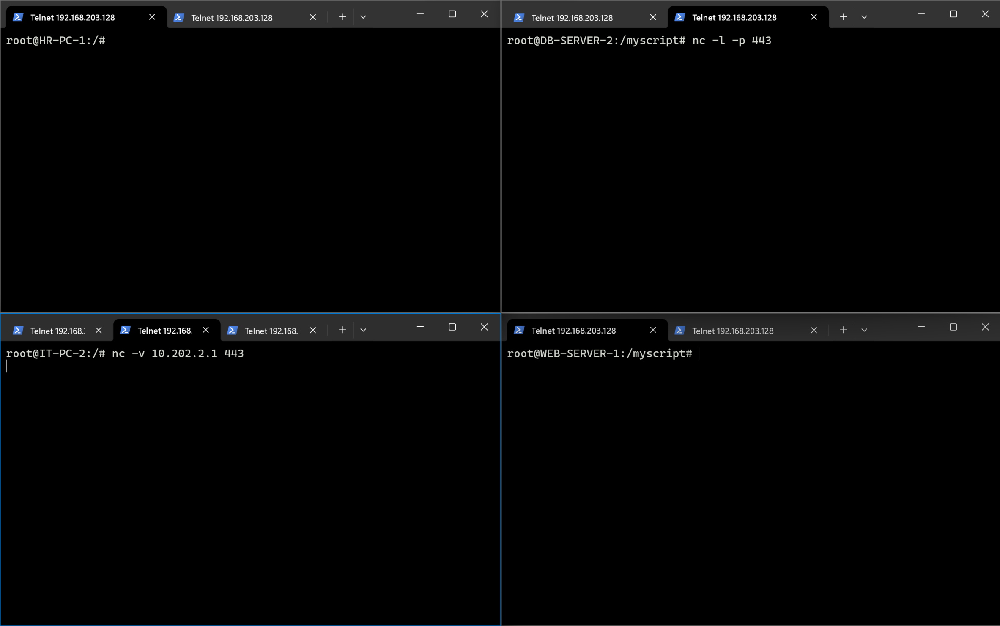
  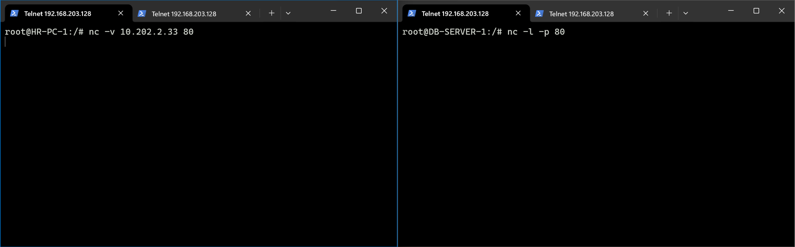
  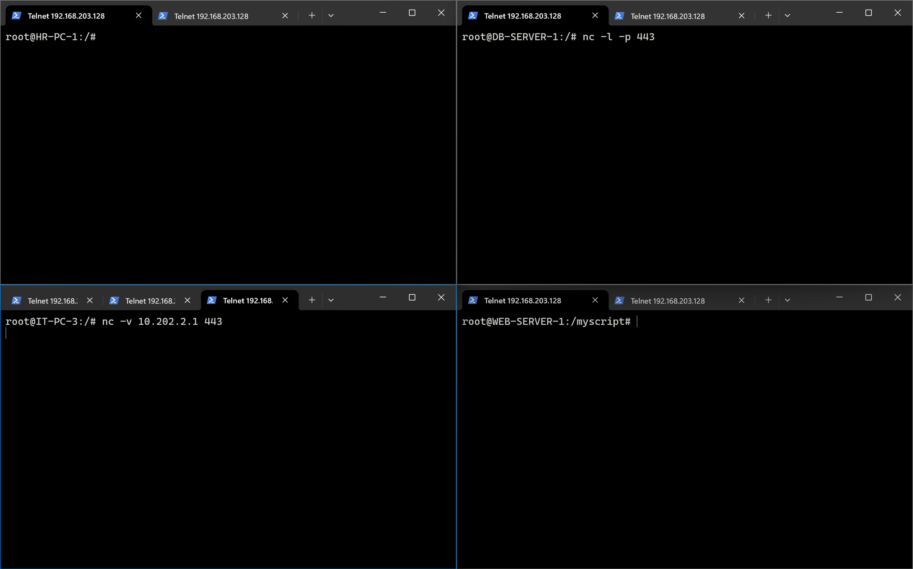

- Explanation

  Configuration :
  ```c
  iptables -A INPUT -p tcp -m multiport --dports 80,443 -m time --timestart 07:00 --timestop 20:00 --weekdays Mon,Tue,Wed,Thu,Fri,Sat -j ACCEPT

  iptables -A INPUT -p tcp -m multiport --dports 80,443 -j DROP
  ```

  Configuration untuk testing : 
  ```c
  iptables -A INPUT -p tcp -m multiport --dports 80,443 -m time --timestart 07:00 --timestop 07:05 --weekdays Mon,Tue,Wed,Thu,Fri,Sat -j ACCEPT

  iptables -A INPUT -p tcp -m multiport --dports 80,443 -j DROP
  ```

  Untuk mengatur akses diperbolehkan pada waktu tertentu maka dapat menggunakan `-m time`, lalu `--timestart --timestop` yang menandakan jam, dan `--weekdays` untuk menandakan hari. Kombinasi tersebut dapat digunakan untuk memenuhi keinginan soal yang menginginkan pada hari dan jam tertentu sesuai dengan yang tertera. 

<br>

## Soal 8

> Kemudian, buat agar “Web-Server-1” dan “Web-Server-2” hanya memperbolehkan traffic bertipe HTTP.

> _Then, make sure that “Web-Server-1” and “Web-Server-2” only allow HTTP type traffic._

**Answer:**

- Screenshot

  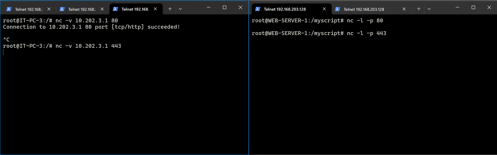
  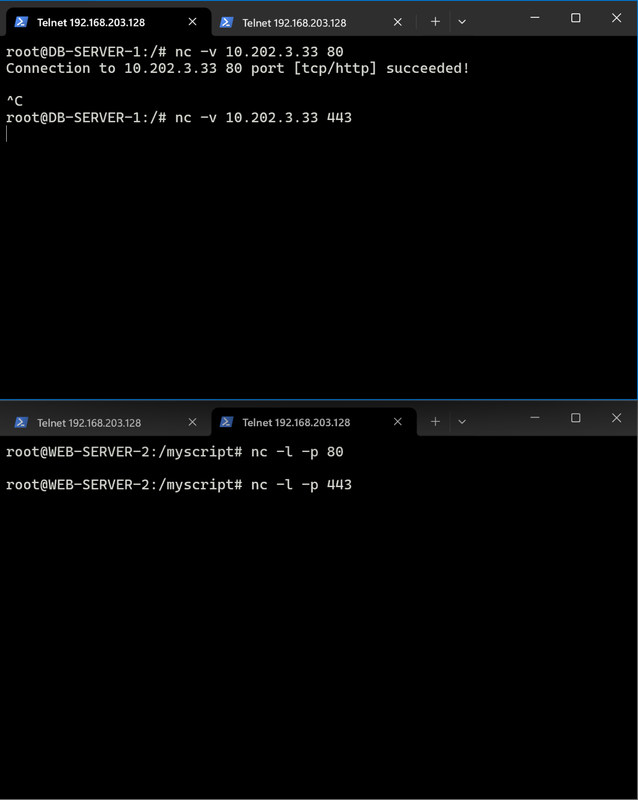

- Explanation

  Configuration pada kedua `WEB-SERVER`
  ```c
  iptables -A INPUT -p tcp --dport 80 -j ACCEPT
  iptables -A INPUT -p tcp --dport 443 -j DROP
  iptables -A INPUT -p tcp -j DROP
  ```

  Karena http berada pada port 80 dan port 443 merupakan port https, maka hanya perlu melakukan konfigurasi dimana akses pada port 80 akan di ACCEPT, sedangkan akses pada port 443 akan di DROP, yang secara tidak langsung hanya akan "memperbolehkan traffic bertipe http saja". 

<br>

## Soal 9

> Pilih salah satu Subnet dan lakukan blokir terhadap semua request protokol ICMP (ping) dari luar subnet terhadap subnet tersebut.

> _Select one of the Subnets and block all ICMP protocol requests (ping) from outside the subnet to that subnet._

**Answer:**

- Screenshot

  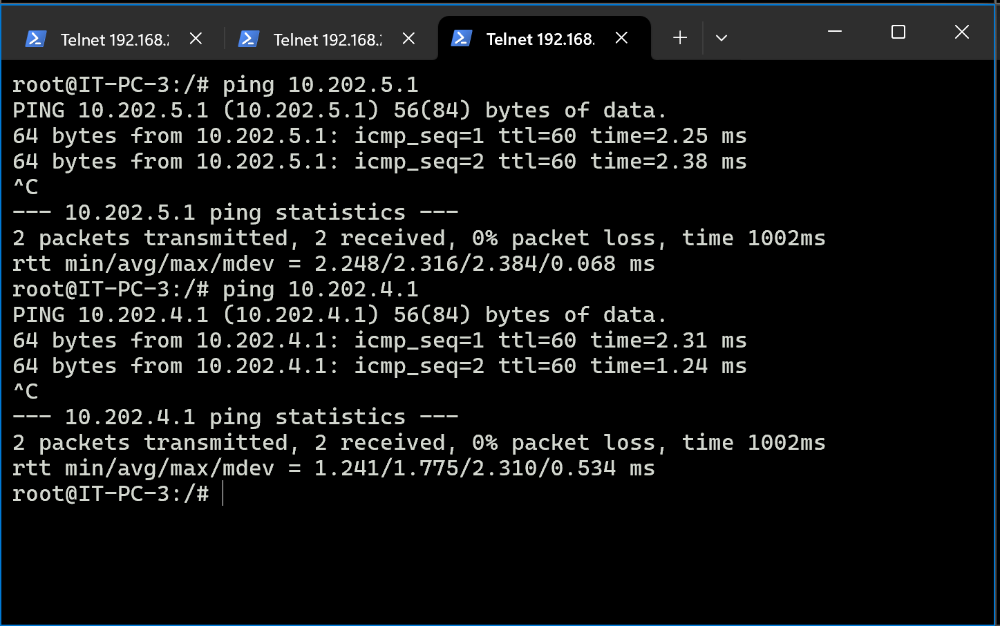
  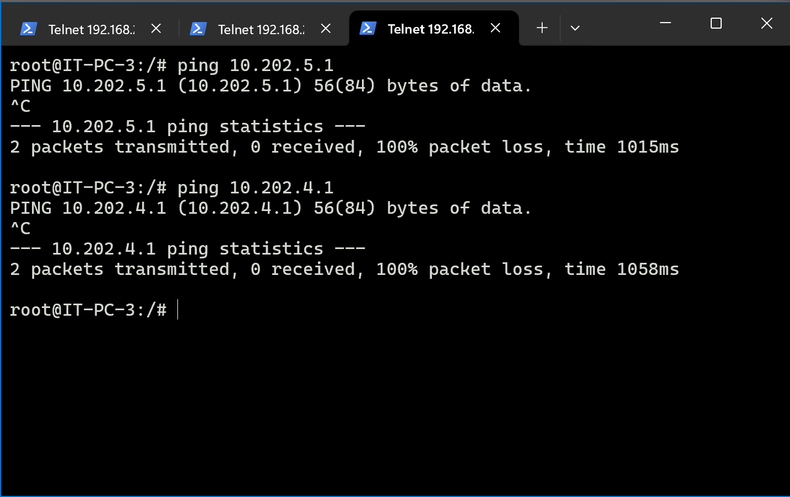

- Explanation

  Configuration : 
  ``` c
  iptables -A FORWARD -m state --state ESTABLISHED,RELATED -j ACCEPT
  iptables -A FORWARD -p icmp -s 10.202.4.0/24 -d 10.202.4.0/24 -j ACCEPT
  iptables -A FORWARD -p icmp -s 10.202.4.0/24 -j ACCEPT
  iptables -A FORWARD -p icmp -d 10.202.4.0/24 -j DROP

  iptables -A FORWARD -p icmp -s 10.202.5.0/24 -d 10.202.5.0/24 -j ACCEPT
  iptables -A FORWARD -p icmp -s 10.202.5.0/24 -j ACCEPT
  iptables -A FORWARD -p icmp -d 10.202.5.0/24 -j DROP
  ```

  `-p icmp` artinya akan memfilter packet dari icmp protocol. `-d <ip>` merupakan target ip. Karena diminta untuk melakukan blokir dari luar terhadap subnet tersebut, artinya config ini dapat diaplikasikan pada router untuk memfilter semua ip. Karena ada perintah DROP, maka semua packet yang melewati router tersebut dari ip manapun yang tujuan/destination nya adalah subnet 4.x atau 5.x akan di drop. Namun karena tidak ada keterangan bahwa dari subnet 4.x dan 5.x tidak boleh melakukan ping keluar, maka tetap ada konfigurasi yang memperbolehkan subnet 4.x dan 5.x untuk ping keluar, dan juga melakukan ping di sesama subnet dibawah naungan router 5. 

<br>

## Soal 10

> Konfigurasikan fitur logging untuk melakukan log terhadap seluruh paket yang di-DROP pada lalu lintas setiap node.

> _Configure the logging feature to log all dropped packets on each node's traffic._

**Answer:**

- Screenshot

  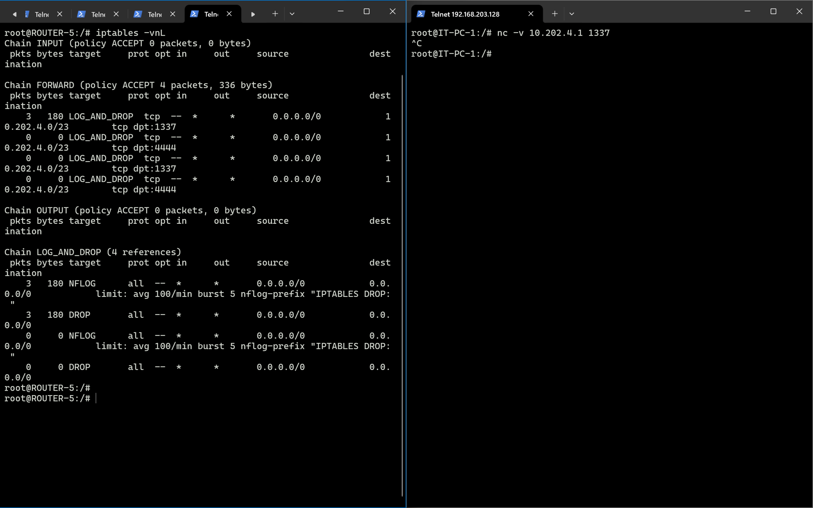
  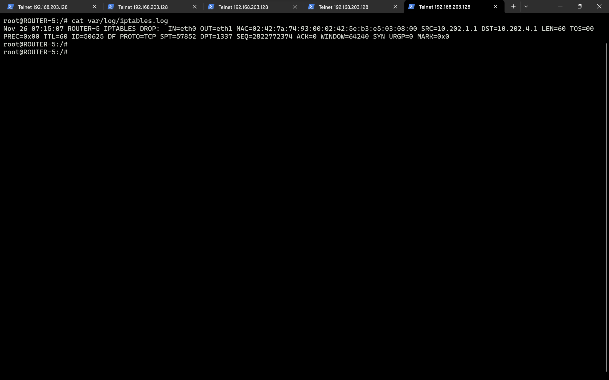

- Explanation

  Pertama perlu untuk melakukan instalasi untuk `ulogd` menggunakan config ini

  `apt-get install ulogd2 -y`

  Setelah itu, diperlukan untuk melakukan perubana pada `ulogd.conf` untuk mengubah output dari hasil log
  ``` conf
  [emu1]
  file=/var/log/iptables.log
  sync=1 
  ```

  Untuk melakukan pengetesan, maka dicoba untuk melakukan drop pada packet yang mengarah ke subnet dibawah naungan `router 5`, yakni subnet 4.x dan 5.x
  ``` c
  iptables -A FORWARD -p tcp -d 10.202.4.0/23 --dport 1337 -j LOG_AND_DROP
  iptables -A FORWARD -p tcp -d 10.202.4.0/23 --dport 4444 -j LOG_AND_DROP

  iptables -A FORWARD -p tcp -d 10.202.5.0/23 --dport 1337 -j LOG_AND_DROP
  iptables -A FORWARD -p tcp -d 10.202.5.0/23 --dport 4444 -j LOG_AND_DROP
  ```

  Untuk mengaktifkan `ulogd` dapat menggunakan command ini pada router
  `ulogd -d -c /path/to/ulogd.conf`

  Setelah dilakukan test nc ke subnet 4.x dan 5.x, hasil dapat dicek menggunakan `cat var/log/iptables.log` untuk ulogd, dan `iptables -vnL` pada iptables langsung. 

<br>
  
## Problems
Karena bertabrakan dengan kegiatan pribadi, maka pengerjaan modul ini kurang maksimal sehingga hasilnya juga kurang maksimal. Selain itu, terdapat kesalahan dalam network configuration yang membuat progress sempat terhambat pada soal nomor 6.

## Revisions (if any)
Memperbaiki untuk nomor 9 yang sebelumnya masih bisa di ping dari node lain, dan menambahkan jawaban untuk nomor 10.