[](https://classroom.github.com/a/aRvIU2lf)
| Name           | NRP        | Kelas     |
| ---            | ---        | ----------|
| Liem, Alfred Haryanto | 5025241100 | Jarkom C |


## Put your topology config image here!

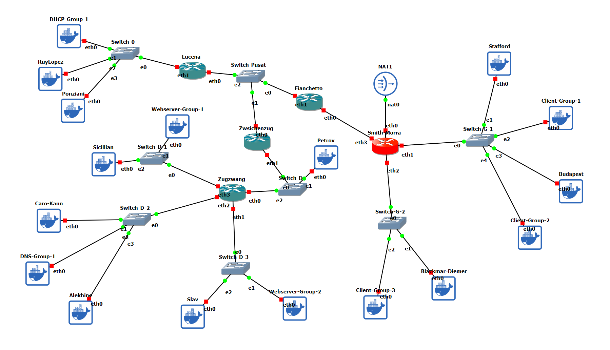

## Put your GNS3 Project file here!

`https://drive.google.com/file/d/1x3s3Nuw4iwAqBZe1YBNmfBot9StQELe4/view?usp=sharing`

<br>

## Soal 1

> Menggunakan metode VLSM, buatlah pembagian subnet untuk masing-masing gedung dengan cara yang seefisien mungkin!

> _Using the VLSM method, create subnets for each building as efficiently as possible!_

**Answer:**

- Screenshot

  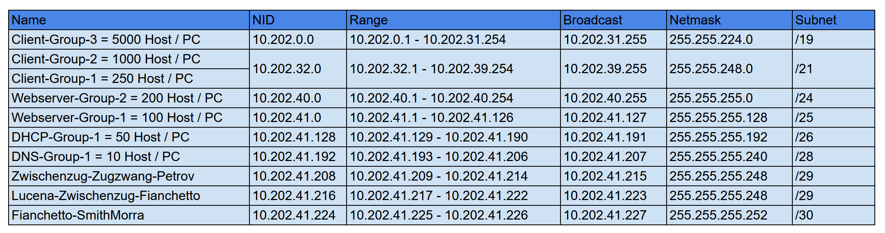
  
  

- Explanation

  Karena VLSM merupakan metode pembagian subnet yang bersifat dinamis, maka dapat diurutkan terlebih dahulu dari kebutuhan IP yang paling besar, yakni `Client-Group-3` yang membutuhkan 5000 host dan seterusnya hingga `DNS-Group-1` dan juga pembagian ip untuk router. 

<br>

## Soal 2

> Konfigurasi semua router agar bisa terhubung ke semua jaringan. Gunakan static routing dan uji dengan melakukan ping dari **Budapest** ke **Alekhine** dan dari **Ponziani** ke **Sicilian**!

> _Configure all routers to connect to all networks. Use static routing and perform testing by pinging from **Budapest** to **Alekhine** and from **Ponziani** to **Sicilian**!_

**Answer:**

- Screenshot


  Test ping dari `Budapest` ke `Alekhine`
  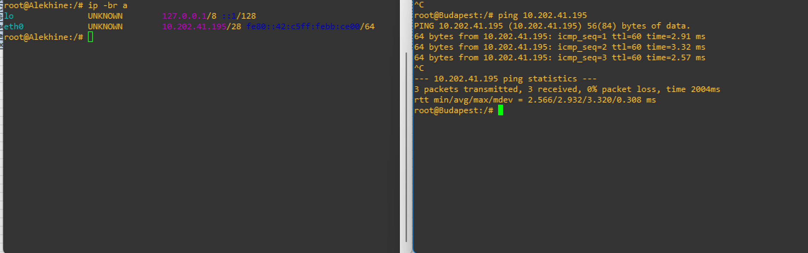

  Test ping dari `Ponziani` ke `Sicilian`
  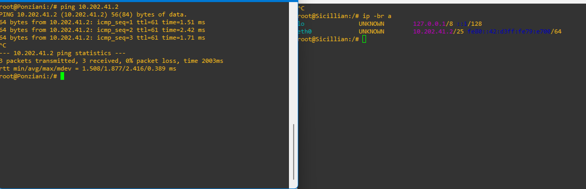

- Explanation

  Konfigurasi static routing pada setiap router adalah sebagai berikut : 

  `Zugzwang`
  ```
  ip route add 10.202.41.128/26 via 10.202.41.209
  ip route add 10.202.32.0/21 via 10.202.41.209
  ip route add 10.202.0.0/19 via 10.202.41.209
  ip route add 10.202.41.208/29 via 10.202.41.209
  ip route add 10.202.41.224/30 via 10.202.41.209
  ```

  `Zwischenzug`
  ```
  ip route add 10.202.41.128/26 via 10.202.41.219
  ip route add 10.202.32.0/21 via 10.202.41.217
  ip route add 10.202.0.0/19 via 10.202.41.217
  ip route add 10.202.41.224/30 via 10.202.41.217
  ip route add 10.202.41.0/25 via 10.202.41.211
  ip route add 10.202.41.192/28 via 10.202.41.211
  ip route add 10.202.40.0/24 via 10.202.41.211
  ```

  `Lucena`
  ```
  ip route add 10.202.41.208/29 via 10.202.41.218
  ip route add 10.202.40.0/24 via 10.202.41.218
  ip route add 10.202.41.192/28 via 10.202.41.218
  ip route add 10.202.41.0/25 via 10.202.41.218
  ip route add 10.202.32.0/21 via 10.202.41.217
  ip route add 10.202.0.0/19 via 10.202.41.217
  ip route add 10.202.41.224/30 via 10.202.41.217
  ```

  `Smith-Morra`
  ```
  ip route add 10.202.41.0/25 via 10.202.41.226
  ip route add 10.202.41.128/26 via 10.202.41.226
  ip route add 10.202.41.192/28 via 10.202.41.226
  ip route add 10.202.40.0/24 via 10.202.41.226
  ip route add 10.202.41.208/29 via 10.202.41.226
  ip route add 10.202.41.216/29 via 10.202.41.226
  ```

  `Fianchetto`
  ```
  ip route add 10.202.32.0/21 via 10.202.41.225
  ip route add 10.202.0.0/19 via 10.202.41.225
  ip route add 10.202.41.208/29 via 10.202.41.218
  ip route add 10.202.41.128/26 via 10.202.41.219
  ip route add 10.202.41.0/25 via 10.202.41.218
  ip route add 10.202.41.192/28 via 10.202.41.218
  ip route add 10.202.40.0/24 via 10.202.41.218
  ```

<br>

## Soal 3

> Berikan seluruh client (**Blackmar-Diemer, Budapest,** dan **Stafford**) IP secara dinamis dari DHCP. Range IP dibebaskan, namun tunjukkan bahwa mereka mendapatkan IP secara dinamis!

> _Assign all clients (**Blackmar-Diemer, Budapest,** and **Stafford**) dynamic IP addresses via DHCP. You may use any IP range you would like, but prove that they receive IP addresses dynamically!_

**Answer:**

- Screenshot

  Dynamic IP address di `Blackmar-Diemer`
  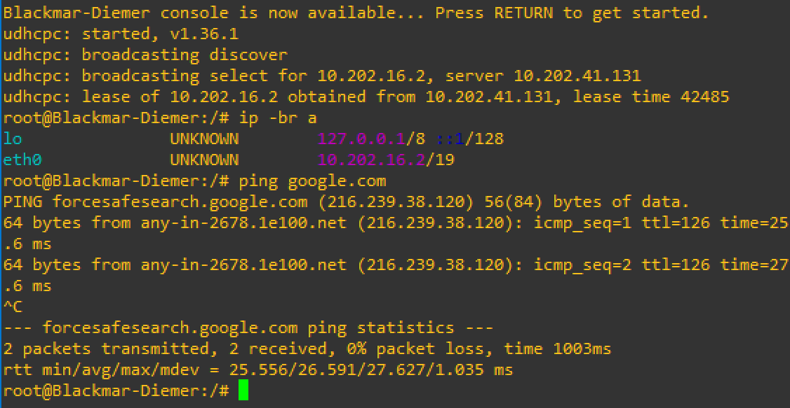

  Dynamic IP address di `Budapest`
  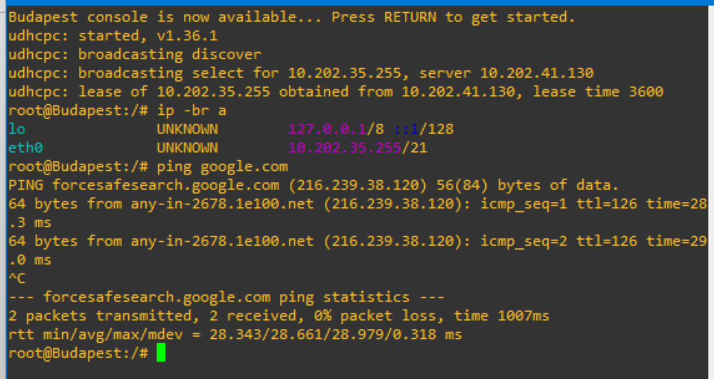
  
  Dynamic IP address di `Stafford`
  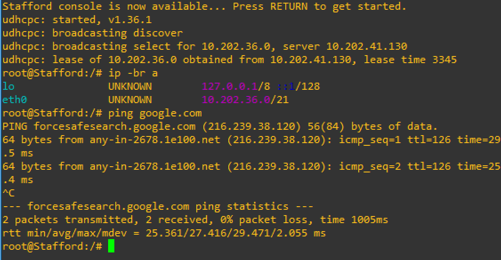

- Explanation

  Pada `dhcpd.conf` untuk DHCP master (Ponziani) diubah menjadi seperti berikut : 
  ``` conf
  failover peer "failover-partner" {
     primary;
     address 10.202.41.131;
     peer address 10.202.41.130;
     max-response-delay 60;
     max-unacked-updates 10;
     mclt 3600;
     split 255;	
     load balance max seconds 3;
  }

  subnet 10.202.0.0 netmask 255.255.224.0 {
    option routers 10.202.0.1;
    option broadcast-address 10.202.31.255;
    pool {
          failover peer "failover-partner";
        range 10.202.0.5 10.202.31.254;
      }
  }

  subnet 10.202.32.0 netmask 255.255.248.0 {
    option routers 10.202.32.1;
    option broadcast-address 10.202.39.255;
    pool {
          failover peer "failover-partner";
        range 10.202.32.5 10.202.39.254;
      }
  }

  subnet 10.202.40.0 netmask 255.255.255.0 {
    option routers 10.202.40.1;
    option broadcast-address 10.202.40.255;
    pool {
          failover peer "failover-partner";
        range 10.202.40.5 10.202.40.254;
      }
  }

  subnet 10.202.41.0 netmask 255.255.255.128 {
      option routers 10.202.41.1;
      option broadcast-address 10.202.41.127;
      pool {
          failover peer "failover-partner";
        range 10.202.41.5 10.202.41.126;
      }
  }

  subnet 10.202.41.128 netmask 255.255.255.192 {
      option routers 10.202.41.129;
      option broadcast-address 10.202.41.191;
      pool {
          failover peer "failover-partner";
        range 10.202.41.135 10.202.41.190;
      }
  }

  subnet 10.202.41.192 netmask 255.255.255.240 {
      option routers 10.202.41.193;
      option broadcast-address 10.202.41.207;
      pool {
          failover peer "failover-partner";
        range 10.202.41.198 10.202.41.206;
      }
  }
  ```

  Untuk `dhcpd.conf` pada DHCP slave (RuyLopez) dapat diubah menjadi seperti berikut : 
  ``` conf
  failover peer "failover-partner" {
      secondary;
      address 10.202.41.130;
      peer address 10.202.41.131;
      max-response-delay 60;
      max-unacked-updates 10;
      mclt 3600;
  }

  subnet 10.202.0.0 netmask 255.255.224.0 {
    option routers 10.202.0.1;
    option broadcast-address 10.202.31.255;
    pool {
          failover peer "failover-partner";
        range 10.202.0.5 10.202.31.254;
      }
  }

  subnet 10.202.32.0 netmask 255.255.248.0 {
    option routers 10.202.32.1;
    option broadcast-address 10.202.39.255;
    pool {
          failover peer "failover-partner";
        range 10.202.32.5 10.202.39.254;
      }
  }

  subnet 10.202.40.0 netmask 255.255.255.0 {
    option routers 10.202.40.1;
    option broadcast-address 10.202.40.255;
    pool {
          failover peer "failover-partner";
        range 10.202.40.5 10.202.40.254;
      }
  }

  subnet 10.202.41.0 netmask 255.255.255.128 {
      option routers 10.202.41.1;
      option broadcast-address 10.202.41.127;
      pool {
          failover peer "failover-partner";
        range 10.202.41.5 10.202.41.126;
      }
  }

  subnet 10.202.41.128 netmask 255.255.255.192 {
      option routers 10.202.41.129;
      option broadcast-address 10.202.41.191;
      pool {
          failover peer "failover-partner";
        range 10.202.41.135 10.202.41.190;
      }
  }

  subnet 10.202.41.192 netmask 255.255.255.240 {
      option routers 10.202.41.193;
      option broadcast-address 10.202.41.207;
      pool {
          failover peer "failover-partner";
        range 10.202.41.198 10.202.41.206;
      }
  }
  ```

  Pada `/etc/default/isc-dhcp-server` setiap DHCP server, bagian `INTERFACESv4` diubah menjadi seperti berikut : 
  ``` conf
  INTERFACESv4="eth0"
  ```

  Untuk menyebarkan ke subnet - subnet lain, maka di tiap router diperlukan DHCP relay, berikut konfigurasi untuk setiap router : 
  ``` conf
  #lucena
  SERVERS="10.202.41.131 10.202.41.130"
  INTERFACES="eth0 eth1"
  OPTIONS=""

  #zwischenzug
  SERVERS="10.202.41.131 10.202.41.130"
  INTERFACES="eth0 eth1"
  OPTIONS=""

  #zugzwang
  SERVERS="10.202.41.131 10.202.41.130"
  INTERFACES="eth0 eth1 eth2 eth3"
  OPTIONS=""

  #fianchetto
  SERVERS="10.202.41.131 10.202.41.130"
  INTERFACES="eth0 eth1"
  OPTIONS=""

  #smith-morra
  SERVERS="10.202.41.131 10.202.41.130"
  INTERFACES="eth1 eth2 eth3"
  OPTIONS=""
  ```

  Setelah konfigurasi untuk DHCP server dan DHCP relay selesai dilakukan, maka pada network config client dapat diubah menjadi seperti berikut agar dapat mendapatkan ip dari DHCP server. 
  ``` conf
  auto eth0
  iface eth0 inet dhcp
  up echo nameserver 192.168.122.1 > /etc/resolv.conf
  ```

  Bila sudah, maka hasilnya setiap client akan mendapat ip secara dinamis, seperti pada gambar yang dilampirkan. 

<br>

## Soal 4

> Berikan web server **Slav** dan **Sicilian** IP address yang tetap/fixed dari DHCP. 

> _Assign **Slav** and **Sicilian** web servers fixed IP addresses via DHCP._

**Answer:**

- Screenshot

  Fixed IP address di `Sicillian`
  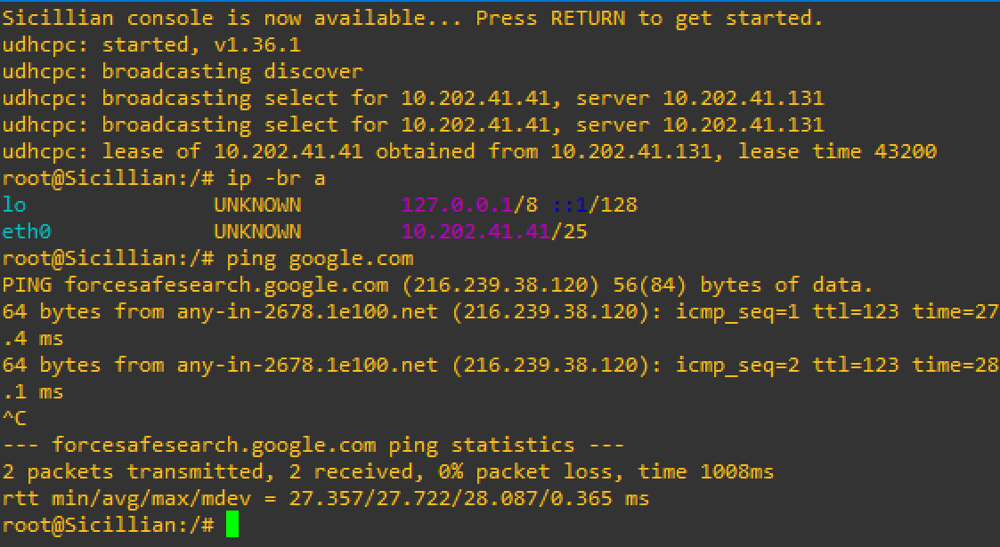
  Fixed IP address di `Slav`
  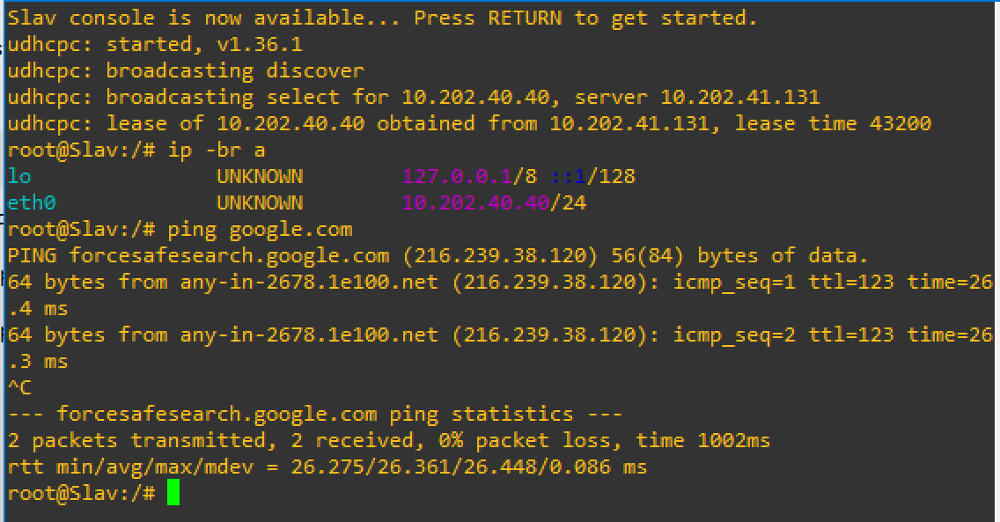

- Explanation

  Karena diminta untuk memberikan fixed IP address, maka harus menggunakan MAC address dari node `Slav` dan `Sicillian`, dengan menambahkan config berikut pada network config kedua node tersebut

  Network config pada `Sicillian`
  ``` conf
  auto eth0
  iface eth0 inet dhcp
  up echo nameserver 192.168.122.1 > /etc/resolv.conf

  hwaddress ether 02:42:d3:79:e7:01  #--> menambahkan line ini
  ```

  Network config pada `Slav`
  ``` conf
  auto eth0
  iface eth0 inet dhcp
  up echo nameserver 192.168.122.1 > /etc/resolv.conf

  hwaddress ether 02:42:13:f0:e2:02 #--> menambahkan line ini
  ```


  Lalu, melakukan update pada DHCP master dan slave dengan mengupdate config ada 2 blok code berikut 
  ``` conf
  subnet 10.202.40.0 netmask 255.255.255.0 {
      option routers 10.202.40.1;
      option broadcast-address 10.202.40.255;
      pool {
          failover peer "failover-partner";
        range 10.202.40.5 10.202.40.254;
      }
      
      host Slav {
          hardware ethernet 02:42:13:f0:e2:02;
          fixed-address 10.202.40.40;
      }
  }

  subnet 10.202.41.0 netmask 255.255.255.128 {
      option routers 10.202.41.1;
      option broadcast-address 10.202.41.127;
      pool {
          failover peer "failover-partner";
        range 10.202.41.5 10.202.41.126;
      }
      host Sicillian {
          hardware ethernet 02:42:d3:79:e7:01;
          fixed-address 10.202.41.41;
      }
  }
  ```

<br>

## Soal 5

> Buatlah konfigurasi untuk domain:  
**parkov.com** → IP Node **Slav**  
**paskarov.com** → IP Node **Sicilian** 
Pada **DNS Master Caro-Kann.** Tambahkan juga subdomain www untuk kedua domain tersebut.

> _Configure the domains:  
**parkov.com** → **Slav** Node IP  
**paskarov.com** → **Sicilian** Node IP  
On the **Caro-Kann DNS Master,** then add the www subdomain for both domains._

**Answer:**

- Screenshot

  Test ping ke `parkov.com` dan `paskarov.com`
  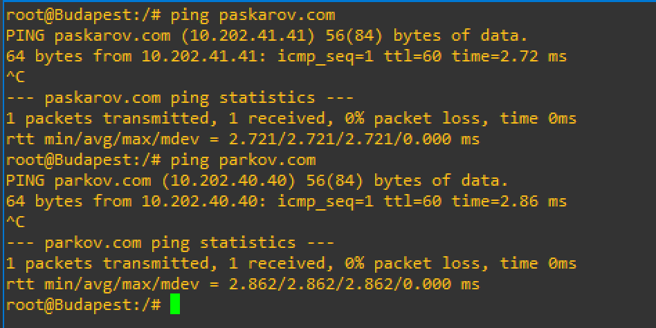

  Test ping ke `www.parkov.com` dan `www.paskarov.com`
  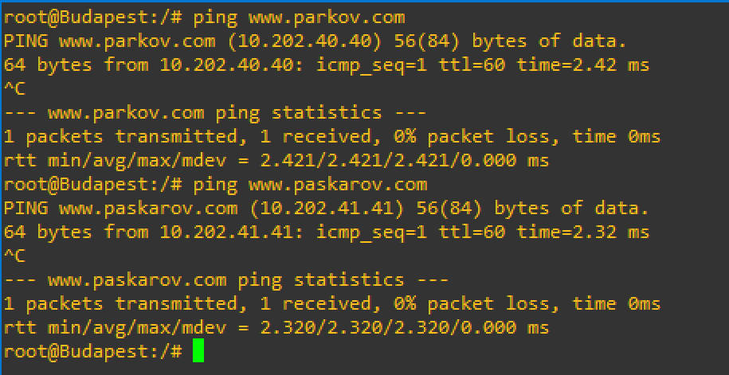

- Explanation

  Untuk menambahkan domain bagi `Slav` dan `Sicillian`, maka diperlukan untuk membuat 3 file yang meliputi `named.conf`, `db.parkov`, dan juga `db.paskarov`. Isi dari masing - masing file adalah sebagai berikut : 

  `named.conf`
  ``` conf
  options {
      directory "/myscript/dns";
      listen-on { any; };
      allow-query { any; };
  };

  zone "parkov.com" {
      type master;
      file "db.parkov";
  };

  zone "paskarov.com" {
      type master;
      file "db.paskarov";
  };
  ```

  `db.parkov`
  ``` conf
  $TTL 86400
  @   IN  SOA ns1.parkov.com. admin.parkov.com. (
          1       ; serial
          3600    ; refresh
          1800    ; retry
          604800  ; expire
          86400 ) ; minimum

      IN  NS  ns1.parkov.com.

  ns1 IN  A   10.202.41.194

  @   IN  A   10.202.40.40;
  www IN  A   10.202.40.40; 
  ```

  `db.paskarov`
  ``` conf
  $TTL 86400
  @   IN  SOA ns1.paskarov.com. admin.paskarov.com. (
          1       ; serial
          3600    ; refresh
          1800    ; retry
          604800  ; expire
          86400 ) ; minimum

      IN  NS  ns1.paskarov.com.

  ns1 IN  A   10.202.41.194

  @   IN  A   10.202.41.41; 
  www IN  A   10.202.41.41; 
  ```

  Lalu untuk menjalankan DNS server dapat menggunakan script berikut : 
  ``` sh
  named -g -c /myscript/dns/named.conf
  ```

  Agar client dapat mengakses custom domain yang baru dibuat, `resolv.conf` pada client harus diubah menjadi ip dari DNS server yang baru, yakni IP address dari `Caro-Kann`
  ```conf
  nameserver 10.202.41.194
  ```

  Setelah melakukan langkah - langkah tersebut, hasil test ping ke custom domain dapat dilihat pada gambar yang terlampir. 

<br>

## Soal 6

> Konfigurasikan juga **Alekhine** sebagai **DNS Slave** yang bekerja untuk membantu **Caro-Kann.** Lakukan pengujian dengan **mematikan Caro-Kann** lalu coba ping ke domain dan subdomain tersebut (pilih salah satu saja).

> _Configure **Alekhine** as a **DNS Slave** to assist **Caro-Kann**. Perform testing by **disabling Caro-Kann** and then pinging the domain and subdomain (choose only one)._

**Answer:**

- Screenshot

  Test ping ketika DNS Master on
  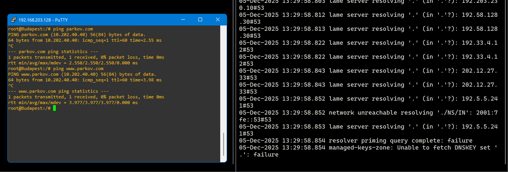

  Test ping ketika DNS Master off
  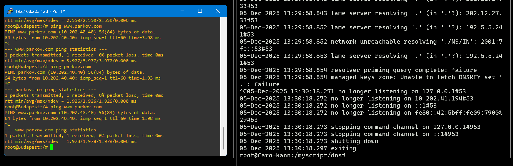

- Explanation

  Untuk menambahkan `Alekhine` sebagai DNS Slave, maka perlu beberapa perubahan pada `name.conf` di DNS Master seperti berikut :  

  `named.conf` di Caro-Kann
  ```
  options {
      directory "/myscript/dns";
      listen-on { any; };
      allow-query { any; };
  };

  zone "parkov.com" {
      type master;
      file "db.parkov";
      allow-transfer { 10.202.41.195; }; --> menambahkan ini
  };

  zone "paskarov.com" {
      type master;
      file "db.paskarov";
      allow-transfer { 10.202.41.195; }; --> menambahkan ini
  };
  ```

  Lalu untuk `named.conf` di DNS Slave `Alekhine` dapat dikonfigurasi seperti berikut : 

  `named.conf` di Alekhine
  ```
  options {
      directory "/myscript/dns";
      listen-on { any; };
      allow-query { any; };
  };

  zone "parkov.com" {
      type slave;
      masters { 10.202.41.194; };
      file "db.parkov";
  };

  zone "paskarov.com" {
      type slave;
      masters { 10.202.41.194; };
      file "db.paskarov";
  };
  ```

  Terdapat beberapa penambahakn konfigurasi juga pada file DB untuk `parkov` dan `paskarov` agar dapat terintegrasi dengan DNS Slave. 

  `db.parkov`
  ```
  $TTL 86400
  @   IN  SOA ns1.parkov.com. admin.parkov.com. (
          1       ; serial
          3600    ; refresh
          1800    ; retry
          604800  ; expire
          86400 ) ; minimum

      IN  NS  ns1.parkov.com.
      IN  NS  ns2.parkov.com. --> menambahkan ini

  ns1 IN  A   10.202.41.194
  ns2 IN  A   10.202.41.195 --> menambahkan ini

  @   IN  A   10.202.40.40;
  www IN  A   10.202.40.40; 
  ```

  `db.paskarov`
  ```
  $TTL 86400
  @   IN  SOA ns1.paskarov.com. admin.paskarov.com. (
          1       ; serial
          3600    ; refresh
          1800    ; retry
          604800  ; expire
          86400 ) ; minimum

      IN  NS  ns1.paskarov.com.
      IN  NS  ns2.paskarov.com. --> menambahkan ini

  ns1 IN  A   10.202.41.194
  ns2 IN  A   10.202.41.195 --> menambahkan ini

  @   IN  A   10.202.41.41; 
  www IN  A   10.202.41.41; 

<br>

## Soal 7

> Konfigurasikan **Sicilian** agar berfungsi sebagai **web server nginx** yang akan menyajikan [halaman berikut](https://drive.google.com/file/d/1eX0ZjRKprx8T34XFAssrpc7ZE1j6Jv0j/view). Konfigurasikan juga agar **Sicilian** bisa menyimpan custom access log ke file **/tmp/access.log** dan error log ke file **/tmp/error.log.**

> _Configure **Sicilian** to function as an **nginx web server**that will serve [this page](https://drive.google.com/file/d/1eX0ZjRKprx8T34XFAssrpc7ZE1j6Jv0j/view). Also, configure **Sicilian** to save custom access logs to **/tmp/access.log** and error logs to **/tmp/error.log.**_

**Answer:**

- Screenshot

  Test curl 
  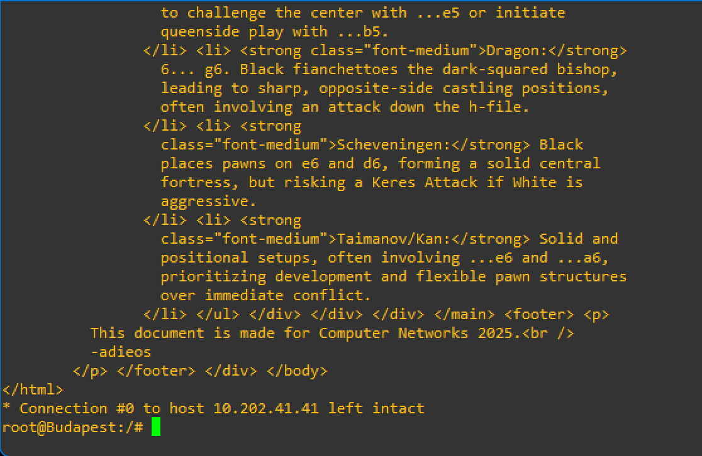

  Hasil custom output path
  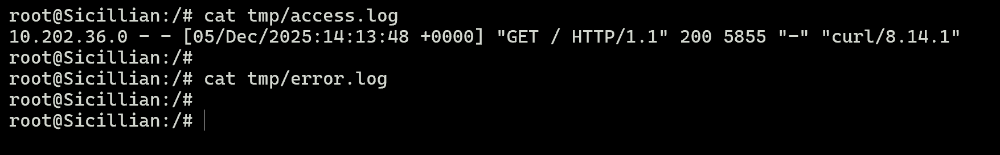

- Explanation

  Konfigurasi untuk `nginx.conf` pada node `Sicillian` adalah sebagai berikut : 

  `nginx.conf`
  ```conf
  user www-data;
  worker_processes auto;
  worker_cpu_affinity auto;
  pid /tmp/nginx.pid;

  events { worker_connections 768; }

  http {
    access_log /tmp/access.log;
    error_log /tmp/error.log;

      server {
          listen 80;
          server_name _;

          root /myscript/myconfig;
          index index.html;

          location / {
              try_files $uri $uri/ =404;
          }
      }
  }
  ```

  Berdasarkan file yang diberikan pada soal, `index.html` berisi sebagai berikut : 

  `index.html`
  ```html
  <!DOCTYPE html>
  <html lang="en">
    <head>
      <meta charset="UTF-8" />
      <meta name="viewport" content="width=device-width, initial-scale=1.0" />
      <title>Sicilian Defense Guide (Offline)</title>
      <style>
        /* General Reset and Base Styles */
        body {
          font-family: Arial, Helvetica, sans-serif;
          margin: 0;
          padding: 40px 20px;
          background-color: #f3f4f6; /* Light gray background */
          min-height: 100vh;
          display: flex;
          flex-direction: column;
          align-items: center;
        }
        .container {
          max-width: 900px;
          width: 100%;
        }

        /* Color Variables (Simplified Palette) */
        :root {
          --primary-blue: #1e40af;
          --primary-dark: #0f172a;
          --card-bg: #ffffff;
          --text-color: #374151;
          --heading-color: #111827;
        }

        /* Header Styling */
        header {
          text-align: center;
          margin-bottom: 40px;
        }
        header h1 {
          font-size: 32px;
          font-weight: 800;
          color: var(--primary-dark);
          letter-spacing: -1px;
          margin-bottom: 8px;
        }
        header p {
          font-size: 18px;
          color: #6b7280;
        }

        /* Card Styling */
        .card {
          background-color: var(--card-bg);
          padding: 30px;
          border-radius: 12px;
          box-shadow: 0 10px 15px -3px rgba(0, 0, 0, 0.1),
            0 4px 6px -2px rgba(0, 0, 0, 0.05);
          border-top: 4px solid var(--primary-blue);
        }

        .card-header {
          display: flex;
          align-items: center;
          margin-bottom: 16px;
        }
        .card-header span {
          font-size: 28px;
          margin-right: 12px;
        }
        .card-header h2 {
          font-size: 24px;
          font-weight: 700;
          color: var(--primary-blue);
        }
        .card h3 {
          font-size: 20px;
          font-weight: 600;
          color: var(--heading-color);
          margin-bottom: 20px;
        }

        /* Content Styles */
        .content p {
          color: var(--text-color);
          line-height: 1.6;
          margin-bottom: 20px;
        }

        /* Code Block/Key Lines */
        .key-sequence {
          background-color: #e5e7eb;
          padding: 15px;
          border-radius: 8px;
          margin-bottom: 20px;
        }
        .key-sequence h4 {
          font-size: 16px;
          font-weight: 700;
          margin-bottom: 8px;
          color: var(--primary-dark);
        }
        .key-sequence code {
          display: block;
          background-color: #d1d5db;
          font-family: monospace;
          padding: 10px;
          border-radius: 4px;
          font-size: 14px;
          color: var(--primary-dark);
          white-space: pre-wrap; /* Ensure wrapping on smaller screens */
        }

        /* List Styles */
        .variations-list {
          list-style: disc;
          margin-left: 20px;
          padding-left: 0;
          color: var(--text-color);
          line-height: 1.5;
        }
        .variations-list li {
          margin-bottom: 8px;
        }
        .variations-list strong {
          font-weight: 600;
        }

        /* Footer */
        footer {
          margin-top: 40px;
          padding-top: 20px;
          text-align: center;
          color: #6b7280;
          font-size: 14px;
          border-top: 1px solid #e5e7eb;
        }

        /* Responsive adjustments */
        @media (min-width: 768px) {
          header h1 {
            font-size: 44px;
          }
          .card {
            padding: 40px;
          }
        }
      </style>
    </head>
    <body>
      <div class="container">
        <header>
          <h1>The Sicilian Defense</h1>
          <p>
            Black's most popular, aggressive, and counter-attacking response to 1.
            e4.
          </p>
        </header>

        <main>
          <!-- SICILIAN DEFENSE CARD -->
          <div class="card">
            <div class="card-header">
              <span role="img" aria-label="Knight icon">♞</span>
              <h2>Key Strategies</h2>
            </div>
            <h3 class="opening-move">Start: 1. e4 c5</h3>

            <div class="content">
              <p>
                The Sicilian is a commitment to imbalance. Black immediately
                fights for the d4 square without directly occupying the center,
                inviting White to expand. This often leads to sharp battles,
                especially in the Open Sicilian variations where White plays d4.
                Black aims to undermine White's central control and use the
                half-open c-file. Favored by champions like Kasparov and Fischer,
                this opening requires high skill to play but can be deadly in the
                right hands.
              </p>

              <!-- Key Lines -->
              <div class="key-sequence">
                <h4>Key Move Sequence (Open Sicilian)</h4>
                <code title="1. e4 c5 2. Nf3 Nc6 3. d4 cxd4 4. Nxd4">
                  1. e4 c5 2. Nf3 Nc6 3. d4 cxd4 4. Nxd4
                </code>
              </div>

              <!-- Sub-Variations -->
              <div class="variations">
                <h3>Major Sub-Variations:</h3>
                <ul class="variations-list">
                  <li>
                    <strong class="font-medium">Najdorf:</strong> 4... a6.
                    Extremely flexible and deep. Black often prepares to challenge
                    the center with ...e5 or initiate queenside play with ...b5.
                  </li>
                  <li>
                    <strong class="font-medium">Dragon:</strong> 6... g6. Black
                    fianchettoes the dark-squared bishop, leading to sharp,
                    opposite-side castling positions, often involving an attack
                    down the h-file.
                  </li>
                  <li>
                    <strong class="font-medium">Scheveningen:</strong> Black
                    places pawns on e6 and d6, forming a solid central fortress,
                    but risking a Keres Attack if White is aggressive.
                  </li>
                  <li>
                    <strong class="font-medium">Taimanov/Kan:</strong> Solid and
                    positional setups, often involving ...e6 and ...a6,
                    prioritizing development and flexible pawn structures over
                    immediate conflict.
                  </li>
                </ul>
              </div>
            </div>
          </div>
        </main>

        <footer>
          <p>
            This document is made for Computer Networks 2025.<br />
            -adieos
          </p>
        </footer>
      </div>
    </body>
  </html>
  ```

  Untuk menyalakan service nginx, maka dapat menggunakan script berikut : 

  `start_http.sh`
  ``` sh
  #!/bin/bash

  nginx -c myscript/myconfig/nginx.conf -g 'daemon off;'
  ```

<br>

## Soal 8

> Buatlah custom access log ke file **/tmp/access.log.** Untuk keperluan logging, gunakan format log seperti di bawah:
> - Tanggal dan waktu akses dalam format standar log.
> - Nama node yang sedang diakses.
> - Alamat IP klien yang mengakses website.
> - Metode HTTP dan URI yang diakses oleh klien.
> - Status respons HTTP yang diberikan oleh server.
> - Jumlah byte yang dikirimkan dalam respons.
> - Waktu yang dihabiskan oleh server untuk menangani permintaan.> 
> - Contoh format log yang sesuai:  
[01/Oct/2024:11:30:45 +0000] Jarkom Node Sicilian Access from 192.168.1.15 using method "GET /resep/bayam HTTP/1.1" returned status 200 with 2567 bytes sent in 0.038 seconds

> _Webserver: Create a custom access log to the file **/tmp/access.log.** For logging purposes, use the log format shown below:_
> - _The date and time of access in standard log format._
> - _The name of the node being accessed._
> - _The IP address of the client accessing the website._
> - _The HTTP method and URI accessed by the client._
> - _The HTTP response status returned by the server._
> - _The number of bytes sent in the response._
> - _The time spent by the server processing the request._
> - _Example of appropriate log format:  
[01/Oct/2024:11:30:45 +0000] Jarkom Node Sicilian Access from 192.168.1.15 using method "GET /resep/bayam HTTP/1.1" returned status 200 with 2567 bytes sent in 0.038 seconds_

**Answer:**

- Screenshot

  Hasil sebelum vs sesudah custom access log : 
  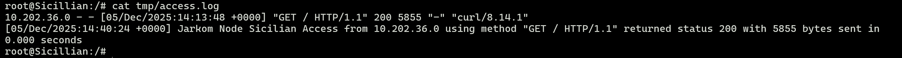

- Explanation

  Untuk membuat custom access log, dapat mengubah `nginx.conf` pada node `Sicillian` untuk memprint custom log yang diinginkan.

  ``` conf
  user www-data;
  worker_processes auto;
  worker_cpu_affinity auto;
  pid /tmp/nginx.pid;

  events { worker_connections 768; }

  http {
    log_format customLog '[${time_local}] Jarkom Node Sicilian Access from $remote_addr using method "$request" returned status $status with $body_bytes_sent bytes sent in $request_time seconds'; --> format custom log

    access_log /tmp/access.log customLog; --> menambahkan ini agar custom access log bisa berjalan
    error_log /tmp/error.log;

      server {
          listen 80;
          server_name _;

          root /myscript/myconfig;
          index index.html;

          location / {
              try_files $uri $uri/ =404;
          }
      }
  }
  ```

<br>

## Soal 9

> Konfigurasikan juga **Slav** agar berfungsi sebagai **web server nginx** yang menyajikan [halaman berikut](https://drive.google.com/file/d/1h8ik1Zcubntp0dvHt9NHYqSZLSTG6FuZ/view) dan **hanya** bisa diakses melalui port **8000** dan **8888.**

> _Configure **Slav** to function as an **nginx web server** that serves [this page](https://drive.google.com/file/d/1h8ik1Zcubntp0dvHt9NHYqSZLSTG6FuZ/view?usp=drive_link) and is **only** accessible via ports **8000** and **8888.**_

**Answer:**

- Screenshot

  Test ping dengan `curl -vL 10.202.40.40`
  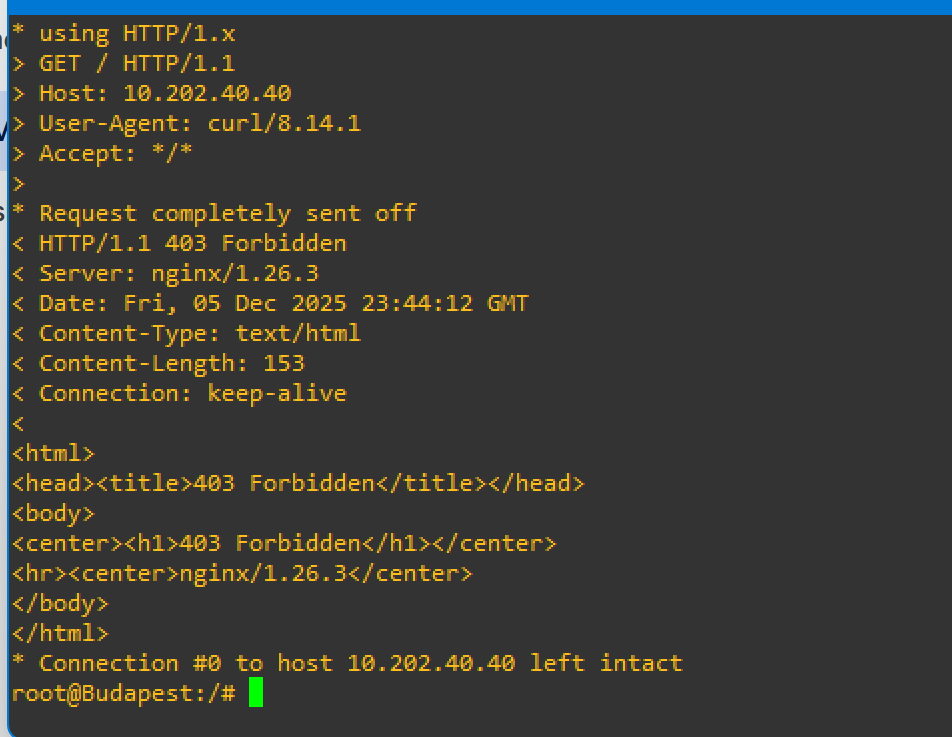

  Test ping dengan `curl -vL 10.202.40.40:8000`
  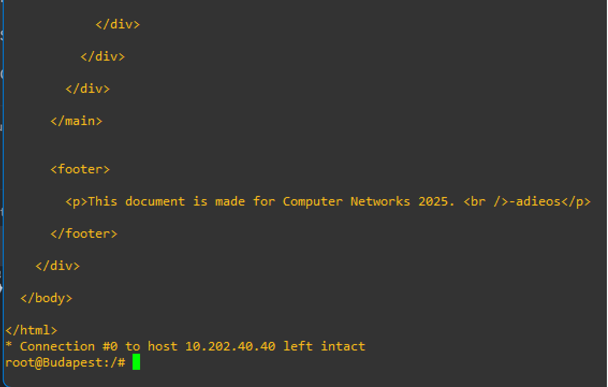
  
  Test ping dengan `curl -vL 10.202.40.40:8888`
  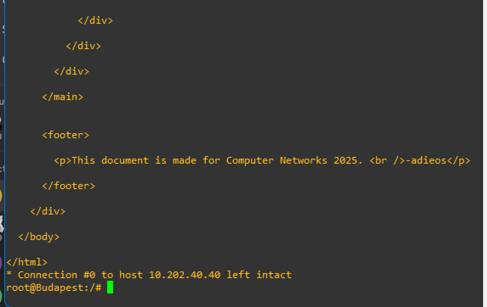

  Hasil custom access log
  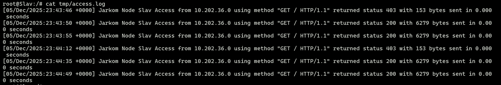

- Explanation

  Langkah - langkah yang diperlukan untuk nomor ini kurang lebih mirip dengan nomor sebelumnya. 

  `nginx.conf` pada `Slav`
  ```conf
  user www-data;
  worker_processes auto;
  worker_cpu_affinity auto;
  pid /tmp/nginx.pid;

  events { worker_connections 768; }

  http {
    log_format customLog '[${time_local}] Jarkom Node Slav Access from $remote_addr using method "$request" returned status $status with $body_bytes_sent bytes sent in $request_time seconds';

    access_log /tmp/access.log customLog;
    error_log /tmp/error.log;

      server {
          listen 8000;
          server_name _;

          root /myscript/myconfig;
          index index.html;

          location / {
              try_files $uri $uri/ =404;
          }
      }
      
      server {
          listen 8888;
          server_name _;

          root /myscript/myconfig;
          index index.html;

          location / {
              try_files $uri $uri/ =404;
          }
      }
      
      server {
          listen 80;
          return 403;
      }
  }
  ```

  `index.htm` pada `Slav`
  ``` html
  <!DOCTYPE html>
  <html lang="en">
    <head>
      <meta charset="UTF-8" />
      <meta name="viewport" content="width=device-width, initial-scale=1.0" />
      <title>Slav Defense Guide (Offline)</title>
      <style>
        /* General Reset and Base Styles */
        body {
          font-family: Arial, Helvetica, sans-serif;
          margin: 0;
          padding: 40px 20px;
          background-color: #f3f4f6; /* Light gray background */
          min-height: 100vh;
          display: flex;
          flex-direction: column;
          align-items: center;
        }
        .container {
          max-width: 900px;
          width: 100%;
        }

        /* Color Variables (Simplified Palette) */
        :root {
          --primary-gray: #374151;
          --primary-dark: #0f172a;
          --card-bg: #ffffff;
          --text-color: #374151;
          --heading-color: #111827;
        }

        /* Header Styling */
        header {
          text-align: center;
          margin-bottom: 40px;
        }
        header h1 {
          font-size: 32px;
          font-weight: 800;
          color: var(--primary-dark);
          letter-spacing: -1px;
          margin-bottom: 8px;
        }
        header p {
          font-size: 18px;
          color: #6b7280;
        }

        /* Card Styling */
        .card {
          background-color: var(--card-bg);
          padding: 30px;
          border-radius: 12px;
          box-shadow: 0 10px 15px -3px rgba(0, 0, 0, 0.1),
            0 4px 6px -2px rgba(0, 0, 0, 0.05);
          border-top: 4px solid var(--primary-gray); /* Darker border for Slav */
        }

        .card-header {
          display: flex;
          align-items: center;
          margin-bottom: 16px;
        }
        .card-header span {
          font-size: 28px;
          margin-right: 12px;
        }
        .card-header h2 {
          font-size: 24px;
          font-weight: 700;
          color: var(--primary-gray);
        }
        .card h3 {
          font-size: 20px;
          font-weight: 600;
          color: var(--heading-color);
          margin-bottom: 20px;
        }

        /* Content Styles */
        .content p {
          color: var(--text-color);
          line-height: 1.6;
          margin-bottom: 20px;
        }

        /* Code Block/Key Lines */
        .key-sequence {
          background-color: #e5e7eb;
          padding: 15px;
          border-radius: 8px;
          margin-bottom: 20px;
        }
        .key-sequence h4 {
          font-size: 16px;
          font-weight: 700;
          margin-bottom: 8px;
          color: var(--primary-dark);
        }
        .key-sequence code {
          display: block;
          background-color: #d1d5db;
          font-family: monospace;
          padding: 10px;
          border-radius: 4px;
          font-size: 14px;
          color: var(--primary-dark);
          white-space: pre-wrap; /* Ensure wrapping on smaller screens */
        }

        /* List Styles */
        .variations-list {
          list-style: disc;
          margin-left: 20px;
          padding-left: 0;
          color: var(--text-color);
          line-height: 1.5;
        }
        .variations-list li {
          margin-bottom: 8px;
        }
        .variations-list strong {
          font-weight: 600;
        }

        /* Footer */
        footer {
          margin-top: 40px;
          padding-top: 20px;
          text-align: center;
          color: #6b7280;
          font-size: 14px;
          border-top: 1px solid #e5e7eb;
        }

        /* Responsive adjustments */
        @media (min-width: 768px) {
          header h1 {
            font-size: 44px;
          }
          .card {
            padding: 40px;
          }
        }
      </style>
    </head>
    <body>
      <div class="container">
        <header>
          <h1>The Slav Defense</h1>
          <p>A solid, classical, and structurally sound response to 1. d4.</p>
        </header>

        <main>
          <!-- SLAV DEFENSE CARD -->
          <div class="card">
            <div class="card-header">
              <span role="img" aria-label="Rook icon">♜</span>
              <h2>Key Strategies</h2>
            </div>
            <h3 class="opening-move">Start: 1. d4 d5 2. c4 c6</h3>

            <div class="content">
              <p>
                The Slav is a reliable way for Black to meet 1. d4. The key idea
                of 2... c6 is to reinforce the d5 pawn while keeping the
                light-squared bishop free to develop outside the pawn chain (on f5
                or g4). It often leads to positional maneuvering rather than the
                sharp tactical lines found in the Sicilian, offering excellent
                control over the center.
              </p>

              <!-- Key Lines -->
              <div class="key-sequence">
                <h4>Key Move Sequence (Slav Accepted)</h4>
                <code title="1. d4 d5 2. c4 c6 3. Nf3 Nf6 4. Nc3 dxc4">
                  1. d4 d5 2. c4 c6 3. Nf3 Nf6 4. Nc3 dxc4
                </code>
              </div>

              <!-- Sub-Variations -->
              <div class="variations">
                <h3>Major Sub-Variations:</h3>
                <ul class="variations-list">
                  <li>
                    <strong class="font-medium">Semi-Slav:</strong> Black plays
                    ...e6 in addition to ...c6. This leads to complex Queen's
                    Gambit Declined structures where Black accepts a blocked c8
                    bishop for a strong central defense.
                  </li>
                  <li>
                    <strong class="font-medium">Anti-Slav Variations:</strong>
                    White avoids 3. Nc3, often playing 3. Nf3 followed by 4. e3 or
                    2. Qb3, attempting to gain space and challenge Black's
                    development early.
                  </li>
                  <li>
                    <strong class="font-medium">Chebanenko Slav:</strong> Black
                    plays 3... a6, securing the b5 square for their light-squared
                    bishop or knight, leading to more original and dynamic lines.
                  </li>
                </ul>
              </div>
            </div>
          </div>
        </main>

        <footer>
          <p>This document is made for Computer Networks 2025. <br />-adieos</p>
        </footer>
      </div>
    </body>
  </html>
  ```

  Dan terakhir untuk menjalankan servis `nginx` dapat menggunakan script berikut :  
  ```sh
  #!/bin/bash

  nginx -c myscript/myconfig/nginx.conf -g 'daemon off;'
  ```

<br>

## Soal 10

> Untuk memudahkan akses, buatlah satu domain lagi dengan nama **openings.com** yang mengarah ke **Petrov.** Lalu, konfigurasikan juga **Petrov** sebagai **Reverse Proxy** yang akan melakukan forward request ke server yang sesuai berdasarkan URL profile yang diminta oleh klien dengan ketentuan sebagai berikut:
> - Request untuk “openings.com/**sicilian**” harus dialihkan ke web server **Sicilian.**
> - Request untuk “openings.com/**slav**” harus dialihkan ke web server **Slav.**

> _To facilitate access, create another domain with the name **openings.com** that points to **Petrov.** Then, configure **Petrov** as a **Reverse Proxy** that will forward requests to the appropriate server based on the profile URL requested by the client with the following conditions:_
> - _Requests for “openings.com/**sicilian**” must be forwarded to web server **Sicilian.**_
> - _Request for “openings.com/**slav**” must be forwarded to web server **Slav.**_

**Answer:**

- Screenshot

  Test curl ke `openings.com`
  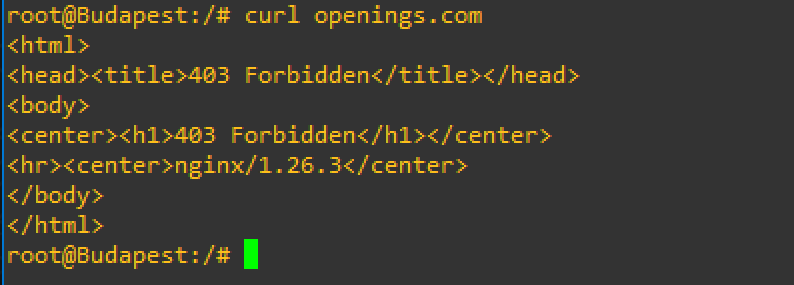

  Test curl ke `openings.com/sicillian`
  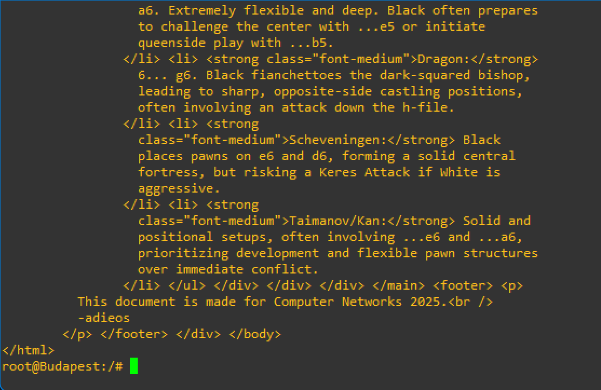
  
  Test curl ke `openings.com/slav`
  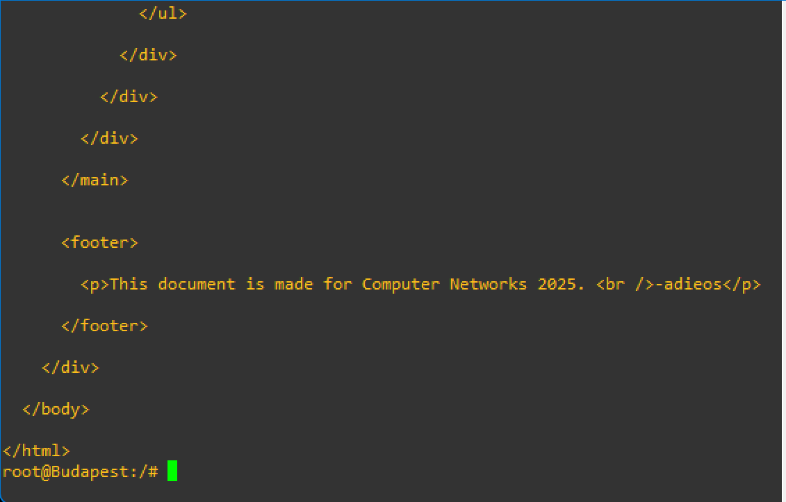

- Explanation

  Untuk melakukan reverse proxy, maka diperlukan membuat domain yang akan mengarahkan ke node `Petrov` terlebih dahulu dengan mengubah konfigurasi pada DNS Master dan Slave

  `DNS Master`
  ```
  zone "openings.com" {
    type master;
    file dp.openings;
    allow-transfer {10.202.41.195; };
  }
  ```

  `DNS Slave`
  ```
  zone "openings.com" {
    type slave;
    file dp.openings;
    masters {10.202.41.194; };
  }
  ```

  Lalu juga menambahkan file `db.openings` yang akan mengarahkan request ke node `Petrov`
  ``` conf
  $TTL 86400
  @   IN  SOA ns1.openings.com. admin.openings.com. (
          1       ; serial
          3600    ; refresh
          1800    ; retry
          604800  ; expire
          86400 ) ; minimum

      IN  NS  ns1.openings.com.
      IN  NS  ns2.openings.com.

  ns1 IN  A   10.202.41.194
  ns2 IN  A   10.202.41.195

  @   IN  A   10.202.41.210
  ```

  Lalu untuk di node `Petrov` sendiri, diperlukan file `nginx.conf` seperti berikut : 
  ``` conf
  user www-data;
  worker_processes auto;
  worker_cpu_affinity auto;
  pid /tmp/nginx.pid;

  events { worker_connections 768; }

  http {
          server {
                  listen 80;
                  server_name openings.com;
                  error_log /tmp/error.log;
                  access_log /tmp/access.log;

                  location /sicillian {
                          proxy_pass http://www.paskarov.com/;
                          proxy_set_header Host $host;
                          proxy_set_header X-Real-IP $remote_addr;
                  }

                  location /slav {
                          proxy_pass http://www.parkov.com:8000/;
                          proxy_set_header Host $host;
                          proxy_set_header X-Real-IP $remote_addr;
                  }
                  
                  location / {
                          return 403;
                  }
          }
  }
  ```

  Konfigurasi tersebut bertujuan untuk memforward request dengan `/sicillian` ke `www.paskarov.com` dan `/slav` ke `www.parkov.com:8000/`, serta untuk secara default maka akan return 403 forbidden.

<br>

## Soal 11

> Tambahkan juga konfigurasi agar request untuk “openings.com/**random**” akan mengalihkan request ke webserver **Sicilian** dan **Slav** dengan algoritma _round-robin_.

> _Additionally, configure requests for "openings.com/**random**" to be redirected to the **Sicilian** and **Slav** web servers using a round-robin algorithm._

**Answer:**

- Screenshot

  Bukti pengaksesan web secara round-robin melalui `access.log` (dapat dilihat dari waktu mengakses)
  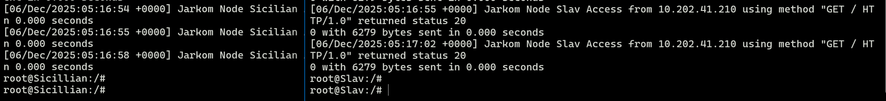

- Explanation

  Untuk bisa mengonfigurasi agar request `openings.com/random` akan mengalihkan ke `Sicillian` atau `Slav` secara round-robin, maka diperlukan beberapa perubahan pada nginx.conf di note `Petrov` seperti berikut : 
  
  ``` conf
  user www-data;
  worker_processes auto;
  worker_cpu_affinity auto;
  pid /tmp/nginx.pid;

  events { worker_connections 768; }

  http {
    upstream roundRoobin{ --> menambahkan blok code ini untuk algoritma round-robin
      server www.paskarov.com;
      server www.parkov.com:8000;
    }

    server {
      listen 80;
      server_name openings.com;
      error_log /tmp/error.log;
      access_log /tmp/access.log;

      location /sicillian {
          proxy_pass http://www.paskarov.com/;
          proxy_set_header Host $host;
          proxy_set_header X-Real-IP $remote_addr;
      }

      location /slav {
          proxy_pass http://www.parkov.com:8000/;
          proxy_set_header Host $host;
          proxy_set_header X-Real-IP $remote_addr;
      }
      
      location /random {
        proxy_pass http://roundRoobin/; --> mengaplikasikan pemanggilan secara round-robin
        proxy_set_header Host $host;
        proxy_set_header X-Real-IP $remote_addr;
      }
    }
  }
  ```

<br>

## Soal 12

> Anatoly Parkov berencana untuk melakukan ekspansi secara besar-besaran. Maka dari itu, hapus seluruh konfigurasi Static Routing dan ubah agar seluruh router menggunakan Dynamic Routing. Gunakan protokol RIP!

> _Anatoly Parkov plans to perform a great expansion. Therefore, remove all Static Routing configurations and configure all routers to use Dynamic Routing. Use the RIP protocol!_

**Answer:**

- Screenshot

  Test ping `Budapest` ke subnet `10.202.41.128`
  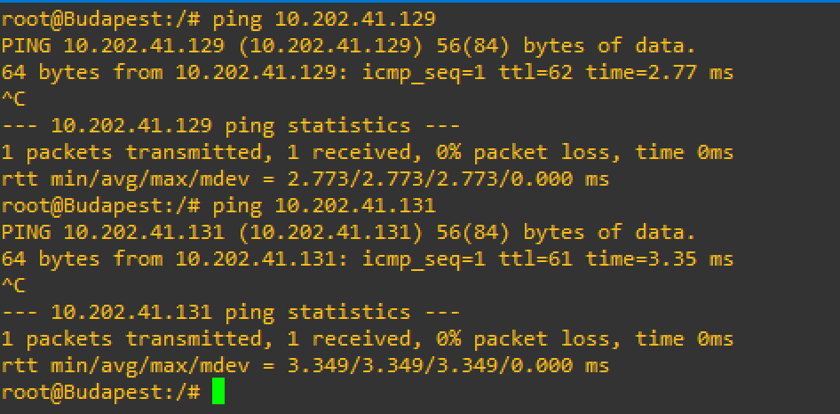

  Test ping `Stafford` ke subnet `10.202.40.0` dan `10.202.41.0 `
  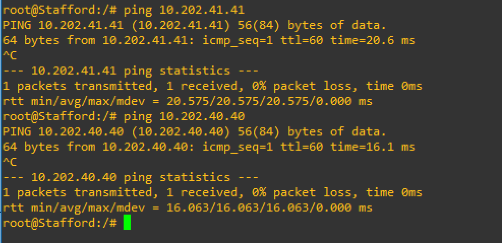
  
  Test ping `Blackmar-Diemer` ke subnet `10.202.41.192`  
  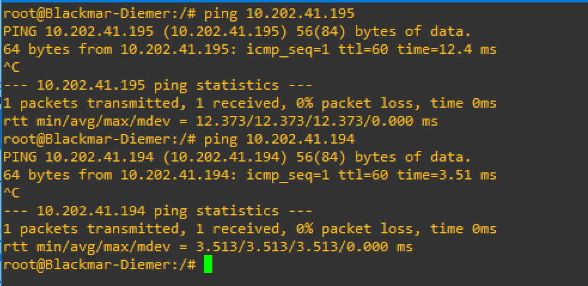

- Explanation

  Untuk menggunakan dynamic routing, maka route lama harus terlebih dahulu dihapus pada setiap router, dan kemudian untuk konfigurasi protokol RIP pada setiap router seperti pada berikut : 

  `Zugzwang`
  ``` conf
  ip route del 10.202.41.128/26 via 10.202.41.209
  ip route del 10.202.32.0/21 via 10.202.41.209
  ip route del 10.202.0.0/19 via 10.202.41.209
  ip route del 10.202.41.224/30 via 10.202.41.209

  #RIP Config
  network 10.202.41.208/29
  network 10.202.40.0/24
  network 10.202.41.192/28
  network 10.202.41.0/25
  ```

  `Zwischenzug`
  ```
  ip route del 10.202.41.128/26 via 10.202.41.219
  ip route del 10.202.32.0/21 via 10.202.41.217
  ip route del 10.202.0.0/19 via 10.202.41.217
  ip route del 10.202.41.224/30 via 10.202.41.217
  ip route del 10.202.41.0/25 via 10.202.41.211
  ip route del 10.202.41.192/28 via 10.202.41.211
  ip route del 10.202.40.0/24 via 10.202.41.211

  #RIP Config
  network 10.202.41.216/29
  network 10.202.41.208/29
  ```

  `Lucena`
  ```
  ip route del 10.202.41.208/29 via 10.202.41.218
  ip route del 10.202.40.0/24 via 10.202.41.218
  ip route del 10.202.41.192/28 via 10.202.41.218
  ip route del 10.202.41.0/25 via 10.202.41.218
  ip route del 10.202.32.0/21 via 10.202.41.217
  ip route del 10.202.0.0/19 via 10.202.41.217
  ip route del 10.202.41.224/30 via 10.202.41.217

  #RIP Config
  network 10.202.41.216/29
  network 10.202.41.128/26
  ```

  `Smith-Morra`
  ```
  ip route del 10.202.41.0/25 via 10.202.41.226
  ip route del 10.202.41.128/26 via 10.202.41.226
  ip route del 10.202.41.192/28 via 10.202.41.226
  ip route del 10.202.40.0/24 via 10.202.41.226
  ip route del 10.202.41.208/29 via 10.202.41.226
  ip route del 10.202.41.216/29 via 10.202.41.226

  #RIP Config
  network 10.202.32.0/21
  network 10.202.0.0/19
  network 10.202.41.224/30
  network 10.202.0.0/16
  default-information originate
  ```

  `Fianchetto`
  ```
  ip route del 10.202.32.0/21 via 10.202.41.225
  ip route del 10.202.0.0/19 via 10.202.41.225
  ip route del 10.202.41.208/29 via 10.202.41.218
  ip route del 10.202.41.128/26 via 10.202.41.219
  ip route del 10.202.41.0/25 via 10.202.41.218
  ip route del 10.202.41.192/28 via 10.202.41.218
  ip route del 10.202.40.0/24 via 10.202.41.218

  #RIP Config
  network 10.202.41.216/29
  network 10.202.41.224/30
  ```

  Untuk mengakses dan mengubah konfigurasi dapat menggunakan command berikut yang meliputi berpindah ke directory frr, menyalakan daemon yang dibutuhkan, mengakses `vtysh`, dan pergi ke konfigurasi untuk protokol RIP. 

  ```sh
  cd /usr/lib/frr

  ./zebra -d
  ./ripd -d
  ./mgmtd -d

  vtysh

  conf t
  router rip
  ```

<br>

## Soal 13

> Untuk meningkatkan keamanan, konfigurasikan firewall **Smith-Morra** untuk melakukan pembatasan koneksi SSH ke server DNS. Drop semua packet SSH yang berasal dari seluruh client yang memiliki tujuan ke **Caro-Kann** atau **Alekhine.**

> _To increase security, configure the **Smith-Morra** firewall to restrict SSH connections to the **DNS server.** Drop all SSH packets from all clients destined for **Caro-Kann** or **Alekhine.**_

**Answer:**

- Screenshot

  Before and after pada client `Budapest`
  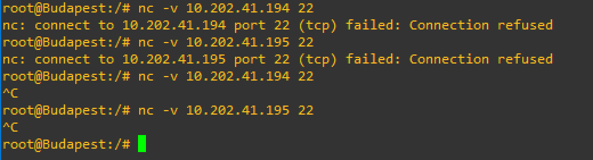

  Before and after pada client `Stafford`
  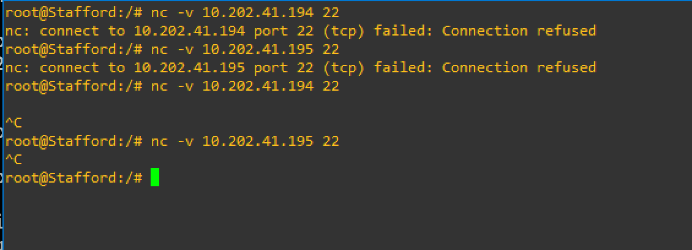

  Before and after pada client `Blackmar-Diemer`
  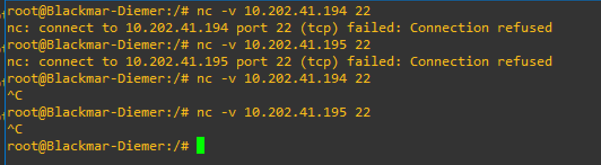

- Explanation

  Untuk melakukan pembatasan koneksi ssd ke server DNS maka dapat menggunakan konfigurasi `iptables` seperti berikut : 

  ``` sh
  iptables -A FORWARD -p tcp --dport 22 -d 10.202.41.194 -j DROP
  iptables -A FORWARD -p tcp --dport 22 -d 10.202.41.195 -j DROP
  ```

  Konfigurasi tersebut akan melakukan drop packet untuk semua packet dengan destinasi server DNS (`10.202.41.194` dan `10.202.41.195`) 

<br>

## Soal 14

> Nampaknya, web server juga manusia sehingga hanya ingin bekerja di hari kerja. Maka dari itu, semua client hanya bisa mengakses **Sicilian** dan **Slav** pada hari Senin-Jumat pada pukul 09:00-17:00.

> _Apparently, web servers are humans too, so they only want to work on weekdays. Therefore, all clients can only access **Sicilian** and **Slav** on Monday through Friday, 9:00 AM to 5:00 PM._

**Answer:**

- Screenshot

  Test akses normal, kiri atas `parkov.com:8000`, kanan atas `parkov.com:8888`, bawah `paskarov.com`
  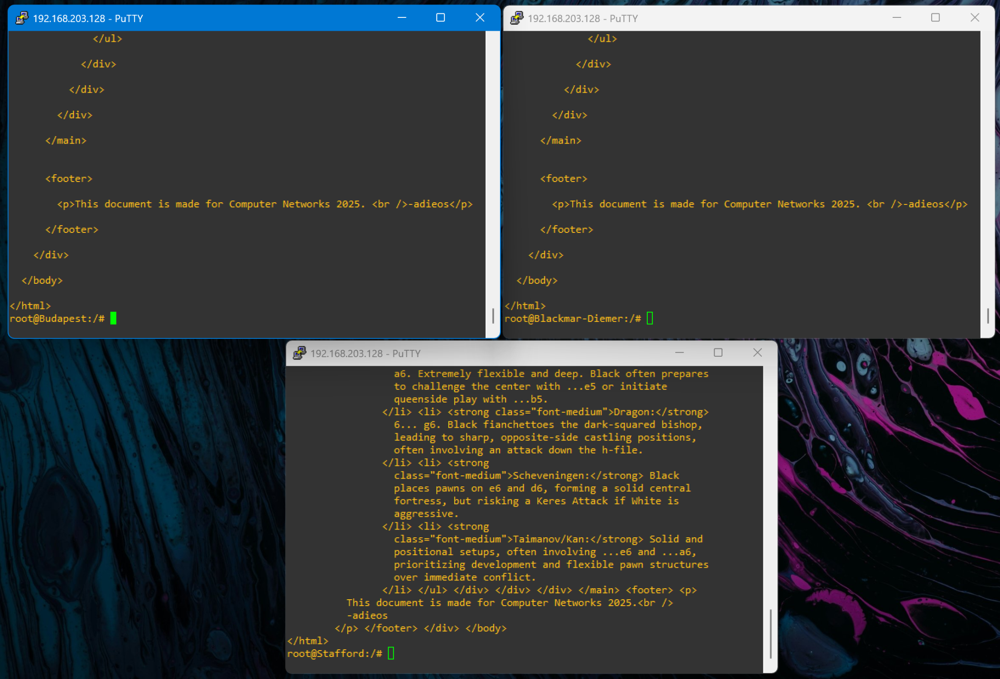

  Test ketika diluar hari yang ditentukan
  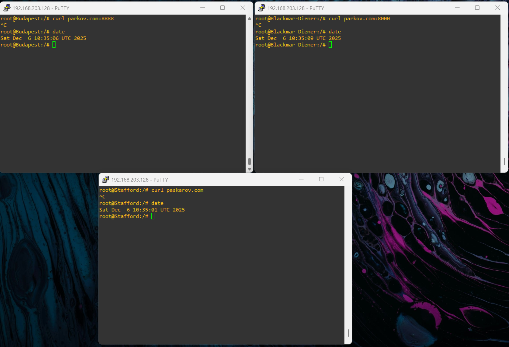

  Test ketika diluar jam yang ditentukan
  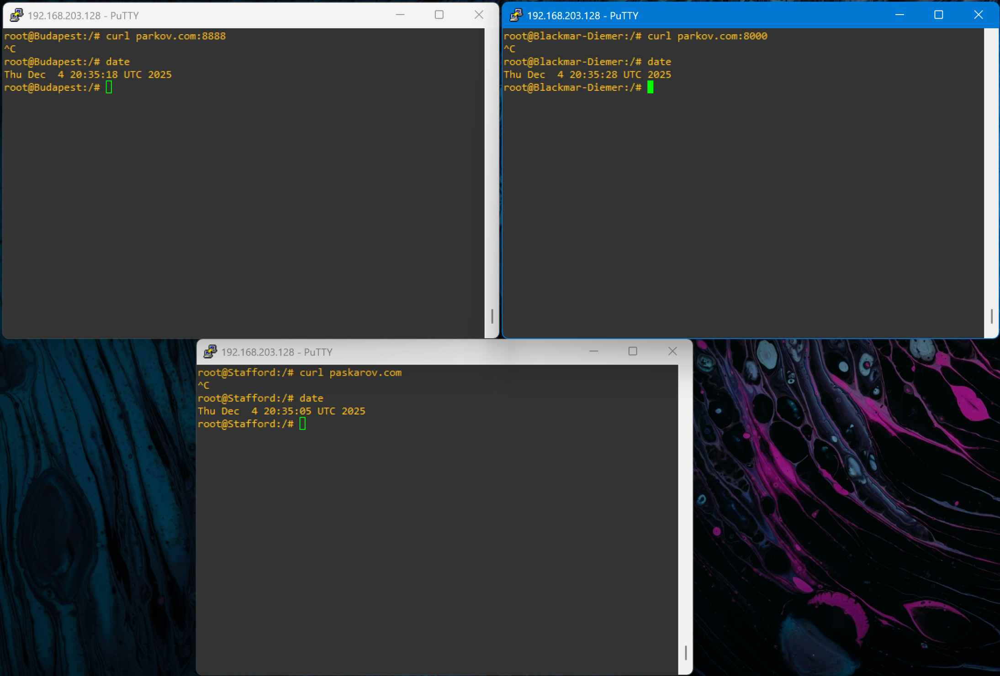

- Explanation

  Perlu menambahkan konfigurasi tables berikut pada router `Smith-Morra`

  ```sh
  iptables -A FORWARD -p tcp -d 10.202.40.40 --dport 80 -m time --timestart 09:00 --timestop 17:00 --weekdays Mon,Tue,Wed,Thu,Fri -j ACCEPT
  iptables -A FORWARD -p tcp -d 10.202.41.41 --dport 8000 -m time --timestart 09:00 --timestop 17:00 --weekdays Mon,Tue,Wed,Thu,Fri -j ACCEPT
  iptables -A FORWARD -p tcp -d 10.202.41.41 --dport 8888 -m time --timestart 09:00 --timestop 17:00 --weekdays Mon,Tue,Wed,Thu,Fri -j ACCEPT

  iptables -A FORWARD -p tcp -d 10.202.40.40 -j DROP
  iptables -A FORWARD -p tcp -d 10.202.41.41 -j DROP
  ```

<br>

## Soal 15

> Terakhir, Gerry Paskarov berpesan untuk selalu melakukan logging, sehingga konfigurasikan fitur logging untuk melakukan log terhadap seluruh paket yang di-DROP pada firewall **Smith-Morra.**
> _Finally, Gerry Paskarov advises to always perform logging, so configure a logging feature to log all packets dropped on the **Smith-Morra** firewall._

**Answer:**

- Screenshot

  Hasil log packet yang di drop pada node `Smith-Morra` dengan melakukan test akses ke `Caro-Kann`, `Alekhine`, dan 
  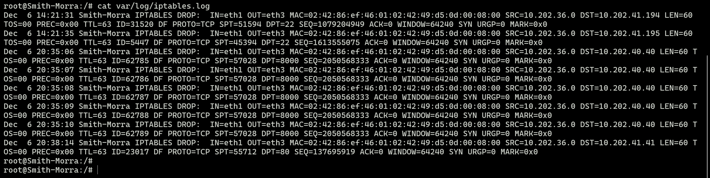

- Explanation

  Untuk dapat melaku logging pada packet yang di DROP pada firewall `Smith-Morra`, maka diperlukan untuk menginstall `ulogd2` terlebih dahulu pada node `Smith-Morra` dengan command berikut : 

  ```sh
  apt-get install ulogd2 -y
  ```

  Lalu agar ulogd2 dapat merekam setiap packet yang di drop maka diperlukan untuk membuat chain baru dengan command berikut : 
  
  ```sh
  iptables -N LOG_AND_DROP

  iptables -A LOG_AND_DROP -m limit --limit 100/min -j NFLOG --nflog-group 0 --nflog-prefix "IPTABLES DROP: "
  iptables -A LOG_AND_DROP -j DROP
  ```

  Dan juga mengganti output log pada `ulogd.conf` ke path `var/log/iptables.log`

  ```sh
  [emu1]

  file="/var/log/iptables.log"
  sync=1
  ```

  Agar dapat terekam, konfigurasi iptables untuk DROP package juga harus diupdate untuk bagian chain nya

  ```sh
  iptables -A FORWARD -p tcp --dport 22 -d 10.202.41.194 -j LOG_AND_DROP
  iptables -A FORWARD -p tcp --dport 22 -d 10.202.41.195 -j LOG_AND_DROP

  iptables -A FORWARD -p tcp -d 10.202.40.40 --dport 80 -m time --timestart 09:00 --timestop 17:00 --weekdays Mon,Tue,Wed,Thu,Fri -j ACCEPT
  iptables -A FORWARD -p tcp -d 10.202.41.41 --dport 8000 -m time --timestart 09:00 --timestop 17:00 --weekdays Mon,Tue,Wed,Thu,Fri -j ACCEPT
  iptables -A FORWARD -p tcp -d 10.202.41.41 --dport 8888 -m time --timestart 09:00 --timestop 17:00 --weekdays Mon,Tue,Wed,Thu,Fri -j ACCEPT

  iptables -A FORWARD -p tcp -d 10.202.40.40 -j LOG_AND_DROP
  iptables -A FORWARD -p tcp -d 10.202.41.41 -j LOG_AND_DROP
  ```

  Jika sudah, maka dapat melakukan start pada service ulog dengan command berikut : 

  ```sh
  ulogd -d -c etc/ulogd.conf
  ```

<br>
  
## Problems
Lagi dan lagi, problem yang terjadi, paling susah, dan memakan waktu terlama adalah 

ROUTING

Terlepas dari itu, tidak ada. 


 
## Revisions (if any)
