| Name | NRP | Kelas |
| --- | --- | ----------|
| 5025231023 | Nabil Julian Syah | Jaringan Komputer (F) |
| 5025231113 | Reynandriel Pramas Thandya | Jaringan Komputer (F) |

## Find your topology here!

- Link: https://drive.google.com/drive/folders/1ECQD6-cQkg0DzyflG-jSxJZaGaxg0KSU?usp=sharing

- Topology distribution for groups: https://docs.google.com/spreadsheets/d/1QKEZjixTStNbdXznOalJoJS0UQ6ed23o51pP8t8eAIM/edit?gid=1757558734#gid=1757558734

## Put your topology config image here!

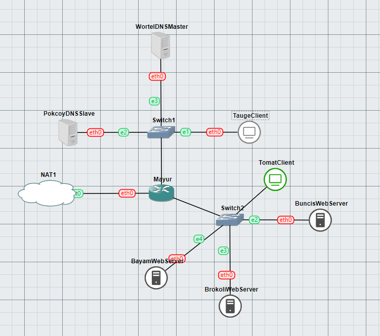

- Network Configuration Mayur
  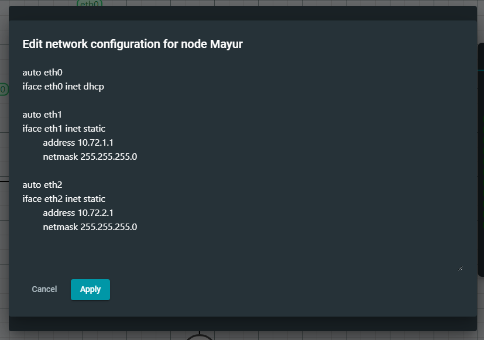
- Network Configuration TaugeClient
  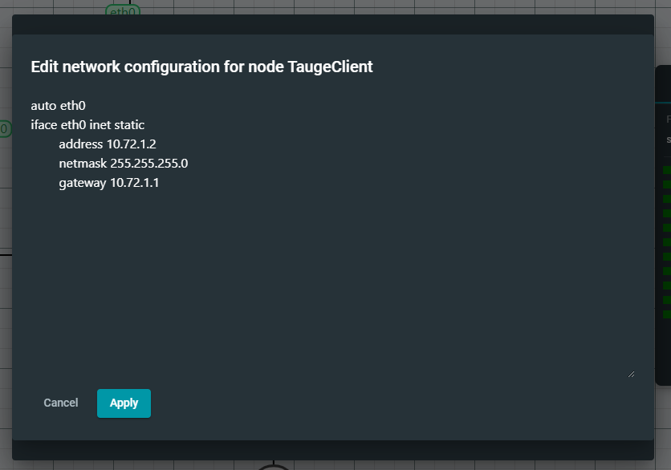
- Network Configuration PokcoyDNSSlave
  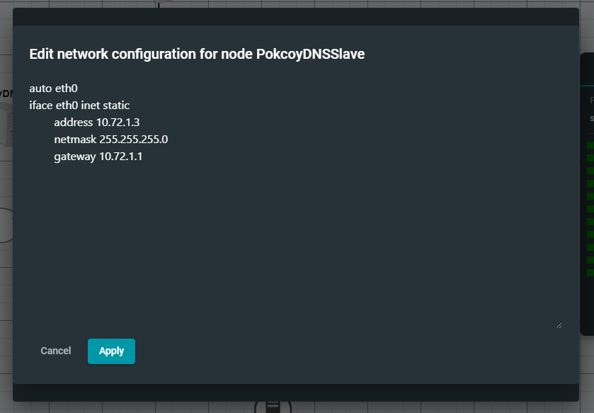
- Network Configuration WortelDNSMaster
  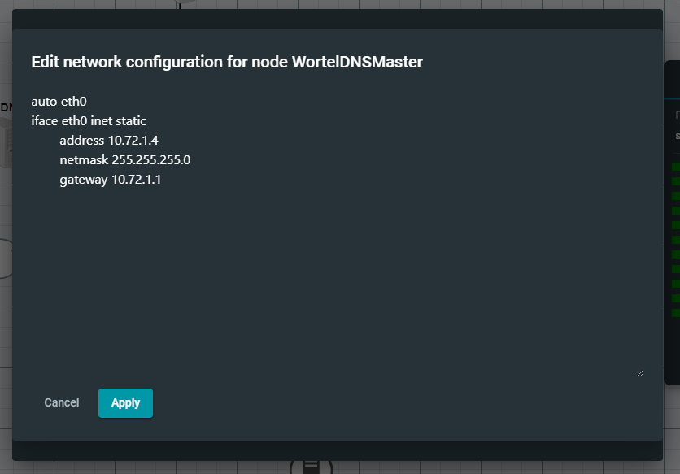
- Network Configuration TomatClient
  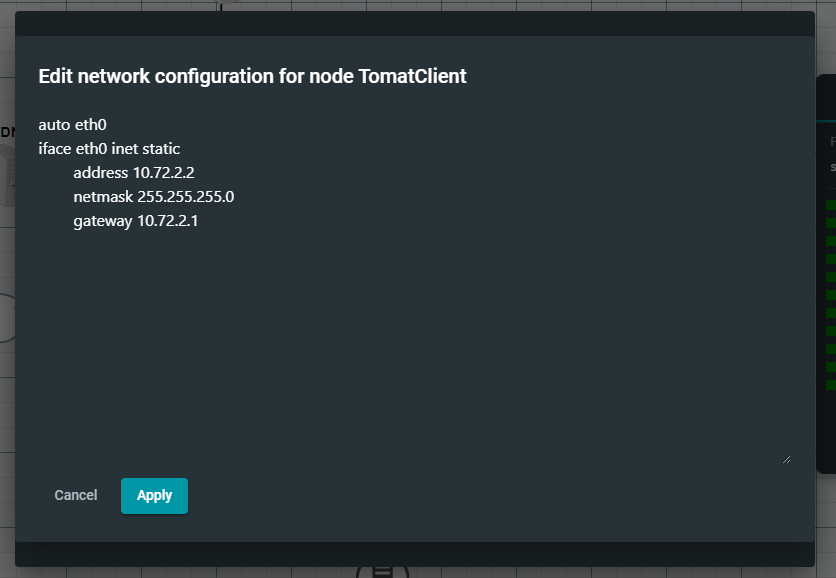
- Network Configuration BuncisWebServer
  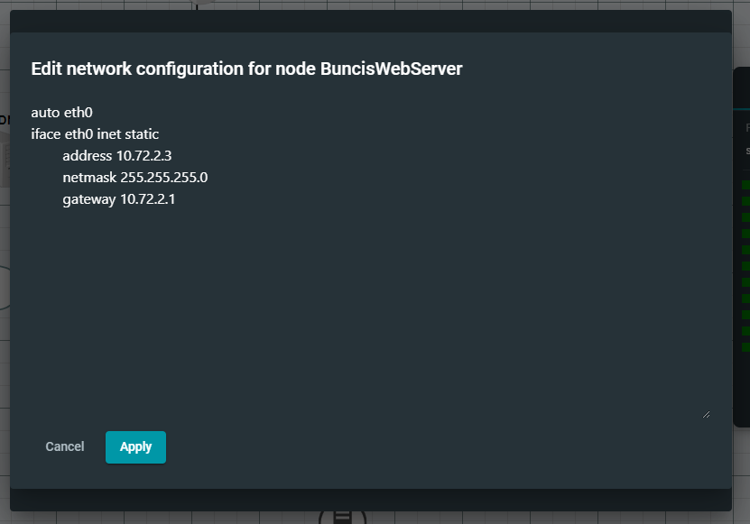
- Network Configuration BrokoliWebServer
  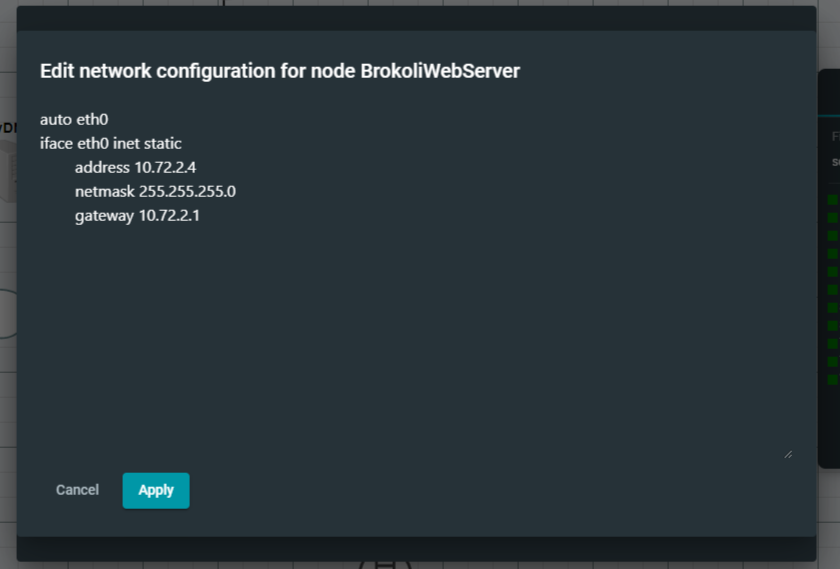
- Network Configuration BayamWebServer
  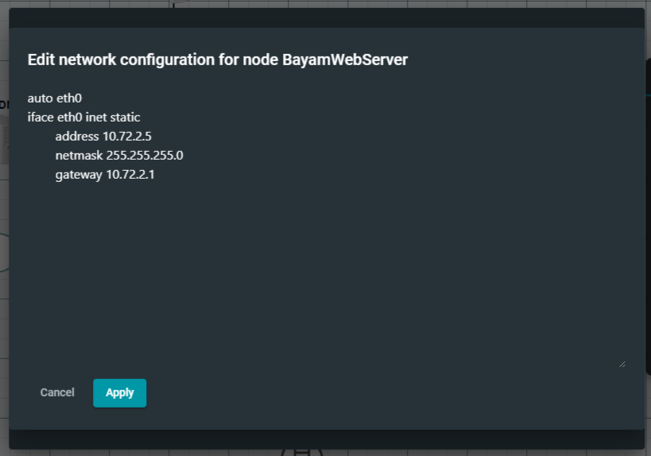

<br>

## Soal 1

> Topologi terdiri dari node Wortel yang berupa DNS Master*. Selain itu, terdapat pula node Pokcoy sebagai DNS Slave*, yang bertugas sebagai cadangan dari node Wortel.
> <br> </br>
> Selanjutnya terdapat node Tomat dan Taoge yang bekerja sebagai Client*, tiga buah Web Server* yaitu Bayam, Buncis, dan Brokoli, serta Mayur sebagai Router\*. Buatlah topologi sesuai dengan pembagian topologi [di sini](https://docs.google.com/spreadsheets/d/1QKEZjixTStNbdXznOalJoJS0UQ6ed23o51pP8t8eAIM/edit?usp=sharing) dan konfigurasi topologi [di sini](https://drive.google.com/drive/folders/1ECQD6-cQkg0DzyflG-jSxJZaGaxg0KSU?usp=sharing). Pastikan bahwa setiap node dapat terhubung ke Internet.

> _The topology consists of a Wortel node which is a DNS Master*. In addition, there is also a Pokcoy node as a DNS Slave*, which serves as a backup for the Wortel node._ > <br> </br> > _Furthermore, there are Tomat and Taoge nodes that work as Client*, three Web Servers*, namely Bayam, Buncis, and Brokoli, then finally Mayur as Router\*. Make a topology according to the topology division [here](https://docs.google.com/spreadsheets/d/1QKEZjixTStNbdXznOalJoJS0UQ6ed23o51pP8t8eAIM/edit?usp=sharing) and the topology configuration [here](https://drive.google.com/drive/folders/1ECQD6-cQkg0DzyflG-jSxJZaGaxg0KSU?usp=sharing). Make sure that each node can connect to the Internet._

**Answer:**

- Screenshot

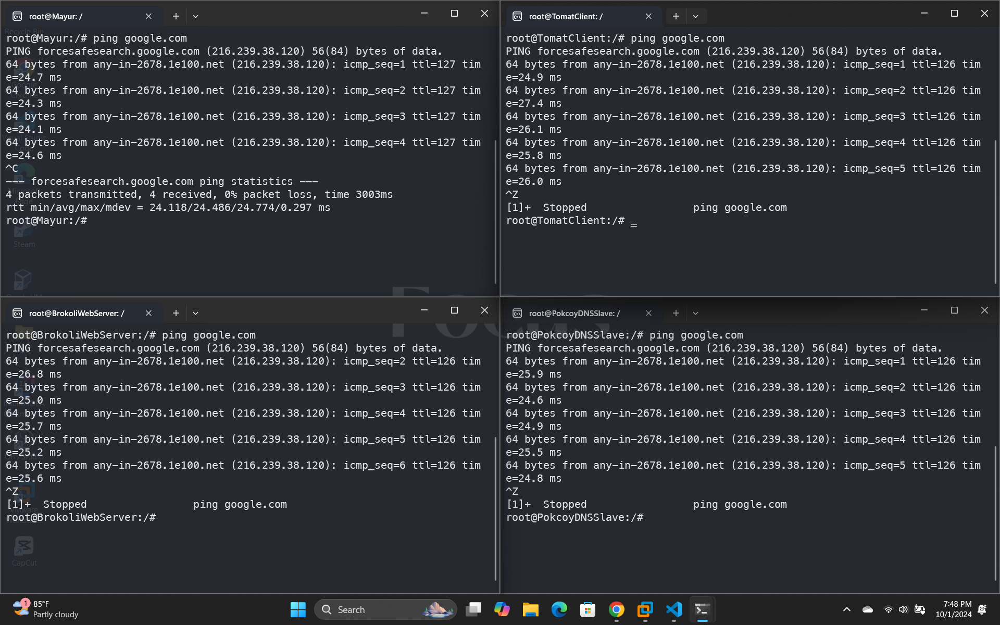

- Explanation
  - lakukan `iptables -t nat -A POSTROUTING -o eth0 -j MASQUERADE -s 10.72.0.0/16` pada router Mayur, keterangan:
  > - iptables: iptables merupakan suatu tools dalam sistem operasi Linux yang berfungsi sebagai filter terhadap lalu lintas data. Dengan iptables inilah kita akan mengatur semua lalu lintas dalam komputer, baik yang masuk, keluar, maupun yang sekadar melewati komputer kita.
  > - NAT (Network Address Translation): Suatu metode penafsiran alamat jaringan yang digunakan untuk menghubungkan lebih dari satu komputer ke jaringan internet dengan menggunakan satu alamat IP.
  > - Masquerade: Digunakan untuk menyamarkan paket, misal mengganti alamat pengirim dengan alamat router.
  > - -s (Source Address): Spesifikasi pada source. Address bisa berupa nama jaringan, nama host, atau alamat IP.
  <br>

  - Ketikan `cat /etc/resolv.conf` untuk mendapatkan nameserver dari Mayur
  - lakukan `echo 'nameserver 192.168.122.1' > /etc/resolve.conf` pada setiap node, untuk menghubungkan ke IP DNS agar tersambung ke internet
  

<br>

## Soal 2

> Tambahkan konfigurasi untuk domain bayam.yyy.com yang mengarah ke IP node Bayam di DNS Master. Dengan cara yang sama, buat konfigurasi domain brokoli.yyy.com yang mengarah ke IP node Brokoli dan domain buncis.yyy.com yang mengarah ke IP node Buncis. Simpan semua konfigurasi dalam folder Jarkom. Selama pengerjaan soal, ubah yyy menjadi kode kelompok masing-masing (contoh: A02).
> <br> </br>
> Jangan lupa update konfigurasi kedua client agar dapat berkomunikasi dengan semua domain tersebut.

> _Add a configuration for bayam.yyy.com domain that points to the Bayam node IP in the DNS Master. In the same way, create a brokoli.yyy.com domain configuration that points to the Brokoli node IP and a buncis.yyy.com domain that points to the Buncis node IP. Save all configurations in a folder called Jarkom. For this practicum, substitute yyy with the code of each group (ex: A02).
> <br> </br>
> Don't forget to update the configuration of both clients so that they can communicate with the domains._

**Answer:**

- Screenshot

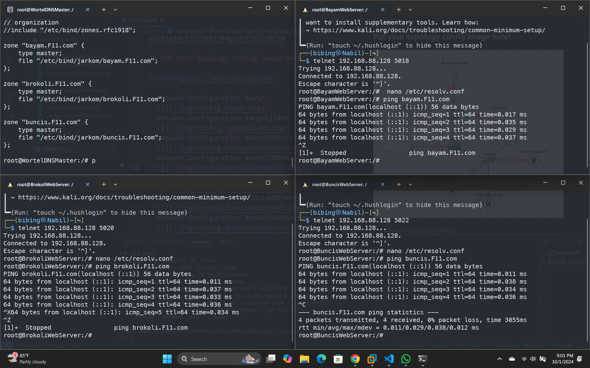
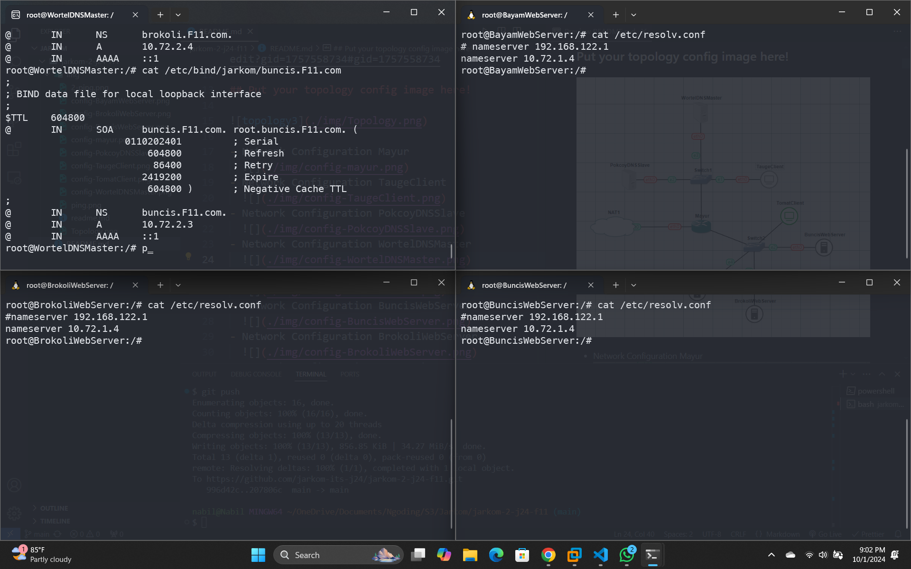
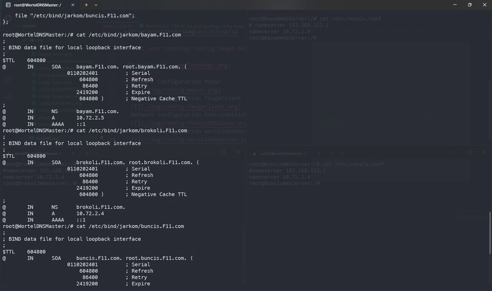

- Explanation
  - Instalasi bind dengan command `upt-get update && apt-get install bind9 -y` pada WortelDNSMaster.
  - Buat direktori Jarkom sesuai dengan perintah soal `mkdir /etc/bind/Jarkom`.
  - konfigurasi setiap domain dengan `nano /etc/bind/named.conf.local`
  - isikan konfigurasi sesuai perintah soal dengan
    ```
    zone "bayam.F11.com" {
    type master;
    file "/etc/bind/Jarkom/bayam.F11.com";
    };

    zone "brokoli.F11.com" {
    type master;
    file "/etc/bind/Jarkom/brokoli.F11.com";
    };

    zone "buncis.F11.com" {
    type master;
    file "/etc/bind/Jarkom/buncis.F11.com";
    };
    ```
  - copy file **db.local** pada **/etc/bind/Jarkom/**, copy untuk masing masing domain.
    ```
    cp /etc/bind/db.local /etc/bind/Jarkom/bayam.F11.com
    cp /etc/bind/db.local /etc/bind/Jarkom/brokoli.F11.com
    cp /etc/bind/db.local /etc/bind/Jarkom/buncis.F11.com
    ```
  - edit masing-masing domain
    > - bayam.F11.com
    ```
    ;
    ; BIND data file for local loopback interface
    ;
    $TTL    43200
    @       IN      SOA     bayam.F11.com. root.bayam.F11.com. (
                        2024100111      ; Serial
                           7200         ; Refresh
                           1800         ; Retry
                        1209600         ; Expire
                         43200 )        ; Negative Cache TTL
    ;
    @       IN      NS      bayam.F11.com.
    @       IN      A       10.72.2.5
    ```
    > - brokoli.F11.com
    ```
    ;
    ; BIND data file for local loopback interface
    ;
    $TTL    604800
    @       IN      SOA     brokoli.F11.com. root.brokoli.F11.com. (
                        2024100111      ; Serial
                         604800         ; Refresh
                          86400         ; Retry
                        2419200         ; Expire
                         604800 )       ; Negative Cache TTL
    ;
    @       IN      NS      brokoli.F11.com.
    @       IN      A       10.72.2.4
    ```

    > - buncis.F11.com
    ```
    ;
    ; BIND data file for local loopback interface
    ;
    $TTL    604800
    @       IN      SOA     buncis.F11.com. root.buncis.F11.com. (
                        2024100111      ; Serial
                         604800         ; Refresh
                          86400         ; Retry
                        2419200         ; Expire
                         604800 )       ; Negative Cache TTL
    ;
    @       IN      NS      buncis.F11.com.
    @       IN      A       10.72.2.3
    ```
  - Restart bind9 `service bind9 restart`
<br>

## Soal 3

> Tambahkan domain alias berupa www.bayam.yyy.com pada alamat bayam.yyy.com dan www.brokoli.yyy.com pada alamat brokoli.yyy.com.

> _Add a domain alias in the form of www.bayam.yyy.com to the bayam.yyy.com address and www.brokoli.yyy.com to the brokoli.yyy.com address._

**Answer:**

- Screenshot
  


- Explanation
  - menggunakan Record CNAME adalah sebuah record yang membuat alias name dan mengarahkan domain ke alamat/domain yang lain.
  - Edit menggunakan nano pada `/etc/bind/Jarkom/brokoli.F11.com`.
  - Tambahkan `www IN CNAME brokoli.F11.com`.
  - lakukan cara yang sama untuk `/etc/bind/Jarkom/bayam.F11.com`.
  - Lakukan testing di TaugeClient, gunakan `host -t CNAME [www.domain]`.

<br>

## Soal 4

> Tambahkan record reverse domain untuk domain brokoli.yyy.com dan buncis.yyy.com.

> _Add a reverse domain record for brokoli.yyy.com and buncis.yyy.com domains._

**Answer:**

- Screenshot

 
 

- Explanation
  - tambahkan reverse dari 3 byte awal dari IP yang ingin dilakukan Reverse. Dari `10.72.2` maka reverse nya adalah `2.72.10` pada `/etc/bind/named.conf.local`.
  - setelah di update
  ```
  zone "buncis.F11.com" {
    type master;
    allow-transfer { 10.72.1.3; };
    file "/etc/bind/Jarkom/buncis.F11.com";
  };
  
  zone "bayam.F11.com" {
    type master;
    allow-transfer { 10.72.1.3; };
    file "/etc/bind/Jarkom/bayam.F11.com";
  };
    
  zone "brokoli.F11.com" {
    type master;
    allow-transfer { 10.72.1.3; };
    file "/etc/bind/Jarkom/brokoli.F11.com";
  };
  
  zone "2.72.10.in-addr.arpa" {
    type master;
    file "/etc/bind/Jarkom/2.72.10.in-addr.arpa";
  };
  ```
  - copy file **db.local** `cp /etc/bind/db.local /etc/bind/Jarkom/2.168.192.in-addr.arpa`
  ```
  ;
  ; BIND data file for local loopback interface
  ;
  $TTL    604800
  @       IN      SOA     buncis.F11.com. root.buncis.F11.com. (
                        2024100111      ; Serial
                         604800         ; Refresh
                          86400         ; Retry
                        2419200         ; Expire
                         604800 )       ; Negative Cache TTL
                         ;
  2.72.10.in-addr.arpa.   IN      NS      buncis.F11.com.
  2.72.10.in-addr.arpa.   IN      NS      brokoli.F11.com.
  3       IN      PTR     buncis.F11.com.
  4       IN      PTR     brokoli.F11.com.
  ```

- Lakukan Testing di TaugeClient gunakan `host -t PTR [IP]`.
<br>

## Soal 5

> Ubah record SOA dari domain bayam.yyy.com sesuai dengan ketentuan berikut:
>
> - Lama waktu server slave menunggu untuk mengecek salinan baru server master adalah sebesar 2 jam.
> - Field yang mengatur revisi file zona ini diubah menjadi tanggal awal praktikum (format YYYYMMDD) kemudian diikuti dengan nomor kelompok (contoh untuk kelompok A02 maka nomornya 02).
> - Lamanya waktu server harus menunggu untuk meminta pembaruan lagi dari nameserver master yang tidak responsif sebesar 30 menit.
> - Lama waktu nama domain di-cache secara lokal sebelum kadaluarsa dan kembali ke nameserver otoritatif untuk informasi terbaru sebesar 12 jam.
> - Jika server slave tidak mendapatkan respons dari server master dalam waktu 2 minggu, server tersebut harus berhenti merespons kueri untuk zona tersebut.

> _Change the SOA record of the bayam.yyy.com domain according to the following conditions:_
>
> - The length of time the slave server waits to check for a new revision of the master server is 2 hours.
> - The field that regulates the revision of this zone file is changed to the start date of the practicum (YYYYMMDD format) then followed by the group number (ex: for A02 the group number would be 02).
> - The length of time the server has to wait to request another update from an unresponsive master nameserver is 30 minutes.
> - The length of time a domain name is cached locally before it expires and returns to an authoritative nameserver for up-to-date information is 12 hours.
> - If the slave server does not get a response from the master server within 2 weeks, it must stop responding to queries for that zone.

**Answer:**

- Screenshot

  


- Explanation
  - Disini diminta untuk mengubah SOA sesuai permintaan soal.
  - Ubah isi /etc/bind/Jarkom/bayam.F11.com
  - Untuk STTL dan Negative Cache TTL diubah menjadi 43200, karena sesuai soal yaitu 12 jam domain di-cache secara lokal sebelum kadaluarsa dan kembali ke nameserver otoritatif untuk informasi terbaru. 
  - Kemudian serial sesuai permintaan soal yaitu 2024100111 (tanggal pertama kali praktikum tambah angka kelompok F11 jadi 11). SOA Refresh dijadikan 2 jam atau 7200 detik. SOA retry 30 menit atau 1800 detik. 
  - Terakhir SOA Expire diubah menjadi 2 minggu atau 1209600 detik.

<br>

## Soal 6

> Untuk menangani request yang berlebih dari client ke ketiga alamat yang tadi dibuat, konfigurasikan node Pokcoy sebagai DNS Slave yang bekerja untuk DNS Master Wortel.

> _To handle excess requests from the client to the three addresses created, configure the Pokcoy node as the DNS Slave that works for Wortel DNS Master._

**Answer:**

- Screenshot


- Explanation

 - Ubah /etc/bind/named.conf.local yaitu pada zone buncis, bayam, dan brokoli dengan menambahkan `allow-transfer { 10.72.1.3; }; `

- Ditambahkan diantara type master dan file, dengan ip `10.72.1.3` adalah IP PokcoyDNSSlave. 
- Kemudian pada PokcoyDNSSlave install semua package yang dibutuhkan (bisa menggunakan bashrc)
- Pada /etc/bind/named.conf.local isi dengan
```
zone "buncis.F11.com" {
    type slave;
    masters { 10.72.1.4; }; //IP WortelDNSMaster
    file "/var/lib/bind/buncis.F11.com";
};

zone "bayam.F11.com" {
    type slave;
    masters { 10.72.1.4; }; //IP WortelDNSMaster
    file "/var/lib/bind/bayam.F11.com";
};

zone "brokoli.F11.com" {
    type slave;
    masters { 10.72.1.4; }; //IP WortelDNSMaster
    file "/var/lib/bind/brokoli.F11.com";
};
```
- Sambungkan BuncisWebServer, BayamWebServer, dan BrokoliWebserver dengan menambahkan "nameserver IP PokcoyDNSSlave" pada /etc/resolv.conf`
```
echo "nameserver 10.72.1.4" > /etc/resolv.conf
echo "nameserver 10.72.1.3" >> /etc/resolv.conf
```
<br>

## Soal 7

> Karena membutuhkan tempat untuk menyimpan resep brokoli, buatlah subdomain berupa vitamin.brokoli.yyy.com dengan alias www.vitamin.brokoli.yyy.com dengan mendelegasikannya dari Wortel ke Pokcoy dengan alamat IP menuju Brokoli yang diatur di folder Vitamin.

> _Since we need a place to store Brokoli recipes, create a subdomain in the form of vitamin.brokoli.yyy.com with an alias of www.vitamin.brokoli.yyy.com by delegating it from Wortel to Pokcoy with an ip to the Brokoli node in a folder called Vitamin._

**Answer:**

- Screenshot
  


- Explanation
  - Pertama buat folder Vitamin dan domain vitamin (vitamin.brokoli.F!1.com) di PokcoyDNSSlave.
  - Tambahkan configurasinnya pada named.conf.local.
  - Setelah itu ubah pada configurasi brokoli.F11.com pada WortelDNSMaster dengan menambahkan vitamin sebagai subdomain.
 
  `Konfigurasi vitamin.brokoli.F11.com`
  ```
  ;
  ; BIND data file for local loopback interface
  ;
  $TTL    604800
  @       IN      SOA    vitamin.brokoli.F11.com. root.vitamin.brokoli.F11.com. (
                        2024100111              ; Serial
                         604800         ; Refresh
                          86400         ; Retry
                        2419200         ; Expire
                         604800 )       ; Negative Cache TTL
  ;
  @       IN      NS      vitamin.brokoli.F11.com.
  @       IN      A       10.72.2.4
  www	IN	CNAME	vitamin.brokoli.F11.com.
  ```

  - `named.conf.local Pokcoy`
  ```
  zone "vitamin.brokoli.F11.com" 
  {
      type master;
      file "/etc/bind/Vitamin/vitamin.brokoli.F11.com";
  };
  
  ```

  - `Konfigurasi brokoli.F11.com`

  ```
  ;
  ; BIND data file for local loopback interface
  ;
  $TTL    604800
  @       IN      SOA    brokoli.F11.com. root.brokoli.F11.com. (
                          2024100111              ; Serial
                          604800         ; Refresh
                            86400         ; Retry
                          2419200         ; Expire
                          604800 )       ; Negative Cache TTL
  ;
  @       IN      NS      brokoli.F11.com.
  @       IN      A       10.72.2.4
  www	IN	CNAME	brokoli.F11.com.
  ns1	IN	A 	10.72.1.3
  vitamin IN 	NS	ns1
  ```

  - `named.conf.local Wortel`
  ```
  zone "brokoli.F11.com" 
  {
      type master;
      file "/etc/bind/Jarkom/Vitamin/vitamin.brokoli.F11.com";
      allow-transfer { 10.72.1.3; };
  };
  ```

  - Ubah named.conf.options pada Pokcoy dan Wortel dengan menambahkan coment line `"dnssec-validation auto"` dan tambahkan `"allow-query{any;};"` pada baris berikutnya"


<br>

## Soal 8

> Buatlah subdomain khusus untuk kandungan brokoli dengan akses k1.vitamin.brokoli.yyy.com dengan alias www.k1.vitamin.brokoli.yyy.com yang mengarah ke IP brokoli dan diatur di folder k1.

> _Create a special subdomain for Brokoli content called k1.vitamin.brokoli.yyy.com with an alias called www.k1.vitamin.brokoli.yyy.com that point to Brokoli node and are organized in a folder called k1._

**Answer:**

- Screenshot


- Explanation
  - Sama seperti sebelumnya, buat domain lagi (kami buatnya di dalam folder Vitamin) di Pokcoy.
  - Tambahkan alias dengan CNAME www pada domain k1.
  - Tambahkan subdomain pada vitamin.brokoli.F11.com dan ubah dengan code berikut:
  
  `Domain k1`

  ```
    ;
    ; BIND data file for local loopback interface
    ;
    $TTL    604800
    @       IN      SOA    k1.vitamin.brokoli.F11.com. root.k1.vitamin.brokoli.F11.com. (
                          2024100111              ; Serial
                          604800         ; Refresh
                            86400         ; Retry
                          2419200         ; Expire
                          604800 )       ; Negative Cache TTL
    ;
    @       IN      NS      k1.vitamin.brokoli.F11.com.
    @       IN      A       10.72.2.4
    www	IN	CNAME	k1.vitamin.brokoli.F11.com.
  ```

  `Domain vitamin`
  ```
  ;
  ; BIND data file for local loopback interface
  ;
  $TTL    604800
  @       IN      SOA    vitamin.brokoli.F11.com. root.vitamin.brokoli.F11.com. (
                          2024100111              ; Serial
                          604800         ; Refresh
                            86400         ; Retry
                          2419200         ; Expire
                          604800 )       ; Negative Cache TTL
  ;
  @       IN      NS      vitamin.brokoli.F11.com.
  @       IN      A       10.72.2.4
  www	IN	CNAME	vitamin.brokoli.F11.com.
  k1	IN	A	10.72.2.4
  ```
  `named.conf.local`
  ```
  zone "k1.vitamin.brokoli.F11.com" {
      type master;
      file "/etc/bind/Vitamin/k1/k1.vitamin.brokoli.F11.com";
  };

  ```
<br>

## Soal 9

> Bayam, Brokoli, dan Buncis masing-masing berfungsi sebagai web server nginx yang menyajikan resep khusus untuk jenis sayuran yang mereka tangani. Untuk mengaktifkan web server pada masing-masing worker, lakukan deployment website menggunakan sumber yang tersedia di sayur_webserver_nginx. Tambahkan konfigurasi untuk log error ke file /var/log/nginx/error.log dan log access ke file /var/log/nginx/access.log.

> _Bayam, Brokoli, and Buncis each function as nginx web servers that serve special recipes for the type of vegetables they handle. To activate the web server on each worker, do the deployment using the resources available in sayur_webserver_nginx. Add configuration for error log to the file /var/log/nginx/error.log and access log to the file /var/log/nginx/access.log._

**Answer:**

- Screenshot


- Explanation
  - Pertama ubah nameserver pada /etc/resolv.conf nya ke 192.168.122.1 pada Worker dan TomatClient.
  - Setelah terhubung internet, download dan install nginx beserta php pada worker dan lynx pada TomatClient.
  - Kemudian download dan unzip file kebutuhan server pada `/var/www/`. 
  - Konfigurasikan webserver dengan membuat file configurasi di dalam /etc/nginx/sites-available/ dengan code sebagai berikut: (lakukan pada ketiga workernya, ubah name)
  ```
  server {


    listen 80;

    root "/var/www/sayur_webserver_nginx";

    index index.php index.html index.htm;
    server_name [nama domain];

    location / {
        try_files $uri $uri/ /index.php?$query_string;
    }

    # pass PHP scripts to FastCGI server
    location ~ \.php$ {
    include snippets/fastcgi-php.conf;
    fastcgi_pass unix:/var/run/php/php7.2-fpm.sock;
    }

  location ~ /\.ht {
        deny all;
    }

    error_log /var/log/nginx/error.log;
    access_log /var/log/nginx/access.log;
  }
  ```

  - Setelah itu connect dengan symlink configurasi yang telah dibuat dengan `ln -s /etc/nginx/sites-available/brokoli /etc/nginx/sites-enabled`.
  - Lakukan start pada nginx dan restart pada php7.2-fpm.
  - Lakukan troubleshooting bila terjadi error saat nginx dinyalakan.
  - Hapus `/etc/nginx/sites-enabled/default` untuk menonaktifkan default. 
  - Lalu test dengan menggunakan lynx pada TomatClient.
<br>

## Soal 10

> Pada masing masing worker nginx, akan terdapat beberapa hal yang perlu diperbaiki pada resource yang diberikan untuk bisa menampilkan resep saat halaman dimuat. Analisis kesalahan yang ada di resource melalui file /var/log/nginx/error.log dan perbaiki hingga halaman bisa menampilkan resep sesuai dengan worker nya.

> _On each nginx worker, there will be several things that need to be fixed in the resources provided to be able to display recipes when the page is loaded. Analyze the errors in the resource through the /var/log/nginx/error.log file and fix it until the page can display recipes according to its worker._

**Answer:**

- Screenshot

  
  


- Explanation
  - Setelah dilihat dari error.log, ternyata hostname dari server tidak ditemukan.
  - Maka solusinya adalah dengan mengubah index.php sehingga sesuai dengan nama WebServer (worker) dan nama file phpnya. **misalkan:** Bayam menjadi BayamWebServer, dan resep_1 menjadi resep1 seperti berikut ini:
  ```
  <?php
  $hostname = gethostname();
  $date = date('l, d F Y H:i:s');
  $php_version = phpversion();
  $visitor_ip = $_SERVER['REMOTE_ADDR'];

  echo "<h1>Selamat Datang di Situs Resep Sayuran!</h1>";
  echo "<p>Pengunjung dari IP: <strong>$visitor_ip</strong></p>";
  echo "<p>Versi PHP: <strong>$php_version</strong></p>";
  echo "<p>Waktu: <strong>$date</strong></p>";
  echo "<hr>";
  echo "<p>Saat ini Anda sedang mengakses resep dari sayur: <strong>$hostname</strong></p>";

  switch ($hostname) {
      case 'BayamWebServer':
          if (!@include 'resep1.php') {
              echo "<p>Gagal Memuat Resep! Cek Error Log untuk info lebih lanjut.</p>";
              error_log("File resep1.php tidak ditemukan!\n", 3, "/var/log/nginx/error.log");
          }
          break;
      case 'BuncisWebServer':
          if (!@include 'resep2.php') {
              echo "<p>Gagal Memuat Resep! Cek Error Log untuk info lebih lanjut.</p>";
              error_log("File resep2.php tidak ditemukan!\n", 3, "/var/log/nginx/error.log");
          }
          break;
      case 'BrokoliWebServer':
          if (!@include 'resep3.php') {
              echo "<p>Gagal Memuat Resep! Cek Error Log untuk info lebih lanjut.</p>";
              error_log("File resep3.php tidak ditemukan!\n", 3, "/var/log/nginx/error.log");
          }
          break;
      default:
          echo "<p>Gagal Memuat Resep! Cek Error Log untuk info lebih lanjut.</p>";
          error_log("Hostname tidak ditemukan!\n", 3, "/var/log/nginx/error.log");
          break;
  }
  ?>
  ```
  - Lalu test lagi dengan lynx pada TomatClient

<br>

## Soal 11

> Setelah website berhasil dideploy pada masing-masing worker (Bayam, Brokoli, dan Buncis) dan halaman dapat menampilkan resep sayuran yang sesuai, buatlah custom access log ke file /var/log/nginx/access.log di masing-masing web server worker menggunakan format log tertentu seperti di bawah:
>
> - Tanggal dan waktu akses dalam format standar log.
>   Nama worker yang sedang dilayani (misalnya: Bayam, Brokoli, atau Buncis).
> - Alamat IP klien yang mengakses website.
> - Metode HTTP dan URI yang diakses oleh klien.
> - Status respons HTTP yang diberikan oleh server.
> - Jumlah byte yang dikirimkan dalam respons.
> - Waktu yang dihabiskan oleh server untuk menangani permintaan.
>   <br> </br>
>   Contoh format log yang sesuai:
>   [01/Oct/2024:11:30:45 +0000] Jarkom Node Bayam Access from 192.168.1.15 using method "GET /resep/bayam HTTP/1.1" returned stat

> _After successfully deploying the website on each worker (Bayam, Brokoli, and Buncis) and ensuring the pages display the appropriate vegetable recipes, create a custom access log file at /var/log/nginx/access.log on each web server worker using a specific log format as described below:_
>
> - _Access date and time in standard log format._
> - _Name of the worker serving the request (e.g., Bayam, Brokoli, or Buncis)._
> - _Client IP address accessing the website._
> - _HTTP method and URI accessed by the client._
> - \_HTTP response status provided by the server.\_\_
> - \_Number of bytes sent in the response.
> - _Time taken by the server to handle the request._ > <br> </br> > _Example of the appropriate log format:
>   [01/Oct/2024:11:30:45 +0000] Jarkom Node Bayam Access from 192.168.1.15 using method "GET /resep/bayam HTTP/1.1" returned status 200 with 2567 bytes sent in 0.038 seconds_

**Answer:**

- Screenshot

  
  
   
  
 	
- Explanation
  - ambahkan line log_format pada ketiga configurasi servernya diluar code bagian server seperti berikut:
  ```
	log_format custom '[$time_local] Jarkom Node $hostname Access from $remote_addr using method "$request_method $uri $server_protocol" returned status $status with $body_bytes_sent bytes sent in $request_time seconds';
  ```

  - Lalu tambahkan "custom" setelah access.log, sehingga isi configurasi menjadi seperti berikut:
  ```
	log_format custom '[$time_local] Jarkom Node $hostname Access from $remote_addr using method "$request_method $uri $server_protocol" returned status $status with $body_bytes_sent bytes sent in $request_time seconds';

	server {
	
		listen 80;
	
		root "/var/www/sayur_webserver_nginx";
	
		index index.php index.html index.htm;
		server_name bayam.F11.com;
	
		location / {
				try_files $uri $uri/ /index.php?$query_string;
		}
	
		# pass PHP scripts to FastCGI server
		location ~ \.php$ {
		include snippets/fastcgi-php.conf;
		fastcgi_pass unix:/var/run/php/php7.2-fpm.sock;
		}
	
	location ~ /\.ht {
				deny all;
		}
	
		error_log /var/log/nginx/error.log;
		access_log /var/log/nginx/access.log custom;
	}

  ```
  - Lakukan testing dengan lynx pada TomatClient
<br>

## Soal 12

> Informasi vitamin pada sayur brokoli akan ditampilkan pada subdomain vitamin.brokoli.yyy.com di node brokoli, buatlah DocumentRoot yang disimpan pada /var/www/vitamin.brokoli.yyy. Konfigurasikan webserver dengan nama server vitamin.brokoli.yyy.com dan server alias www.vitamin.brokoli.yyy.com. Lakukan konfigurasi Apache Web Server pada Brokoli dengan menggunakan sumber yang tersedia di [sini](https://docs.google.com/uc?export=download&id=1QbGkKXo3jt4c68AdVAkl1hD4LolTUPg2).

> _For information on vitamins in brokoli will be displayed on the vitamin.brokoli.yyy.com subdomain on the brokoli node, create a DocumentRoot stored in /var/www/vitamin.brokoli.yyy. Configure the web server with the server name vitamin.brokoli.yyy.com and server alias www.vitamin.brokoli.yyy.com. Configure the Apache Web Server on Brokoli using [this resource](https://docs.google.com/uc?export=download&id=1QbGkKXo3jt4c68AdVAkl1hD4LolTUPg2)._

**Answer:**

- Screenshot


- Explanation
  - Hubungkan node dengan internet (ubah nameserver).
  - Download dan install apache pada brokoli.
  - Download pula file server dan unzip pada `/var/www/`.
  - Buat konfigurasi server pada `/etc/apache2/sites-available/` pada node Brokoli dengan mengcopy `/etc/apache2/sites-available/000-default`.
  - conf menjadi `/etc/apache2/sites-available/vitamin.brokoli.F11.com.conf`.
  - Lalu ubah codenya dengan menambahkan:

  ```
  ServerName vitamin.brokoli.F11.com
  ServerAlias www.vitamin.brokoli.F11.com
  DocumentRoot /var/www/vitamin.brokoli.F11
  ```
  - Tepat dibawah `ServerAdmin`. Matikan nginx dengan `service nginx stop` dan nyalakan apache dengan `service apache2 start`.
  - Aktifkan server dengan `a2ensite vitamin.brokoli.F11.com.conf` lalu reload apache dengan `service apache2 reload`.
  - Testing dengan lynx pada TomatClient.

<br>

## Soal 13

> Pada subdomain vitamin.brokoli.yyy.com, terdapat subfolder /nutrisi yang menyediakan informasi tentang berbagai vitamin dalam brokoli, seperti Vitamin A, C, dan K. Aktifkan directory listing untuk folder /nutrisi, dan buatlah rewrite rule di Apache untuk memperbaiki URL agar halaman seperti www.vitamin.brokoli.yyy.com/nutrisi/vitamin_a.php dapat diakses hanya dengan www.vitamin.brokoli.yyy.com/nutrisi/vitamin_a. Pastikan setiap halaman vitamin dapat diakses langsung melalui url yang telah disederhanakan.

> _On the vitamin.brokoli.yyy.com subdomain, there is a /nutrisi subfolder that provides information about various vitamins in brokoli, such as Vitamin A, C, and K. Activate directory listing for the /nutrisi folder, and create a rewrite rule in Apache to fix the URL so that pages like www.vitamin.brokoli.yyy.com/nutrisi/vitamin_a.php can be accessed only with www.vitamin.brokoli.yyy.com/nutrisi/vitamin_a. Make sure each vitamin page can be accessed directly through the simplified url._

**Answer:**

- Screenshot


- Explanation
  - Ubah lagi konfigurasi server dengan menambahkan directory listing nutrisi dengan code sebagai berikut:
  ```
  <Directory /var/www/vitamin.brokoli.F11/nutrisi>
      Options +FollowSymLinks -Multiviews
      AllowOverride All
  </Directory>
  ```
  - Buat suatu file bernama `.htaccess` pada `var/www/vitamin.brokoli.F11/nutrisi/` yang berisikan fungsi rewrite sebagai berikut:
  ```
  RewriteEngine On
  RewriteCond %{REQUEST_FILENAME} !-d
  RewriteRule ^([^\.]+)$ $1.php [NC,L]
  ```
  - jalankan `a2enmod rewrite` untuk mengaktifkan rewrite dan jalankan ulang apache2.
  - Testing dengan lynx pada TomatClient.
<br>

## Soal 14

> Tambahkan alias untuk folder /public/images/ pada subdomain www.vitamin.brokoli.yyy.com agar folder tersebut dapat diakses langsung melalui url www.vitamin.brokoli.yyy.com/img.

> _Add an alias for the /public/images/ folder on the www.vitamin.brokoli.yyy.com subdomain so that the folder can be accessed directly through the url www.vitamin.brokoli.yyy.com/img._

**Answer:**

- Screenshot


- Explanation
  - Tambahkan directory listing serta Alias pada configurasi server seperti code berikut: 
  ```
  <Directory /var/www/vitamin.brokoli.F11/public>
      Options +Indexes
  </Directory>

  Alias "/img" "/var/www/vitamin.brokoli.F11/public/images"
  ```
  - Reload apache dan testing di TomatClient.

<br>

## Soal 15

> Karena terdapat resep rahasia di file /secret/recipe_secret.txt pada subdomain www.vitamin.brokoli.yyy.com, konfigurasikan folder /secret agar tidak dapat diakses oleh pengguna (dengan menampilkan 403 Forbidden).

> _Because there is a secret recipe in the /secret/recipe_secret.txt file on the www.vitamin.brokoli.yyy.com subdomain, configure the /secret folder so that it cannot be accessed by users (by displaying 403 Forbidden)._

**Answer:**

- Screenshot

  
  
  

- Explanation
  - Tambahkan directory listing dengan batasan untuk direktori secret pada konfigurasi server `vitamin.brokoli.F11.com.conf` seperti dibawah:
  ```
  <Directory /var/www/vitamin.brokoli.F11/secret>
      Order deny,allow
      Deny from all
  </Directory>
  ```
  - kemudian lakukan testing dengan lynx di TomatClient.

<br>

## Soal 16

> Karena dinilai terlalu panjang coba ubah konfigurasi www.vitamin.brokoli.yyy.com/public/js menjadi www.vitamin.brokoli.yyy.com/js

> _Since it is considered too long, change the configuration from www.vitamin.brokoli.yyy.com/public/js to www.vitamin.brokoli.yyy.com/js._

**Answer:**

- Screenshot


- Explanation
  - Untuk memberikan alias pada domain tersebut dapat dilakukan dengan menambahkan Alias pada konfigurasi server.
  ```
	Alias "/js" "/var/www/vitamin.brokoli.F11/public/js"
  ```
  - Disini Alias berfungsi untuk menjadi suatu alias dengan `/js` yang akan mengarahkan langsung ke `/var/www/vitamin.brokoli.F11/public/js` ketika diconnect.
  
  - Lakukan testing dengan lynx pada TomatClient.
  
<br>

## Soal 17

> Supaya Web kita aman terkendali maka ubah konfigurasi www.k1.vitamin.brokoli.yyy.com menjadi hanya bisa di akses oleh port 9696 dan 8888

> _To keep our web secure, configure www.k1.vitamin.brokoli.yyy.com to only be accessible through ports 9696 and 8888._

**Answer:**

- Screenshot

  

- Explanation
  - Buat lagi seperti soal 12 dengan mendownload dan mengekstrak seluruh file yang dibutuhkan server ke dalam `/var/www/` (pastikan node sudah terhubung dengan internet).
  - Lalu, buat configurasi servernya pada `/etc/apache2/sites-available/ `(supaya mudah disini bisa gunakan copy atau cp dari file configurasi yang sudah ada, misalkan vitamin.brokoli.F11.com.conf).
  - Lalu ubah isinya supaya ServerName sesuai dengan nama server, dan DocumentRoot juga pada folder yang sesuai.
  - Tambahkan pula port khusus di dalam configurasi (Di VirtualHost, bisa digabung atau dipisah). Berikan port `9696` dan `8888` (sesuai soal).
  -  Lalu pada `/etc/apache2/ports.conf` tambahkan `Listen 9696` dan `Listen 8888` dibawah `Listen 80` supaya port `9696` dan `8888` juga didengar.
  - Terakhir untuk mencegah penghubungan tanpa menggunakan port, bisa dilakukan dengan menambah konfigurasi `VirtualHost *:80` lalu berikan Req

 `Kode configurasi`

  ```
  <VirtualHost *:9696>
          # The ServerName directive sets the request scheme, hostname and port that
          # the server uses to identify itself. This is used when creating
          # redirection URLs. In the context of virtual hosts, the ServerName
          # specifies what hostname must appear in the request's Host: header to
          # match this virtual host. For the default virtual host (this file) this
          # value is not decisive as it is used as a last resort host regardless.
          # However, you must set it for any further virtual host explicitly.
          #ServerName www.example.com

          ServerAdmin webmaster@localhost
          ServerName k1.vitamin.brokoli.F11.com
          ServerAlias www.k1.vitamin.brokoli.F11.com
          DocumentRoot /var/www/k1.vitamin.brokoli.F11

          <Directory /var/www/k1.vitamin.brokoli.F11>
              AuthType Basic
              AuthName "Restricted"
              AuthUserFile /etc/apache2/.htpasswd
              Require valid-user
          </Directory>

          # Available loglevels: trace8, ..., trace1, debug, info, notice, warn,
          # error, crit, alert, emerg.
          # It is also possible to configure the loglevel for particular
          # modules, e.g.
          #LogLevel info ssl:warn

          ErrorLog ${APACHE_LOG_DIR}/error.log
          CustomLog ${APACHE_LOG_DIR}/access.log combined

          # For most configuration files from conf-available/, which are
          # enabled or disabled at a global level, it is possible to
          # include a line for only one particular virtual host. For example the
          # following line enables the CGI configuration for this host only
          # after it has been globally disabled with "a2disconf".
          #Include conf-available/serve-cgi-bin.conf
  </VirtualHost>

  # vim: syntax=apache ts=4 sw=4 sts=4 sr noet

  <VirtualHost *:8888>
          # The ServerName directive sets the request scheme, hostname and port that
          # the server uses to identify itself. This is used when creating
          # redirection URLs. In the context of virtual hosts, the ServerName
          # specifies what hostname must appear in the request's Host: header to
          # match this virtual host. For the default virtual host (this file) this
          # value is not decisive as it is used as a last resort host regardless.
          # However, you must set it for any further virtual host explicitly.
          #ServerName www.example.com

          ServerAdmin webmaster@localhost
          ServerName k1.vitamin.brokoli.F11.com
          ServerAlias www.k1.vitamin.brokoli.F11.com
          DocumentRoot /var/www/k1.vitamin.brokoli.F11


          <Directory /var/www/k1.vitamin.brokoli.F11>
            AuthType Basic
            AuthName "Restricted"
            AuthUserFile /etc/apache2/.htpasswd
            Require valid-user
          </Directory>

          # Available loglevels: trace8, ..., trace1, debug, info, notice, warn,
          # error, crit, alert, emerg.
          # It is also possible to configure the loglevel for particular
          # modules, e.g.
          #LogLevel info ssl:warn

          ErrorLog ${APACHE_LOG_DIR}/error.log
          CustomLog ${APACHE_LOG_DIR}/access.log combined

          # For most configuration files from conf-available/, which are
          # enabled or disabled at a global level, it is possible to
          # include a line for only one particular virtual host. For example the
          # following line enables the CGI configuration for this host only
          # after it has been globally disabled with "a2disconf".
          #Include conf-available/serve-cgi-bin.conf
  </VirtualHost>

    <VirtualHost *:80>
          # The ServerName directive sets the request scheme, hostname and port that
          # the server uses to identify itself. This is used when creating
          # redirection URLs. In the context of virtual hosts, the ServerName
          # specifies what hostname must appear in the request's Host: header to
          # match this virtual host. For the default virtual host (this file) this
          # value is not decisive as it is used as a last resort host regardless.
          # However, you must set it for any further virtual host explicitly.
          #ServerName www.example.com


          ServerName k1.vitamin.brokoli.F11.com
          ServerAlias www.k1.vitamin.brokoli.F11.com

          <Location />
                  Require all denied
          </Location>

          # Available loglevels: trace8, ..., trace1, debug, info, notice, warn,
          # error, crit, alert, emerg.
          # It is also possible to configure the loglevel for particular
          # modules, e.g.
          #LogLevel info ssl:warn

          ErrorLog ${APACHE_LOG_DIR}/error.log
          CustomLog ${APACHE_LOG_DIR}/access.log combined

          # For most configuration files from conf-available/, which are
          # enabled or disabled at a global level, it is possible to
          # include a line for only one particular virtual host. For example the
          # following line enables the CGI configuration for this host only
          # after it has been globally disabled with "a2disconf".
          #Include conf-available/serve-cgi-bin.conf
  </VirtualHost>

  ```

<br>

## Soal 18

> Lanjutkan dari nomor sebelumnya buatlah autentikasi dengan username “Seblak” dan password “sehatyyy” dengan yyy adalah kode kelompok. Letakkan Document Root pada /var/www/k1.vitamin.brokoli.yyy.

> _Continuing from the previous point, create authentication with the username “Seblak” and the password “sehatyyy” where yyy is the group code. Set the Document Root to /var/www/k1.vitamin.brokoli.yyy._

**Answer:**

- Screenshot

 


- Explanation
  - Tambahkan konfigurasi directory listing beserta atribut tambahan pada `k1.vitamin.F11.com` supaya terbentuk autorisasi.
  
  ```
  <Directory /var/www/k1.vitamin.brokoli.F11>
    	AuthType Basic
	AuthName "Restricted"
	AuthUserFile /etc/apache2/.htpasswd
	Require valid-user 
  </Directory>
  ```

  - Lalu tambahkan username dan password pada `/etc/apache2/.htpasswd` dengan menggunakan command `htpasswd -c -b /etc/apache2/.htpasswd Seblak sehatF11` dengan `Seblak` sebagai **username** dan `sehatF11` sebagai **password**.
  - Lakukan testinh pada TomatClient dengan lynx.
  
<br>

## Soal 19

> Konfigurasikan agar setiap kali IP Brokoli diakses dengan lynx, secara otomatis akan dialihkan ke www.brokoli.yyy.com (alias).

> _Configure it so that every time Brokoli's IP is accessed using lynx, it is automatically redirected to www.brokoli.yyy.com (alias)._

**Answer:**

- Screenshot


- Explanation
  - Sebetulnya soal ini bisa diselesaikan ketika soal 12 supaya nginx dan apache tidak bertabrakan, tetapi disini saya buat untuk nomor 19. Untuk brokoli.F11.com dapat dijalankan maka nginx harus bisa berjalan bersamaan dengan apache2. 
  - Diperlukan port yang berbeda supaya kedua webserver tidak bertabrakan. Disini saya memilih untuk mengganti port nginx (brokoli.F11.com) yang awalnya pada 80 menjadi 8080.
  - Kemudian diperlukan pula reverse proxy supaya saat lynx ke brokoli.F11.com dijalankan, tidak perlu menambahkan port spesifik (mengarahkan port default atau 80 supaya ke port 8080).
  - Sehingga dibuatlah brokoli.conf pada apache2 dengan kode sebagai berikut:
  ```
  <VirtualHost *:80>
        # The ServerName directive sets the request scheme, hostname and port that
        # the server uses to identify itself. This is used when creating
        # redirection URLs. In the context of virtual hosts, the ServerName
        # specifies what hostname must appear in the request's Host: header to
        # match this virtual host. For the default virtual host (this file) this
        # value is not decisive as it is used as a last resort host regardless.
        # However, you must set it for any further virtual host explicitly.
        #ServerName www.example.com


        ServerName brokoli.F11.com
        ServerAlias www.brokoli.F11.com

        ProxyPass / http://127.0.0.1:8080/
        ProxyPassReverse / http://127.0.0.1:8080/
        # Available loglevels: trace8, ..., trace1, debug, info, notice, warn,
        # error, crit, alert, emerg.
        # It is also possible to configure the loglevel for particular
        # modules, e.g.
        #LogLevel info ssl:warn

        ErrorLog ${APACHE_LOG_DIR}/error.log
        CustomLog ${APACHE_LOG_DIR}/access.log combined

        # For most configuration files from conf-available/, which are
        # enabled or disabled at a global level, it is possible to
        # include a line for only one particular virtual host. For example the
        # following line enables the CGI configuration for this host only
        # after it has been globally disabled with "a2disconf".
        #Include conf-available/serve-cgi-bin.conf
  </VirtualHost>		
  ```

- `kode untuk nginx brokoli`

  ```

  log_format custom '[$time_local] Jarkom Node $hostname Access from $remote_addr using method "$request_method $uri $server_protocol" returned status $status with $body_bytes_sent bytes sent in $request_time seconds';

  server {

    listen 8080;

    root "/var/www/sayur_webserver_nginx";

    index index.php index.html index.htm;
    server_name bayam.F11.com;

    location / {
        try_files $uri $uri/ /index.php?$query_string;
    }

    # pass PHP scripts to FastCGI server
    location ~ \.php$ {
    include snippets/fastcgi-php.conf;
    fastcgi_pass unix:/var/run/php/php7.2-fpm.sock;
    }

  location ~ /\.ht {
        deny all;
    }

    error_log /var/log/nginx/error.log;
    access_log /var/log/nginx/access.log custom;
  }

  ```

  - Lalu jalankan modul proxy dengan a2enmod proxy dan a2enmod proxy_http. Aktifkan brokoli.conf apache dengan `a2ensite brokoli`.
  - Nonaktifkan default dengan `a2dissite 000-default.conf`. 
  - Reload apache dan nginx lalu testing dengan lynx pada TomatClient.
<br>

## Soal 20

> Karena jumlah pengunjung website www.vitamin.brokoli.yyy.com semakin meningkat dan terdapat banyak gambar random, ubah permintaan gambar yang mengandung substring "vitamin" agar diarahkan ke file vitamin.png.

> _Since the number of visitors to www.vitamin.brokoli.yyy.com is increasing and there are many random images, redirect image requests that contain the substring "vitamin" to the file vitamin.png._

**Answer:**

- Screenshot

`Foto vitamin.png`


`Foto sayur-vitamin-k.jpg (sudah mengarah ke vitamin.png)`


`Foto brokoli1.png (menunjukkan bahwa tidak terarah ke vitamin.png)`


- Explanation
  - Pertama untuk mempermudah, download tools untuk menampilkan gambar, disini saya menggunakan img2txt dari caca-utils.
  - Download dan install pada node TomatClient (pastikan nameserver di /etc/resolv.conf sudah tersambung dengan IP 192.168.122.1 atau internet). 
  - Kemudian tambahkan konfigurasi rewrite pada vitamin.brokoli.F11.com.conf supaya ketika ada request yang mengandung kata `vitamin` akan langsung diredirect (rewrite path) ke `/vitamin.brokoli.F11/public/images/vitamin.png`. Codenya adalah sebagai berikut:

  ```
  RewriteEngine On
  RewriteCond %{REQUEST_URI} .vitamin. [NC]
  RewriteRule ^.*$ /public/images/vitamin.png [L]
  ```

  - Setelah konfigurasi diubah, ubah kembali nameserver pada TomatClient supaya kembali terkoneksi dengan Wortel dan Pokcoy.
  - Nyalakan mod rewrite di Brokoli dengan `a2enmod rewrite`.
  - Kemudian  Testing pada TomatClient.
<br>
  
## Problems
Terdapat beberapa problem:
1. Baru sadar bahwa seharusnya testing ping dilakukan di client
2. Bingung mencari link server di nomor 9
3. Link yang berbeda pada nomor 12, menyebabkan ada file yang tidak lengkap
4. Bingung nomor 19 kok ga ngapa-ngapain 😂 <br>
Sisanya masalah seputar kurangnya informasi yang diberikan di soal, ambiguitas dalam pemilihan kata di soal, dan hal-hal terkait soal yang membuat kebingungan dalam pengerjaan.

## Revisions (if any)
