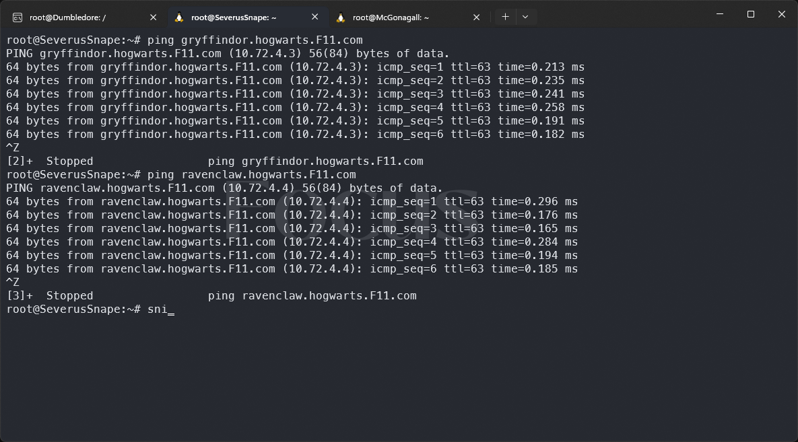

[](https://classroom.github.com/a/1zoHyFGp)
| Name | NRP | Kelas |
| --- | --- | ----------|
| Nabil Julian Syah | 5025231023 | Jaringan Komputer (F) |
| Reynandriel Pramas Thandya | 5025231113 | Jaringan Komputer (F) |

## Put your topology config image here!


Topology: https://drive.google.com/file/d/1xDUMOymM2WXcb2qlMEafiyfs6EbO9b7d/view?usp=sharing
<br>

> Template testing report: https://docs.google.com/document/d/17T0fsnh_4zZTrG-lELDJ88intrc9mkwCzZ_s-23JLCc/edit?usp=sharing

## Put your testing report here!

> The report is sent in PDF format, uploaded to Drive, and set to public view.

https://drive.google.com/file/d/11wECBFh8mR22GGxKTr6xVx1GSOXhDkrA/view?usp=sharing
https://docs.google.com/document/d/16GrKB0AelpA5YgXNE_LcXOqTVAnu_SKpd7FAvTWP3HU/edit?usp=sharing

## Soal 0

> Pada perlombaan akhir tahun kali ini, semua worker dan client ikut serta di dalamnya sebagai perwakilan dari masing-masing asrama. Persiapan yang dilakukan untuk perlombaan ini adalah dengan setup semua network configuration yang sesuai dengan tabel peran diatas. Khusus untuk client menggunakan konfigurasi dari DHCP Server.

> _For the end-of-year competition, all the workers and clients participate, representing their respective houses. The preparation includes setting up the network configuration as per the table above, with clients using DHCP Server configuration_

**Answer**

- Dumbledore:

  ```
  auto eth0
  iface eth0 inet dhcp
  up iptables -t nat -A POSTROUTING -o eth0 -j MASQUERADE -s 10.72.0.0/16

  auto eth1
  iface eth1 inet static
  	address 10.72.1.9
  	netmask 255.255.255.0

  auto eth2
  iface eth2 inet static
  	address 10.72.2.9
  	netmask 255.255.255.0

  auto eth3
  iface eth3 inet static
  	address 10.72.3.9
  	netmask 255.255.255.0

  auto eth4
  iface eth4 inet static
  	address 10.72.4.9
  	netmask 255.255.255.0

  auto eth5
  iface eth5 inet static
  	address 10.72.5.9
  	netmask 255.255.255.0

  auto eth6
  iface eth6 inet static
  	address 10.72.6.9
  	netmask 255.255.255.0
  ```

- SeverusSnape:

```
auto eth0
iface eth0 inet static
	address 10.72.3.2
	netmask 255.255.255.0
	gateway 10.72.3.9
```

- McGonagall:

```
auto eth0
iface eth0 inet static
	address 10.72.3.3
	netmask 255.255.255.0
	gateway 10.72.3.9
```

- Hagrid:

```
auto eth0
iface eth0 inet static
	address 10.72.4.2
	netmask 255.255.255.0
	gateway 10.72.4.9
```

- Voldemort:

```
auto eth0
iface eth0 inet static
	address 10.72.4.3
	netmask 255.255.255.0
	gateway 10.72.4.9
```

- Dementor:

```
auto eth0
iface eth0 inet static
	address 10.72.4.4
	netmask 255.255.255.0
	gateway 10.72.4.9
```

- HarryPotter:

```
auto eth0
iface eth0 inet static
	address 10.72.1.2
	netmask 255.255.255.0
	gateway 10.72.1.9
```

- RonWeasley:

```
auto eth0
iface eth0 inet static
	address 10.72.1.3
	netmask 255.255.255.0
	gateway 10.72.1.9
```

- HermioneGranger:

```
auto eth0
iface eth0 inet dhcp
hwaddress ether 52:4a:aa:8b:79:82
```

- LunaLovegood:

```
auto eth0
iface eth0 inet static
	address 10.72.6.4
	netmask 255.255.255.0
	gateway 10.72.6.9
```

- FiliusFlitwick:

```
auto eth0
iface eth0 inet static
	address 10.72.6.3
	netmask 255.255.255.0
	gateway 10.72.6.9
```

- ChoChang:

```
auto eth0
iface eth0 inet dhcp
hwaddress ether d2:7b:56:41:3c:dc
```

- DracoMalfoy:

```
auto eth0
iface eth0 inet dhcp
```

- AstoriaGreengrass:

```
auto eth0
iface eth0 inet dhcp
```

- SusanBones:

```
auto eth0
iface eth0 ine`t dhcp
```

- HannahAbbott:

```
auto eth0
iface eth0 inet dhcp
```

## Soal 1

> Melakukan registrasi subdomain untuk PHP worker bernama gryffindor.hogwarts.yyy.com yang mengarah ke alamat IP load balancer Voldemort dan untuk laravel worker bernama ravenclaw.hogwarts.yyy.com yang mengarah ke alamat IP load balancer Dementor. Seluruh domain ini berkumpul dalam suatu ruang atau folder bernama hogwarts

> _Registering subdomains for the PHP workers named gryffindor.hogwarts.yyy.com, pointing to the IP Voldemort load balancer, and for the Laravel workers named ravenclaw.hogwarts.yyy.com, pointing to the IP Dementor load balancer. All domains are gathered in a folder named "hogwarts."_

**Answer:**

- Screenshot
  

- Configuration

> .bashrc

```
echo nameserver '192.168.122.1' >> /etc/resolv.conf
apt-get update
apt-get install dnsutils -y
apt install bind9 -y
```

### Explanation

- Mengatur nameserver ke 192.168.122.1
- update dan install dnsutils dan bind9 yang diperlukan untuk server DNS.

> named.conf.local

```
zone "ravenclaw.hogwarts.F11.com" {
	type master;
	file "/etc/bind/hogwarts/ravenclaw.hogwarts.F11.com";
};

zone "gryffindor.hogwarts.F11.com" {
	type master;
	file "/etc/bind/hogwarts/gryffindor.hogwarts.F11.com";
};

zone "4.72.10.in-addr.arpa" {
	type master;
	file "/etc/bind/hogwarts/4.72.10.in-addr.arpa";
};
```

### Explanation

- Mendefinisikan zona forward untuk kedua subdomain, gryffindor.hogwarts.F11.com dan ravenclaw.hogwarts.F11.com.
- Zona reverse 4.72.10.in-addr.arpa dibuat untuk melakukan pemetaan IP ke nama host.

> gryffindor.hogwarts.F11.com

```
;
; BIND data file for local loopback interface
;
$TTL    604800
@       IN      SOA     gryffindor.hogwarts.F11.com. root.gryffindor.hogwarts.F11.com. (
                        2024102111    ; Serial
                        604800        ; Refresh
                        86400         ; Retry
                        2419200       ; Expire
                        604800 )      ; Negative Cache TTL
;
@               IN      NS      gryffindor.hogwarts.F11.com.
@               IN      A       10.72.4.3 ; IP Voldemort
```

### Explanation

- Konfigurasi subdomain gryffindor.hogwarts.F11.com dengan NS-nya sendiri dan mengarah ke IP load balancer Voldemort (10.72.4.3).

> ravenclaw.hogwarts.F11.com

```
;
; BIND data file for local loopback interface
;
$TTL    604800
@       IN      SOA     ravenclaw.hogwarts.F11.com. root.ravenclaw.hogwarts.F11.com. (
                        2024102111    ; Serial
                        604800        ; Refresh
                        86400         ; Retry
                        2419200       ; Expire
                        604800 )      ; Negative Cache TTL
;
@               IN      NS      ravenclaw.hogwarts.F11.com.
@               IN      A       10.72.4.4 ; IP Dementor
```

### Explanation

- Konfigurasi subdomain ravenclaw.hogwarts.F11.com dengan NS-nya sendiri dan mengarah ke IP load balancer Voldemort (10.72.4.3).

> 4.72.10.in-addr.arpa

```
;
; BIND data file for local loopback interface
;
$TTL    604800
@       IN      SOA     gryffindor.hogwarts.F11.com. root.gryffindor.hogwarts.F11.com. (
                        2024102111    ; Serial
                        604800        ; Refresh
                        86400         ; Retry
                        2419200       ; Expire
                        604800 )      ; Negative Cache TTL
;
4.72.10.in-addr.arpa.         IN      NS      gryffindor.hogwarts.F11.com.
3                             IN      PTR     gryffindor.hogwarts.F11.com.
4                             IN      PTR     ravenclaw.hogwarts.F11.com.
```

### Explanation

- Menghubungkan IP 10.72.4.3 dengan subdomain gryffindor.hogwarts.F11.com dan IP 10.72.4.4 dengan subdomain ravenclaw.hogwarts.F11.com.
- 3 dan 4 merupakan bit terakhir dari IP Voldemort dan Dementor

> named.conf.options

```
options {
        directory "/var/cache/bind";

        // If there is a firewall between you and nameservers you want
        // to talk to, you may need to fix the firewall to allow multiple
        // ports to talk.  See http://www.kb.cert.org/vuls/id/800113

        // If your ISP provided one or more IP addresses for stable
        // nameservers, you probably want to use them as forwarders.
        // Uncomment the following block, and insert the addresses replacing
        // the all-0's placeholder.

        forwarders {
         192.168.122.1;
        };

		//========================================================================
        // If BIND logs error messages about the root key being expired,
        // you will need to update your keys.  See https://www.isc.org/bind-keys
        //========================================================================
        dnssec-validation no;

        allow-query{any;};
        auth-nxdomain no;    # conform to RFC1035
        listen-on-v6 { any; };
};
```

### Explanation

- Forwarder diatur ke 192.168.122.1 (Dumbledore)
- dnssec-validation di set ke no
- `allow-query{any;};` memungkinkan DNS server menerima query dari alamat IP mana pun.
  <br>

## Soal 2

> Memberikan ketentuan khusus untuk DracoMalfoy dan AstoriaGreengrass yang mendapat range IP dari [Prefix IP].2.64 - [Prefix IP].2.65 dan [Prefix IP].2.100 - [Prefix IP].2.101

> Selain itu, untuk HannahAbbott dan SusanBones mendapat range IP dari [Prefix IP].5.50 - [Prefix IP].5.51 dan [Prefix IP].5.155 - [Prefix IP].5.156.

> _Special provisions are given to DracoMalfoy and AstoriaGreengrass, who are assigned the IP range from [Prefix IP].2.64 - [Prefix IP].2.65 and [Prefix IP].2.100 - [Prefix IP].2.101._

> _Additionally, HannahAbbott and SusanBones are assigned the IP range from [Prefix IP].5.50 - [Prefix IP].5.51 and [Prefix IP].5.155 - [Prefix IP].5.156._

**Answer:**

- Screenshot


- Configuration

> **Di SeverusSnape** <br>

- /etc/default/isc-dhcp-server
  ```
  INTERFACESv4="eth0"
  ```
- /etc/dhcp/dhcpd.conf

  ```
  subnet 10.72.1.0 netmask 255.255.255.0 {
  }

  subnet 10.72.2.0 netmask 255.255.255.0 {
      range 10.72.2.64 10.72.2.65;
      range 10.72.2.100 10.72.2.101;
      option routers 10.72.2.9;
      option broadcast-address 10.72.2.255;
      option domain-name-servers 10.72.3.2;

  }

  subnet 10.72.3.0 netmask 255.255.255.0 {
  }

  subnet 10.72.4.0 netmask 255.255.255.0 {
  }

  subnet 10.72.5.0 netmask 255.255.255.0 {
      range 10.72.5.50 10.72.5.51;
      range 10.72.5.155 10.72.5.156;
      option routers 10.72.5.9;
      option broadcast-address 10.72.5.255;
      option domain-name-servers 10.72.3.2;
  }

  subnet 10.72.6.0 netmask 255.255.255.0 {
  }
  ```

> **Di Dumbledore**

- /etc/default/isc-dhcp-relay

  ```
  SERVERS="10.72.3.1"
  INTERFACES="eth1 eth2 eth3 eth4 eth5 eth6"
  OPTIONS=
  ```

- /etc/sysctl.conf
  ```
  net.ipv4.ip_forward=1
  ```

### Explanation

Diperlukan dhcp server pada severus snape untuk set IP dinamis. Pertama diawali dengan menginstall install dhcp server

```
echo 'nameserver 192.168.122.1' > /etc/resolv.conf
apt update
apt install isc-dhcp-server -y
```

- Lalu setup pada `dhcpd.conf`

```
  subnet 10.72.5.0 netmask 255.255.255.0 { -> ip berapa yang mau di DHCP
  range 10.72.5.50 10.72.5.51; -> range ip pertama
  range 10.72.5.155 10.72.5.156; -> range ip kedua
  option routers 10.72.5.9; -> router switch yang menghubungkan
  option broadcast-address 10.72.5.255; -> address broadcast
  option domain-name-servers 10.72.3.2; -> ip mcgonagal
}
```

> **Konfigurasi juga untuk switch 2 sesuai soal**

- Lalu install pada Dumbledore untuk dhcp relay

  ```
  apt-get update
  apt-get install isc-dhcp-relay -y # isi lah nanti dengan 1, eth1 eth2 eth3 eth4 eth5 eth6, terakhir jawab enter
  service isc-dhcp-relay start
  ```

> **konfigurasi dhcp relay**

- /etc/default/isc-dhcp-relay

  ```
  SERVERS="10.72.3.1"  -> DHCP Server (Snape)
  INTERFACES="eth1 eth2 eth3 eth4 eth5 eth6" -> supaya link mana aja yang di listen (biar aman semua kecuali eth0)
  OPTIONS=
  ```

- Lalu pada /etc/sysctl.conf set ip forward jadi 1

  ```
  net.ipv4.ip_forward=1
  ```

- `service isc-dhcp-relay restart`

> **Langkah testing**

- Stop semua node
- nyalakan Dumbledore, Snape, dan Mcgonagal
- Jalankan DHCP Server, DNS Server, DHCP Relay
- Start Node pada switch 2 dan 5

<br>

## Soal 3

> Khusus untuk HermioneGranger yang berada di switch 1 mendapat range IP dari
> [Prefix IP].1.10 - [Prefix IP].1.15 dan [Prefix IP].1.20 - [Prefix IP].1.25

> Khusus untuk ChoChang yang berada di switch 6 mendapat range IP dari
> [Prefix IP].6.10 - [Prefix IP].6.15 dan [Prefix IP].6.20 - [Prefix IP].6.25

> _HermioneGranger, who is on switch 1, is assigned the IP range from [Prefix IP].1.10 - [Prefix IP].1.15 and [Prefix IP].1.20 - [Prefix IP].1.25._

> _ChoChang, who is on switch 6, is assigned the IP range from [Prefix IP].6.10 - [Prefix IP].6.15 and [Prefix IP].6.20 - [Prefix IP].6.25._

**Answer:**

- Screenshot


- Configuration

  > Snape

  ```
  subnet 10.72.1.0 netmask 255.255.255.0 {
    range 10.72.1.10 10.72.1.15;
    range 10.72.1.20 10.72.1.25;
    option routers 10.72.1.9;
    option broadcast-address 10.72.1.255;
    option domain-name-servers 10.72.3.2;
  }

  subnet 10.72.2.0 netmask 255.255.255.0 {
    range 10.72.2.64 10.72.2.65;
    range 10.72.2.100 10.72.2.101;
    option routers 10.72.2.9;
    option broadcast-address 10.72.2.255;
    option domain-name-servers 10.72.3.2;
  }

  subnet 10.72.3.0 netmask 255.255.255.0 {
  }

  subnet 10.72.4.0 netmask 255.255.255.0 {
  }

  subnet 10.72.5.0 netmask 255.255.255.0 {
    range 10.72.5.50 10.72.5.51;
    range 10.72.5.155 10.72.5.156;
    option routers 10.72.5.9;
    option broadcast-address 10.72.5.255;
    option domain-name-servers 10.72.3.2;
  }

  subnet 10.72.6.0 netmask 255.255.255.0 {
    range 10.72.6.10 10.72.6.15;
    range 10.72.6.20 10.72.6.25;
    option routers 10.72.6.9;
    option broadcast-address 10.72.6.255;
    option domain-name-servers 10.72.3.2;
  }
  ```

  > Dumbledore
  > masih sama seperti configurasi sebelumnya.

  > Hermione dan ChoChang

  - ubah configuration pada network
  - uncoment bagian
    ```
    auto eth0
    iface eth0 inet dhcp
    ```

- Explanation

`Sama seperti nomor sebelumnya, tambahkan konfigurasi untuk Hermione dan ChoChang dengan menambahkan subnet pada dhcp server configuration file. Ubah pula konfigurasi Hermione dan ChoChang menjadi dhcp.

<br>

## Soal 4

> Menetapkan batasan waktu untuk DHCP server dalam peminjaman alamat IP untuk client melalui switch 2 selama 5 menit sedangkan client yang melalui switch 5 selama 20 menit. Untuk switch 1 dan switch 6 memiliki batas waktu 10 menit. Alokasi waktu maksimal peminjaman alamat IP selama 100 menit.

> _The DHCP server's lease time for IP addresses is set as follows: Clients connected through switch 2 have a lease time of 5 minutes, Clients connected through switch 5 have a lease time of 20 minutes, Switches 1 and 6 have a lease time of 10 minutes, The maximum lease time for IP addresses is set at 100 minutes._

**Answer:**

- Screenshot


- Configuration

  > SeverusSnape

  - tambahkan `INTERFACESv4="eth0"` pada `/etc/default/isc-dhcp-server`.
  - configurasi dhcpd

  ```
  <!-- Tambahkan -->
  subnet 10.72.1.0 netmask 255.255.255.0 {
    range 10.72.1.10 10.72.1.15;
    range 10.72.1.20 10.72.1.25;
    option routers 10.72.1.9;
    option broadcast-address 10.72.1.255;
    option domain-name-servers 10.72.3.2;
    default-lease-time 600; # 60 s kali 10 m
    max-lease-time 6000; # 60 s kali 100 m
  }

  subnet 10.72.2.0 netmask 255.255.255.0 {
    range 10.72.2.64 10.72.2.65;
    range 10.72.2.100 10.72.2.101;
    option routers 10.72.2.9;
    option broadcast-address 10.72.2.255;
    option domain-name-servers 10.72.3.2;
    default-lease-time 300; # 60 s kali 5 m
    max-lease-time 6000; # 60 s kali 100 m
  }

  subnet 10.72.3.0 netmask 255.255.255.0 {
  }

  subnet 10.72.4.0 netmask 255.255.255.0 {
  }

  subnet 10.72.5.0 netmask 255.255.255.0 {
    range 10.72.5.50 10.72.5.51;
    range 10.72.5.155 10.72.5.156;
    option routers 10.72.5.9;
    option broadcast-address 10.72.5.255;
    option domain-name-servers 10.72.3.2;
    default-lease-time 1200; # 60 s kali 20 m
    max-lease-time 6000; # 60 s kali 100 m
  }

  <!-- Tambahkan -->
  subnet 10.72.6.0 netmask 255.255.255.0 {
    range 10.72.6.10 10.72.6.15;
    range 10.72.6.20 10.72.6.25;
    option routers 10.72.6.9;
    option broadcast-address 10.72.6.255;
    option domain-name-servers 10.72.3.2;
    default-lease-time 600; # 60 s kali 10 m
    max-lease-time 6000; # 60 s kali 100 m
  }
  ```

  > Dumbledore

- Tidak ada yang di ubah.

### Explanation

Tambahkan waktu pada dhcpd server conf sesuai permintaan soal dengan `default-lease-time` untuk default dan `max:lease-time` untuk maksimal.

- Restart dhcp `service isc-dhcp-server restart`
  <br>

## Soal 5

> Memastikan bahwa semua CLIENT, HermioneGranger, dan ChoChang harus menggunakan konfigurasi dari DHCP server, menerima DNS dari Professor McGonagall dan dapat akses internet. Khusus untuk HermioneGranger dan ChoChang mendapatkan IP Statis dari DHCP dengan [Prefix IP].x.14. hint: fixed address

> _Ensure that all CLIENT, HermioneGranger, and ChoChang use DHCP server configurations, receive DNS from Professor McGonagall, and can access the internet. HermioneGranger and ChoChang must receive static IPs from DHCP with the address [Prefix IP].x.14 (hint: fixed address)._

**Answer:**

- Screenshot


- Configuration

  > SeverusSnape

  - configurasi dhcp

  ```
  subnet 10.72.1.0 netmask 255.255.255.0 {
    range 10.72.1.10 10.72.1.15;
    range 10.72.1.20 10.72.1.25;
    option routers 10.72.1.9;
    option broadcast-address 10.72.1.255;
    option domain-name-servers 10.72.3.2;
    default-lease-time 600; # 60 s kali 10 m
    max-lease-time 6000; # 60 s kali 100 m
  }

  <!-- Tambahkan -->
  host HermioneGranger{
    hardware ethernet 52:4a:aa:8b:79:82;
    fixed-address 10.72.1.14;
  }

  subnet 10.72.2.0 netmask 255.255.255.0 {
    range 10.72.2.64 10.72.2.65;
    range 10.72.2.100 10.72.2.101;
    option routers 10.72.2.9;
    option broadcast-address 10.72.2.255;
    option domain-name-servers 10.72.3.2;
    default-lease-time 300; # 60 s kali 5 m
    max-lease-time 6000; # 60 s kali 100 m
  }

  subnet 10.72.3.0 netmask 255.255.255.0 {
  }

  subnet 10.72.4.0 netmask 255.255.255.0 {
  }

  subnet 10.72.5.0 netmask 255.255.255.0 {
    range 10.72.5.50 10.72.5.51;
    range 10.72.5.155 10.72.5.156;
    option routers 10.72.5.9;
    option broadcast-address 10.72.5.255;
    option domain-name-servers 10.72.3.2;
    default-lease-time 1200; # 60 s kali 20 m
    max-lease-time 6000; # 60 s kali 100 m
  }

  subnet 10.72.6.0 netmask 255.255.255.0 {
    range 10.72.6.10 10.72.6.15;
    range 10.72.6.20 10.72.6.25;
    option routers 10.72.6.9;
    option broadcast-address 10.72.6.255;
    option domain-name-servers 10.72.3.2;
    default-lease-time 600; # 60 s kali 10 m
    max-lease-time 6000; # 60 s kali 100 m
  }

  <!-- Tambahkan -->
  host ChoChang{
    hardware ethernet d2:7b:56:41:3c:dc;
    fixed-address 10.72.6.14;
  }
  ```

  > ChoChang dan HermioneGranger

- Edit configuration network
- `hwaddress ether d2:7b:56:41:3c:dc` untuk ChoChang
- `hwaddress ether 52:4a:aa:8b:79:82` untuk HermioneGranger
- tambahkan di bawah line dhcp

### Explanation

- Jadi pertama cari tahu informasi hwaddress dari tiap nodenya. Lakukan dengan ip a, lalu setelah dapat tambahkan pada konfigurasi Hermione dan ChoChang hwaddress ether addressnya. Lalu tambahkan pada konfigurasi dhcp server untuk Host Hermione dan ChoChang.
- Restart dhcp `service isc-dhcp-server restart`

<br>

## Soal 6

> Dimulai dari asrama Gryffindor yang menjadi PHP worker, mereka harus melakukan deployment untuk website berikut menggunakan PHP 7.4.

> _The Gryffindor house, represented by the PHP workers, must deploy the following website using PHP 7.4._

**Answer:**

- Screenshot


- Configuration
  > Setup HarryPotter, RonWeasley, HermioneGranger
- tambahkan `nameserver 192.168.122.1` pada /etc/resolv.conf

  ```
  apt-get update -y
  apt-get install software-properties-common -y
  add-apt-repository ppa:ondrej/php -y
  apt-get update -y

  apt-get install php7.4-mbstring php7.4-xml php7.4-cli php7.4-common php7.4-intl php7.4-opcache php7.4-readline php7.4-mysql php7.4-fpm php7.4-curl unzip wget -y

  apt-get install nginx -y
  ```

  - Download dan Unzip

  ```
  mkdir -p /var/www/gryffindor

  wget -O '/var/www/gryffindor/a.zip' 'https://drive.google.com/uc?export=download&id=17R4Zcxm3emHq21WdMJzSfCxO8FHqvATM'
  apt-get install unzip
  unzip -o /var/www/gryffindor/a.zip -d /var/www/gryffindor
  rm /var/www/gryffindor/a.zip
  ```

> Harry

- /etc/nginx/sites-available/gryffindor.F11.com

```
server {

  listen 8001;

  root /var/www/gryffindor/;

  index index.php index.html index.htm;
  server_name gryffindor.hogwarts.F11.com;

  location / {
    try_files $uri $uri/ /index.php?$query_string;
  }

  # pass PHP scripts to FastCGI server
  location ~ \.php$ {
    include snippets/fastcgi-php.conf;
    fastcgi_pass unix:/var/run/php/php7.4-fpm.sock;
  }

  location ~ /\.ht {
    deny all;
  }

  error_log /var/log/nginx/HarryPotter_error.log;
  access_log /var/log/nginx/HarryPotter_access.log;
}
```

- `ln -s /etc/nginx/sites-available/gryffindor.F11.com /etc/nginx/sites-enabled/`
- `service php7.4-fpm start && service nginx restart`

> RonWeasley

- /etc/nginx/sites-available/gryffindor.F11.com

```
server {

  listen 8002;

  root /var/www/gryffindor/;

  index index.php index.html index.htm;
  server_name gryffindor.hogwarts.F11.com;

  location / {
    try_files $uri $uri/ /index.php?$query_string;
  }

  # pass PHP scripts to FastCGI server
    location ~ \.php$ {
    include snippets/fastcgi-php.conf;
    fastcgi_pass unix:/var/run/php/php7.4-fpm.sock;
  }

  location ~ /\.ht {
    deny all;
  }

  error_log /var/log/nginx/RonWeasley_error.log;
  access_log /var/log/nginx/RonWeasley_access.log;
}
```

- `ln -s /etc/nginx/sites-available/gryffindor.F11.com /etc/nginx/sites-enabled/`
- `service php7.4-fpm start && service nginx restart`

> HermioneGranger

- /etc/nginx/sites-available/gryffindor.F11.com

```
server {

  listen 8003;

  root /var/www/gryffindor/;

  index index.php index.html index.htm;
  server_name gryffindor.hogwarts.F11.com;

  location / {
    try_files $uri $uri/ /index.php?$query_string;
  }

  # pass PHP scripts to FastCGI server
  location ~ \.php$ {
    include snippets/fastcgi-php.conf;
    fastcgi_pass unix:/var/run/php/php7.4-fpm.sock;
  }

  location ~ /\.ht {
    deny all;
  }

  error_log /var/log/nginx/HermioneGranger_error.log;
  access_log /var/log/nginx/HermioneGranger_access.log;
}
```

- `ln -s /etc/nginx/sites-available/gryffindor.F11.com /etc/nginx/sites-enabled/`
- `service php7.4-fpm start && service nginx restart`

- Explanation
- Sama seperti modul sebelumnya, install nginx dan buat webserver pada HarryPotter, Hermione, dan Ron. Lalu setup webserver nginx, buat portnya juga berbeda-beda. Buat symlink untuk mengaktifkan server dan aktifkan nginx. Kemudian coba lynx di salah satu client yang mengacu pada IP worker.
  <br>

## Soal 7

> Khusus perlombaan ini, Voldemort sudah jinak dan dia menjadi load balancer untuk para penghuni asrama Gryffindor yang menjadi worker PHP. Aturlah agar Voldemort dapat membagi pekerjaan kepada worker PHP secara optimal. Sebagai pengetesan awal, terapkan algoritma round robin dan lakukan test index.php menggunakan apache benchmark dengan 1000 request dan 100 request/second. Lakukan test sebanyak 3 kali lalu hitung rata-rata dan standar deviasi dari time/request

> _Voldemort, who is now reformed, becomes the load balancer for the Gryffindor PHP workers. Optimize Voldemort to distribute tasks to the PHP workers. For the initial test, apply the round-robin algorithm and test it to the index.php page using Apache Benchmark with 1,000 requests and 100 requests/second. Do the test 3 times and calculate the mean and standard deviation of time/request._

**Answer:**

- Screenshot


Apache Benchmark (sample satu percobaan)


- Configuration

Di Voldemort jalankan

```
apt-get update -y
apt-get install software-properties-common -y
add-apt-repository ppa:ondrej/php -y
apt-get update -y

apt-get install php7.4-mbstring php7.4-xml php7.4-cli php7.4-common php7.4-intl php7.4-opcache php7.4-readline php7.4-mysql php7.4-fpm php7.4-curl unzip wget -y

apt-get install nginx -y

echo 'nameserver 10.72.3.2' > /etc/resolv.conf
```

Lalu buat konfigurasi LB nya

```
upstream gryffindor{
        server 10.72.1.1:8001;
        server 10.72.1.2:8002;
        server 10.72.1.3:8003;
}

server {
        listen 80;
        server_name gryffindor.hogwarts.F11.com;

        location / {
                proxy_pass http://gryffindor;
        }
}
```

Lalu pada client jalankan

```
apt-get update -y
apt-get install apache2-utils -y
apt install less -y

ab -V

mkdir /root/benchmark

cd /root/benchmark
ab -n 1000 -c 100 -g output.data http://gryffindor.hogwarts.F11.com/
```

- Explanation

Buat konfigurasi pada Voldermort sebagai load balancer. Lalu testing dengan lynx http://gryffindor.hogwarts.F11.com pada client. Jika sudah berhasil, testing dengan apache benchmark dengan intall apache benchmark.

<br>

## Soal 8

> Dalam penilaian akhir tahun ini, dibutuhkan algoritma terbaik, cobalah tes 3 algoritma load balancer dengan menggunakan jmeter. Jmeter perlu melakukan login, akses home, dan terakhir logout. Lakukan test dengan 300 thread dan 3 sec ramp up period. Lakukan test sebanyak 3 kali per algoritma, lalu hitung rata-rata dan standar deviasi dari response time. (username: wingardium, password: leviosa)

> _For the final assessment, try three different load-balancing algorithms using JMeter with 300 threads and a 3-second ramp-up period. Jmeter have to be able to login, access homepage, and logout. Do the test 3 times for each algorithm, then calculate the mean and standard deviation of response time. (username: wingardium, password: leviosa)_

**Answer:**

- Screenshot

Sample percobaan htop untuk Round Robin


Sample hasil percobaan dengan Round Robin


- Configuration

Di install client

```
apt-get install openjdk-11-jre

mkdir -p /jmeter
wget -O '/jmeter/a.zip'  https://dlcdn.apache.org//jmeter/binaries/apache-jmeter-5.6.3.zip

apt-get install unzip
unzip -o /jmeter/a.zip -d /jmeter
rm /jmeter/a.zip
```

Lalu buat di dalam jmeter/bin sebuah jmx

```
<?xml version="1.0" encoding="UTF-8"?>
<jmeterTestPlan version="1.2" properties="5.0" jmeter="5.6.3">
  <hashTree>
    <TestPlan guiclass="TestPlanGui" testclass="TestPlan" testname="Test Plan">
      <elementProp name="TestPlan.user_defined_variables" elementType="Arguments" guiclass="ArgumentsPanel" testclass="Arguments" testname="User Defined Variables">
        <collectionProp name="Arguments.arguments"/>
      </elementProp>
    </TestPlan>
    <hashTree>
      <ThreadGroup guiclass="ThreadGroupGui" testclass="ThreadGroup" testname="Thread Group">
        <intProp name="ThreadGroup.num_threads">300</intProp>
        <intProp name="ThreadGroup.ramp_time">3</intProp>
        <boolProp name="ThreadGroup.same_user_on_next_iteration">true</boolProp>
        <stringProp name="ThreadGroup.on_sample_error">continue</stringProp>
        <elementProp name="ThreadGroup.main_controller" elementType="LoopController" guiclass="LoopControlPanel" testclass="LoopController" testname="Loop Controller">
          <stringProp name="LoopController.loops">3</stringProp>
          <boolProp name="LoopController.continue_forever">false</boolProp>
        </elementProp>
      </ThreadGroup>
      <hashTree>

        <HTTPSamplerProxy guiclass="HttpTestSampleGui" testclass="HTTPSamplerProxy" testname="Submit Login Credentials">
          <stringProp name="HTTPSampler.domain">gryffindor.hogwarts.F11.com</stringProp>
          <stringProp name="HTTPSampler.protocol">http</stringProp>
          <stringProp name="HTTPSampler.path">/php/login.php</stringProp>
          <boolProp name="HTTPSampler.follow_redirects">true</boolProp>
          <stringProp name="HTTPSampler.method">POST</stringProp>
          <boolProp name="HTTPSampler.use_keepalive">true</boolProp>
          <boolProp name="HTTPSampler.postBodyRaw">true</boolProp>
          <stringProp name="HTTPSampler.postBody">username=wingardium&amp;password=leviosa</stringProp>
        </HTTPSamplerProxy>
        <hashTree/>

        <HTTPSamplerProxy guiclass="HttpTestSampleGui" testclass="HTTPSamplerProxy" testname="Logout">
          <stringProp name="HTTPSampler.domain">gryffindor.hogwarts.F11.com</stringProp>
          <stringProp name="HTTPSampler.protocol">http</stringProp>
          <stringProp name="HTTPSampler.path">/php/home.php</stringProp>
          <boolProp name="HTTPSampler.follow_redirects">true</boolProp>
          <stringProp name="HTTPSampler.method">GET</stringProp>
          <boolProp name="HTTPSampler.use_keepalive">true</boolProp>
        </HTTPSamplerProxy>
        <hashTree/>
   
        <HTTPSamplerProxy guiclass="HttpTestSampleGui" testclass="HTTPSamplerProxy" testname="Logout">
          <stringProp name="HTTPSampler.domain">gryffindor.hogwarts.F11.com</stringProp>
          <stringProp name="HTTPSampler.protocol">http</stringProp>
          <stringProp name="HTTPSampler.path">/php/logout.php</stringProp>
          <boolProp name="HTTPSampler.follow_redirects">true</boolProp>
          <stringProp name="HTTPSampler.method">GET</stringProp>
          <boolProp name="HTTPSampler.use_keepalive">true</boolProp>
        </HTTPSamplerProxy>
        <hashTree/>

        <ResultCollector guiclass="ViewResultsFullVisualizer" testclass="ResultCollector" testname="View Results Tree">
          <boolProp name="ResultCollector.error_logging">false</boolProp>
          <objProp>
            <name>saveConfig</name>
            <value class="SampleSaveConfiguration">
              <time>true</time>
              <latency>true</latency>
              <timestamp>true</timestamp>
              <success>true</success>
              <label>true</label>
              <code>true</code>
              <message>true</message>
              <threadName>true</threadName>
              <dataType>true</dataType>
              <encoding>false</encoding>
              <assertions>true</assertions>
              <subresults>true</subresults>
              <responseData>false</responseData>
              <samplerData>false</samplerData>
              <xml>false</xml>
              <fieldNames>true</fieldNames>
              <responseHeaders>false</responseHeaders>
              <requestHeaders>false</requestHeaders>
              <responseDataOnError>false</responseDataOnError>
              <saveAssertionResultsFailureMessage>true</saveAssertionResultsFailureMessage>
              <assertionsResultsToSave>0</assertionsResultsToSave>
              <bytes>true</bytes>
              <sentBytes>true</sentBytes>
              <url>true</url>
              <threadCounts>true</threadCounts>
              <idleTime>true</idleTime>
              <connectTime>true</connectTime>
            </value>
          </objProp>
          <stringProp name="filename"></stringProp>
        </ResultCollector>
        <hashTree/>

      </hashTree>
    </hashTree>
  </hashTree>
</jmeterTestPlan>
```

Jalankan dengan

```
./jmeter -n -t no8.jmx -l test.csv -e -o ../test>
```

- Explanation

Pertama download dulu jmeter pada client, lalu buat jmx untuk testingnya sesuai scriptnya. Lalu jalankan testing dengan command `./jmeter -n -t no8.jmx -l test.csv -e -o ../test>`. Untuk menguji ip hash dan least connection, tambahkan  ip_hash; atau least_conn; pada upstream di Voldemort sebelum ip workernya. Lakukan pengujian lagi sebanyak 3 kali tiap algoritma. Pada akhirnya didapatlah algoritma terbaik adalah IP Hash dengan rata-rata time per request yaitu 14.69.

<br>

## Soal 9

> Tidak semua IP dapat akses asrama Gryffindor melalui IP Load balancer Voldemort. Untuk itu, berikan akses pada load balancer Voldemort. Autentikasi akan memerlukan username: “jarkom” dan password: “modul3”. Simpan file autentikasi pada /etc/nginx/secretchamber

> _Not all IPs can access Gryffindor's house through Voldemort’s load balancer. Grant access to the Voldemort load balancer. Authentication will require username: “jarkom” and password: “modul3”. Save the authentication file in /etc/nginx/secretchamber._

**Answer:**

- Screenshot


- Configuration

  pada Voldemort tambahkan conf di dalam location

       	 	auth_basic "Restricted Access";
        	auth_basic_user_file /etc/nginx/secretchamber;

  pada terminal: htpasswd -c -b /etc/nginx/secretchamber jarkom modul 3

```
upstream gryffindor{
        server 10.72.1.1:8001;
        server 10.72.1.2:8002;
        server 10.72.1.3:8003;
}

server {
        listen 80;
        server_name gryffindor.hogwarts.F11.com;

        location / {
                proxy_pass http://gryffindor;
        	auth_basic "Restricted Access";
        	auth_basic_user_file /etc/nginx/secretchamber;
        }
}
```

- Explanation

`Put your explanation in here`

<br>

## Soal 10

> Setelah menambahkan autentikasi ke Gryffindor, coba testing ulang dengan menggunakan JMeter (algoritma round robin) serta skenario, thread, dan ramp up period yang sama seperti no 8 (300 thread, 3 sec ramp up period, login-home-logout). Kali ini, coba juga jumlah worker yang berbeda: 3 worker, 2 worker, dan 1 worker.

> _After adding authentication to Gryffindor, retest using JMeter (round-robin algorithm) with the same scenario, thread, and ramp up period as number 8 (300 thread, 3 sec ramp up period, login-home-logout). This time, test with different numbers of workers: 3 workers, 2 workers, and 1 worker._

**Answer:**

- Screenshot


3 Worker


2 Worker


1 Worker


- Configuration
```
<?xml version="1.0" encoding="UTF-8"?>
<jmeterTestPlan version="1.2" properties="5.0" jmeter="5.6.3">
  <hashTree>
    <TestPlan guiclass="TestPlanGui" testclass="TestPlan" testname="Test Plan">
      <elementProp name="TestPlan.user_defined_variables" elementType="Arguments" guiclass="ArgumentsPanel" testclass="Arguments" testname="User Defined Variables">
        <collectionProp name="Arguments.arguments"/>
      </elementProp>
    </TestPlan>
    <hashTree>
      <ThreadGroup guiclass="ThreadGroupGui" testclass="ThreadGroup" testname="Thread Group">
        <intProp name="ThreadGroup.num_threads">300</intProp>
        <intProp name="ThreadGroup.ramp_time">3</intProp>
        <boolProp name="ThreadGroup.same_user_on_next_iteration">true</boolProp>
        <stringProp name="ThreadGroup.on_sample_error">continue</stringProp>
        <elementProp name="ThreadGroup.main_controller" elementType="LoopController" guiclass="LoopControlPanel" testclass="LoopController" testname="Loop Controller">
          <stringProp name="LoopController.loops">3</stringProp>
          <boolProp name="LoopController.continue_forever">false</boolProp>
        </elementProp>
      </ThreadGroup>
      <hashTree>
        <AuthManager guiclass="AuthPanel" testclass="AuthManager" testname="HTTP Authorization Manager">
          <collectionProp name="AuthManager.auth_list">
            <elementProp name="" elementType="Authorization">
              <stringProp name="Authorization.url">http://gryffindor.hogwarts.F11.com</stringProp>
              <stringProp name="Authorization.username">jarkom</stringProp>
              <stringProp name="Authorization.password">modul3</stringProp>
              <stringProp name="Authorization.domain"></stringProp>
              <stringProp name="Authorization.realm"></stringProp>
            </elementProp>
          </collectionProp>
	  <boolProp name="AuthManager.controlledByThreadGroup">false</boolProp>
        </AuthManager>
        <hashTree/>

	<HeaderManager guiclass="HeaderPanel" testclass="HeaderManager" testname="HTTP Header Manager">
        <collectionProp name="HeaderManager.headers"/>
        </HeaderManager>
        <hashTree/>	

        <HTTPSamplerProxy guiclass="HttpTestSampleGui" testclass="HTTPSamplerProxy" testname="Submit Login Credentials">
          <stringProp name="HTTPSampler.domain">gryffindor.hogwarts.F11.com</stringProp>
          <stringProp name="HTTPSampler.protocol">http</stringProp>
          <stringProp name="HTTPSampler.path">/php/login.php</stringProp>
          <boolProp name="HTTPSampler.follow_redirects">true</boolProp>
          <stringProp name="HTTPSampler.method">POST</stringProp>
          <boolProp name="HTTPSampler.use_keepalive">true</boolProp>
          <boolProp name="HTTPSampler.postBodyRaw">true</boolProp>
          <stringProp name="HTTPSampler.postBody">username=wingardium&amp;password=leviosa</stringProp>
        </HTTPSamplerProxy>
        <hashTree/>

        <HTTPSamplerProxy guiclass="HttpTestSampleGui" testclass="HTTPSamplerProxy" testname="Logout">
          <stringProp name="HTTPSampler.domain">gryffindor.hogwarts.F11.com</stringProp>
          <stringProp name="HTTPSampler.protocol">http</stringProp>
          <stringProp name="HTTPSampler.path">/php/home.php</stringProp>
          <boolProp name="HTTPSampler.follow_redirects">true</boolProp>
          <stringProp name="HTTPSampler.method">GET</stringProp>
          <boolProp name="HTTPSampler.use_keepalive">true</boolProp>
        </HTTPSamplerProxy>
        <hashTree/>
   
        <HTTPSamplerProxy guiclass="HttpTestSampleGui" testclass="HTTPSamplerProxy" testname="Logout">
          <stringProp name="HTTPSampler.domain">gryffindor.hogwarts.F11.com</stringProp>
          <stringProp name="HTTPSampler.protocol">http</stringProp>
          <stringProp name="HTTPSampler.path">/php/logout.php</stringProp>
          <boolProp name="HTTPSampler.follow_redirects">true</boolProp>
          <stringProp name="HTTPSampler.method">GET</stringProp>
          <boolProp name="HTTPSampler.use_keepalive">true</boolProp>
        </HTTPSamplerProxy>
        <hashTree/>

        <ResultCollector guiclass="ViewResultsFullVisualizer" testclass="ResultCollector" testname="View Results Tree">
          <boolProp name="ResultCollector.error_logging">false</boolProp>
          <objProp>
            <name>saveConfig</name>
            <value class="SampleSaveConfiguration">
              <time>true</time>
              <latency>true</latency>
              <timestamp>true</timestamp>
              <success>true</success>
              <label>true</label>
              <code>true</code>
              <message>true</message>
              <threadName>true</threadName>
              <dataType>true</dataType>
              <encoding>false</encoding>
              <assertions>true</assertions>
              <subresults>true</subresults>
              <responseData>false</responseData>
              <samplerData>false</samplerData>
              <xml>false</xml>
              <fieldNames>true</fieldNames>
              <responseHeaders>false</responseHeaders>
              <requestHeaders>false</requestHeaders>
              <responseDataOnError>false</responseDataOnError>
              <saveAssertionResultsFailureMessage>true</saveAssertionResultsFailureMessage>
              <assertionsResultsToSave>0</assertionsResultsToSave>
              <bytes>true</bytes>
              <sentBytes>true</sentBytes>
              <url>true</url>
              <threadCounts>true</threadCounts>
              <idleTime>true</idleTime>
              <connectTime>true</connectTime>
            </value>
          </objProp>
          <stringProp name="filename"></stringProp>
        </ResultCollector>
        <hashTree/>

      </hashTree>
    </hashTree>
  </hashTree>
</jmeterTestPlan>
```

- Explanation

Ulangi tes tiga kali untuk masing-masing konfigurasi worker (1, 2, dan 3 worker), menggunakan skenario yang sama:

Untuk setiap skenario:

- Uji dengan 1 worker
- Uji dengan 2 worker
- Uji dengan 3 worker
(untuk mengurangi worker, hapus saja satu ip pada upstream di konfigurasi Voldemort)
300 thread
3 seconds ramp-up period
Login -> Home -> Logout
Jalankan pengujian menggunakan JMeter untuk setiap konfigurasi worker (1, 2, dan 3 worker) dan simpan hasil tes.
Setelah dicek, ternyata semakin banyak worker, waktu yang dibutuhkan semakin sedikit.
<br>

## Soal 11

> Hogwarts juga bekerjasama dengan ITS dalam perlombaan ini. Untuk itu, setiap request pada Voldemort yang mengandung /informatika pada akhir url akan di proxy passing menuju halaman https://www.its.ac.id/informatika/id/beranda/

> _Hogwarts has also partnered with ITS for this competition. Any request to Voldemort containing /informatika at the end of the URL should be proxied to the page at https://www.its.ac.id/informatika/id/beranda/._

**Answer:**

- Screenshot


- Configuration

Di Voldermort

```
upstream gryffindor {
    server 10.72.1.1:8001;
    server 10.72.1.2:8002;
    server 10.72.1.3:8003;
}

server {
    listen 80;
    server_name gryffindor.hogwarts.F11.com 10.72.4.2;

    location /informatika {
       proxy_pass https://www.its.ac.id/informatika/id/beranda/;
    }

    location ~ ^/(?!informatika$).*informatika${
	rewrite ^ /informatika;
    }

    location / {
        proxy_pass http://gryffindor;
        proxy_set_header Host $host;

        auth_basic "Restricted Access";
        auth_basic_user_file /etc/nginx/secretchamber;
    }


}
```

- Explanation

Tambahkan konfigurasi untuk proxy pass location /informatika yang akan langsung mengarahkan ke https://www.its.ac.id/informatika/id/beranda/ dan tambahkan rewrite supaya apabila ada /jaya/informatika akan di rewrite dan akan mengarahnkan ke https://www.its.ac.id/informatika/id/beranda/.
<br>

## Soal 12

> Selain butuh autentikasi dalam pengaksesan asrama Gryffindor melalui LB Voldemort, juga perlu dibatasi dengan pembatasan IP. LB Voldemort hanya boleh diakses oleh client dengan IP [Prefix IP].2.64, [Prefix IP].2.100, [Prefix IP].5.50, dan [Prefix IP].5.155. hint: (fixed in dulu clientnya)

> _In addition to requiring authentication for access to Gryffindor through Voldemort’s load balancer, IP restrictions also need to be enforced. Voldemort's load balancer can only be accessed by clients with IPs: [Prefix IP].2.64, [Prefix IP].2.100, [Prefix IP].5.50, and [Prefix IP].5.155. (hint: fixed client IPs first)._

**Answer:**

- Screenshot


- Configuration
  Di Voldermort

```
upstream gryffindor {
    server 10.72.1.1:8001;
    server 10.72.1.2:8002;
    server 10.72.1.3:8003;
}

server {
    listen 80;
    server_name gryffindor.hogwarts.F11.com 10.72.4.2;

    allow 10.72.2.64;
    allow 10.72.2.100;
    allow 10.72.5.50;
    allow 10.72.5.155;
    deny all;

    location /informatika {
       proxy_pass https://www.its.ac.id/informatika/id/beranda/;
    }

    location / {
        proxy_pass http://gryffindor;
        proxy_set_header Host $host;

        auth_basic "Restricted Access";
        auth_basic_user_file /etc/nginx/secretchamber;
    }


}
```

lalu tambahkan hwaddress tiap clientnya, seperti nomor 5

```
ip a
```

tambahkan pada konfigurasi node

`hwaddress ether [address]`

Di Snape DHCP untuk atus fixed address tiap client

```
echo 'subnet 10.72.1.0 netmask 255.255.255.0 {
    range 10.72.1.10 10.72.1.15;
    range 10.72.1.20 10.72.1.25;
    option routers 10.72.1.9;
    option broadcast-address 10.72.1.255;
    option domain-name-servers 10.72.3.2;
    default-lease-time 600; # 60 s kali 10 m
    max-lease-time 6000; # 60 s kali 100 m
}

host HermioneGranger{
    hardware ethernet 52:4a:aa:8b:79:82;
    fixed-address 10.72.1.14;
}

subnet 10.72.2.0 netmask 255.255.255.0 {
    range 10.72.2.64 10.72.2.65;
    range 10.72.2.100 10.72.2.101;
    option routers 10.72.2.9;
    option broadcast-address 10.72.2.255;
    option domain-name-servers 10.72.3.2;
    default-lease-time 300; # 60 s kali 5 m
    max-lease-time 6000; # 60 s kali 100 m
}

host DracoMalfoy{
    hardware ethernet a6:ed:28:b8:95:cd;
    fixed-address 10.72.2.64;
}

host AstoriaGreengrass{
    hardware ethernet b6:21:52:91:60:68;
    fixed-address 10.72.2.100;
}

subnet 10.72.3.0 netmask 255.255.255.0 {
}

subnet 10.72.4.0 netmask 255.255.255.0 {
}

subnet 10.72.5.0 netmask 255.255.255.0 {
    range 10.72.5.50 10.72.5.51;
    range 10.72.5.155 10.72.5.156;
    option routers 10.72.5.9;
    option broadcast-address 10.72.5.255;
    option domain-name-servers 10.72.3.2;
    default-lease-time 1200; # 60 s kali 20 m
    max-lease-time 6000; # 60 s kali 100 m
}

host SusanBones{
    hardware ethernet 72:56:04:8a:62:57;
    fixed-address 10.72.5.50;
}

host HannahAbbott{
    hardware ethernet 22:7c:17:9e:d3:74;
    fixed-address 10.72.5.155;
}

subnet 10.72.6.0 netmask 255.255.255.0 {
    range 10.72.6.10 10.72.6.15;
    range 10.72.6.20 10.72.6.25;
    option routers 10.72.6.9;
    option broadcast-address 10.72.6.255;
    option domain-name-servers 10.72.3.2;
    default-lease-time 600; # 60 s kali 10 m
    max-lease-time 6000; # 60 s kali 100 m
}


host ChoChang{
    hardware ethernet d2:7b:56:41:3c:dc;
    fixed-address 10.72.6.14;
}
```

- Explanation

Untuk membuat LB Voldemort hanya bisa diakses oleh IP tertentu, maka perlu ditambahkan IP tertentu dan deny all (melarang semua selain ip tersebut) di konfigurasi pada LB. Jadi tambahkan  allow [IP]; dan diakhiri deny all; pada configurasi. Terakhir supaya mudah, buat fixed-address tiap client dengan IP pada soal supaya bisa testing keempatnya.

<br>

## Soal 13

> Pengaturan database yang dibutuhkan dalam perlombaan ini wajib diatur di Hagrid. Pastikan pengaturan database tersebut dapat diakses oleh Lunalovegood, FiliusFlitwick, dan ChoChang dengan menggunakan username: kelompokyyy dan password: passwordyyy

> _Database setup for this competition is managed by Hagrid. Ensure that this database can be accessed by LunaLovegood, FiliusFlitwick, and ChoChang using the username: "kelompokyyy" and password: "passwordyyy”_

**Answer:**

- Screenshot


- Configuration

> Hagrid

- `echo 'nameserver 192.168.122.1' > /etc/resolv.conf` Mengatur server DNS: Menambahkan alamat IP 192.168.122.1 sebagai nameserver pada /etc/resolv.conf.
- `apt-get update -y` update.
- `apt-get install mariadb-server -y` Menginstal MariaDB server.
- `service mysql start` memulai layanan server database.
- ```
  CREATE USER 'kelompokF11'@'10.72.6.14' IDENTIFIED BY 'passwordF11';
  CREATE USER 'kelompokF11'@'10.72.6.2' IDENTIFIED BY 'passwordF11';
  CREATE USER 'kelompokF11'@'10.72.6.3' IDENTIFIED BY 'passwordF11';
  ```
  Masing masing IP (Lunalovegood, FiliusFlitwick, dan ChoChang) diberikan kata sandi `passwordF11` untuk masing-masing.
- `CREATE DATABASE dbkelompokF11;` Buat database bernama dbkelompokF11.
- ```
  GRANT ALL PRIVILEGES ON dbkelompokF11.* TO 'kelompokF11'@'10.72.6.14';
  GRANT ALL PRIVILEGES ON dbkelompokF11.* TO 'kelompokF11'@'10.72.6.2';
  GRANT ALL PRIVILEGES ON dbkelompokF11.* TO 'kelompokF11'@'10.72.6.3';
  ```
  Memberikan hak akses penuh (all privileges) ke database dbkelompokF11 untuk masing-masing pengguna di IP yang disebutkan.
- `FLUSH PRIVILEGES;` Memuat hak akses yang baru diberikan agar segera berlaku.

- configurasi MariaDB pada `/etc/mysql/my.cnf`
  ```
  [mysqld]
  skip-networking=0
  skip-bind-address
  ```
  Mengizinkan MySQL untuk menerima koneksi jaringan eksternal dengan tidak mengabaikan bind address, sehingga server dapat menerima koneksi dari IP eksternal.

> Lunalovegood, FiliusFlitwick, dan ChoChang

- `echo 'nameserver 192.168.122.1' > /etc/resolv.conf` Mengatur server DNS: Menambahkan alamat IP 192.168.122.1 sebagai nameserver pada /etc/resolv.conf.
- `apt-get update -y` update.
- `apt-get install mariadb-client -y` install MariaDB client untuk mengakses database MariaDB.
- `mariadb --host=10.72.4.1 --port=3306 --user=kelompokF11 --password=passwordF11` menghubungkan ke server MariaDB dengan IP `10.72.4.1` (Hagrid), menggunakan akun `kelompokF11` dan kata sandi `passwordF11`.
- note untuk testing: `COMMAND UNTUK LIAT DATABASES: SHOW DATABASES` dan `COMMAND UNTUK LIAT USERS: SELECT User, Host FROM mysql.user;`

<br>

## Soal 14

> Selain itu, untuk Lunalovegood, FiliusFlitwick, dan ChoChang memiliki website sesuai dengan https://github.com/lodaogos/laravel-jarkom-modul-3/tree/main berikut. Jangan lupa melakukan instalasi PHP8.0 dan Composer! Pastikan database di Hagrid sudah ada isinya sekarang dan server Laravel sudah running di localhost!

> _Additionally, LunaLovegood, FiliusFlitwick, and ChoChang have websites following this GitHub link: Laravel Jarkom Modul 3. Install PHP 8.0 and Composer! Make sure Hagrid's data storage is populated, and the Laravel servers are running on localhost!_

**Answer:**

- Screenshot


- Configuration

> Lunalovegood, FiliusFlitwick, dan ChoChang

- `echo 'nameserver 192.168.122.1' > /etc/resolv.conf` Mengatur server DNS: Menambahkan alamat IP 192.168.122.1 sebagai nameserver pada /etc/resolv.conf.
- `apt-get update -y` update.
- `apt-get install mariadb-client -y` install MariaDB client untuk mengakses database MariaDB.
- `apt-get install software-properties-common -y` Tool untuk mengelola repositori, termasuk PPA (Personal Package Archives).
- `add-apt-repository ppa:ondrej/php -y` Menambahkan PPA pihak ketiga untuk instalasi versi PHP terbaru.
- `apt-get install php8.0 -y`Menginstal interpreter PHP versi 8.0.
- `apt-get install php8.0-mbstring php8.0-xml php8.0-cli php8.0-common php8.0-intl php8.0-opcache php8.0-readline php8.0-mysql php8.0-fpm php8.0-curl unzip wget -y` Menginstal beberapa ekstensi PHP yang dibutuhkan untuk Laravel, seperti mbstring, xml, mysql, dan lainnya.
- `apt-get install nginx -y` Menginstal web server Nginx untuk menjalankan aplikasi PHP dan Laravel.
- `wget https://getcomposer.org/download/2.0.13/composer.phar` Mengunduh Composer, tool manajemen dependency PHP
- `apt-get install git -y` Menginstal Git
- `git clone https://github.com/lodaogos/laravel-jarkom-modul-3.git` clone repo yang disediakan.
- `composer update` Memperbarui dependencies sesuai dengan file composer.json.
- `composer install` Menginstal semua dependencies yang dibutuhkan proyek Laravel berdasarkan composer.lock.
- `cp /laravel-jarkom-modul-3/.env.example /laravel-jarkom-modul-3/.env` Menyalin file konfigurasi .env.example menjadi .env

Ubah pada .env
```
DB_HOST=10.72.4.1
DB_PORT=3306
DB_DATABASE=dbkelompokF11
DB_USERNAME=kelompokF11
DB_PASSWORD=passwordF11
```
### Konfigurasi NGINX

- lakukan konfigurasi pada `/etc/nginx/sites-available/server`.

  ```
  server {

    listen 7001;

    root /laravel-jarkom-modul-3/public/;

    index index.php index.html index.htm;
    server_name 10.72.6.3;

    location / {
      try_files $uri $uri/ /index.php?$query_string;
    }

    # pass PHP scripts to FastCGI server
    location ~ \.php$ {
      include snippets/fastcgi-php.conf;
      fastcgi_pass unix:/var/run/php/php8.0-fpm.sock;
    }

    location ~ /\.ht {
      deny all;
    }

    error_log /var/log/nginx/LunaLovegood_error.log;
    access_log /var/log/nginx/LunaLovegood_access.log;
  }
  ```

  Listen pada port `7001` dengan root `/laravel-jarkom-modul-3/public/`, dan meneruskan permintaan PHP ke PHP-FPM.

- `ln -s /etc/nginx/sites-available/server /etc/nginx/sites-enabled/` Membuat symbolic link dari file konfigurasi Nginx ke direktori sites-enabled, sehingga konfigurasi server baru ini aktif.
- `chown -R www-data.www-data /laravel-jarkom-modul-3/storage` menggubah kepemilikan pada aplikasi Laravel ke user dan group www-data, memastikan akses baca-tulis yang benar untuk server web.
- `service php8.0-fpm start` digunakan untuk memproses permintaan PHP dari Nginx.
- `service nginx restart` Memulai ulang layanan Nginx untuk menerapkan konfigurasi yang baru.

> clients

- `apt-get update && apt-get instal lynx` Memperbarui paket dan menginstal lynx untuk pengujian.
- `lynx http://IP:7001` atau `lynx localhost:7001` mengakses aplikasi. atau menggunakan `lynx localhost:7001` untuk mengakses aplikasi dari local.

<br>

## Soal 15

> Lakukan testing endpoint /register sebanyak 100 request dengan 10 request/second di salah satu worker menggunakan apache benchmark dari SusanBones! Kenapa failed 99x? Jelaskan!

> _Test the /register endpoint with 100 requests and 10 requests per second on one of the workers using Apache Benchmark from SusanBones! Why did 99 tests fail? Explain!_

**Answer:**

- Screenshot


- Configuration
  > SusanBones
```
apt-get update -y 
apt-get install apache2-utils -y
apt install less -y
apt-get install htop -y
ab -V
mkdir -p /root/benchmark
echo '{                                                                                                                    
"username": "username",
"password": "password"
}' >  /root/benchmark/register.json
cd /root/benchmark
ab -n 100 -c 10 -p register.json -T application/json http://10.72.6.3:7001/api/auth/register
```

- `echo 'nameserver 192.168.122.1' > /etc/resolv.conf` Mengatur server DNS: Menambahkan alamat IP 192.168.122.1 sebagai nameserver pada /etc/resolv.conf.
- `apt-get update -y` update.
- `apt-get install apache2-utils -y` Menginstal apache2-utils yang berisi berbagai utilitas untuk Apache.
- `apt install less -y` Menginstal less, untuk menampilkan file teks panjang secara interaktif di terminal.
- `apt-get install htop -y`Menginstal htop, untuk memantau sumber daya sistem seperti CPU, memori, dan proses.
- `ab -V` Memeriksa versi ab (Apache Benchmark) yang terinstal untuk memastikan instalasi berhasil.
- `mkdir -p /root/benchmark` Membuat direktori benchmark di dalam /root untuk menyimpan file yang digunakan saat testing.
- `ab -n 100 -c 10 -p register.json -T application/json http://10.72.6.3:7001/api/auth/register` Menjalankan pengujian menggunakan Apache Benchmark
  - `-n 100`: Mengirim 100 permintaan HTTP.
  - `-c 10` : Mengirim 10 permintaan secara bersamaan.
  - `-p register.json` : Menggunakan file `register.json` sebagai data POST untuk permintaan.
  - `-T application/json` : Mengatur tipe menjadi `application/json`.
  - `http://10.72.6.3:7001/api/auth/register` sebagai endpoint pada server target.

> Hagrid

- `SHOW DATABASES;` Menampilkan daftar semua database yang tersedia di server MySQL.
- `USE dbkelompokF11;` Menggunakan database dbkelompokF11.
- `SELECT * FROM users;` Menampilkan semua baris dan kolom dari tabel users dalam database dbkelompokF11. Ini akan memberikan informasi tentang semua pengguna yang ada.
- `DELETE FROM users;` Hapus user jika ingin melakukan test lagi.

<br>

Penjelasan Mengapa 99x request failed? ya jelas, kan sudah ada user yang terregistrasi dengan username dan password yang sama (tidak bisa duplicate username), sehingga dari 100 kali percobaan hanya sekali yang berhasil.
## Soal 16

> Lakukan juga testing pada endpoint /login sebanyak 100 request dengan 10 request/second di salah satu worker menggunakan apache benchmark dari SusanBones! Dapatkan token melalui responsenya juga!

> _Test the /login endpoint with 100 requests and 10 requests per second on one of the workers using Apache Benchmark from SusanBones! Collect the token from the response!_

**Answer:**

- Screenshot


- Configuration

> SusanBones
```
echo 'nameserver 10.72.3.2' > /etc/resolv.conf
apt-get update -y
apt-get install apache2-utils -y
apt install less -y
apt-get install htop -y
ab -V
mkdir /root/benchmark
echo '{
"username": "username",
"password": "password"
}' >  /root/benchmark/login.json
cd /root/benchmark
ab -n 100 -c 10 -p login.json -T application/json http://10.72.6.3:7001/api/auth/login > ab_output16.txt
curl -X POST http://10.72.6.3:7001/api/auth/login -H "Content-Type: application/json" -d '{"username":"username","password":"password"}'
```

- `curl -X POST http://10.72.6.3:7001/api/auth/login -H "Content-Type: application/json" -d '{"username":"username", "password":"password"}'`
  - menggunakan curl untuk mengirim permintaan `POST` ke endpoint `/api/auth/login`.
  - `-H "Content-Type: application/json"` mengirimkan data dalam format JSON
  - `-d '{"username":"username", "password":"password"}'` sertakan isi dari data login di dalam permintaan

<br>

## Soal 17

> Coba testing pada endpont /me sebanyak 100 request dengan 10 request/second di salah satu worker menggunakan apache benchmark dari SusanBones! Periksa responsenya apakah sudah sesuai dengan yang diloginkan?

> _Test the /me endpoint with 100 requests and 10 requests per second on one of the workers using Apache Benchmark from SusanBones! Check if the response matches the logged-in user!_

**Answer:**

- Screenshot


- Configuration

> SusanBones
```
echo 'nameserver 10.72.3.2' > /etc/resolv.conf
apt-get update -y
apt-get install apache2-utils -y
apt install less -y
apt-get install htop -y
apt-get install jq -y
ab -V
mkdir /root/benchmark
echo '{
"username": "username",
"password": "password"
}' > /root/benchmark/login.json
cd /root/benchmark
curl -X POST http://10.72.6.3:7001/api/auth/login -H "Content-Type: application/json" -d '{"username":"username","password":"password"}' > /root/benchmark/token.txt
token=$(cat token.txt | jq -r '.token')
ab -n 100 -c 10 -H "Authorization: Bearer $token" http://10.72.6.3:7001/api/me > /root/benchmark/ab_output17.txt
```

- `token=$(cat token.txt | jq -r '.token')` Membaca token dari file `token.txt`, lalu mengekstraknya menggunakan jq dan menyimpannya ke variabel token.
- `ab -n 100 -c 10 -H "Authorization: Bearer $token" http://10.72.6.3:7001/api/me` Menjalankan pengujian menggunakan Apache Benchmark
  - `-n 100`: Mengirim 100 permintaan HTTP.
  - `-c 10` : Mengirim 10 permintaan secara bersamaan.
  - `-H "Authorization: Bearer $token` Menambahkan header Authorization berisi bearer token dari variabel `token`.
  - `http://10.72.6.3:7001/api/me` sebagai endpoint pada server target.

<br>

## Soal 18

> Mendekati tugas akhir perlombaan ini, mari seimbangkan kekuatan LunaLovegood, FiliusFlitwick, dan ChoChang untuk bekerja sama secara adil! Buatkan load balancer Laravel dengan Dementor dan implementasikan Proxy Bind untuk mengaitkan IP dari ketiga worker tersebut!

> _As the competition nears its end, balance the workload of LunaLovegood, FiliusFlitwick, and ChoChang! Create a Laravel load balancer using Dementor and implement Proxy Bind to link the IPs of the three workers!_

**Answer:**

- Screenshot


- Configuration

> Dementor
- `echo 'nameserver 192.168.122.1' > /etc/resolv.conf` Mengatur server DNS: Menambahkan alamat IP 192.168.122.1 sebagai nameserver pada /etc/resolv.conf.
- `apt-get update -y` update.
- `apt-get install software-properties-common -y` install software-properties-common, yang memungkinkan penggunaan add-apt-_repository_ untuk menambahkan PPA (Personal Package Archive).
- `add-apt-repository ppa:ondrej/php -y` Menambahkan PPA
- ```
  apt-get install php8.0 php8.0-mbstring php8.0-xml php8.0-cli \
  php8.0-common php8.0-intl php8.0-opcache php8.0-readline \
  php8.0-mysql php8.0-fpm php8.0-curl unzip wget -y
  ```
  Menginstal PHP 8.0 beserta modul-modul yang sering digunakan:
  - php8.0-fpm untuk konfigurasi Nginx.
  - php8.0-mbstring, php8.0-xml untuk pemrosesan string dan XML.
  - php8.0-mysql untuk koneksi basis data MySQL.
  - php8.0-curl untuk permintaan jaringan berbasis cURL.
  - wget dan unzip.
- `apt-get install nginx -y` Menginstal Nginx, sebuah web server yang digunakan sebagai _reverse proxy_.

- **/etc/nginx/sites-available/ravenclaw.F11.com**

```
upstream ravenclaw {
    server 10.72.6.14:7001;  # LunaLovegood
    server 10.72.6.2:7001;   # FiliusFlitwick
    server 10.72.6.3:7001;   # ChoChang
}

server {
    listen 80;
    server_name ravenclaw.hogwarts.F11.com;

    location / {
        proxy_pass http://ravenclaw;

    }
}
}
```

- `ln -s /etc/nginx/sites-available/ravenclaw.F11.com /etc/nginx/sites-enabled/` Membuat link di `/sites-enabled/` untuk mengaktifkan konfigurasi `ravenclaw.F11.com` pada Nginx.
- `service php8.0-fpm start && service nginx restart` memulai PHP dan restart nginx.

> SusanBones
Testing dengan menggunakan `lynx ravenclaw.hogwarts.F11.com`

## Soal 19

> Untuk menguatkan para Laravel Worker, coba implementasikan PHP-FPM pada LunaLovegood, FiliusFlitwick, dan ChoChang. Untuk testing kinerja naikkan:
> pm.max_children
> pm.start_servers
> pm.min_spare_servers
> pm.max_spare_servers
> sebanyak tiga percobaan dan lakukan analisis testing menggunakan apache benchmark sebanyak 100 request dengan 10 request/second atau menggunakan jmeter dengan 100 threads! (Pilih 1 metode testing)

> _To strengthen the Laravel workers, implement PHP-FPM on LunaLovegood, FiliusFlitwick, and ChoChang. For performance testing, adjust: pm.max_children, pm.start_servers, pm.min_spare_servers, pm.max_spare_servers. Run the tests three times and analyze the performance by using Apache Benchmark with 100 requests at a rate of 10 requests per second or using JMeter with 100 threads! (Choose 1 testing method)_

**Answer:**

- Screenshot


> Pada Tiap Worker

- Edit `/etc/php/8.0/fpm/pool.d/www.conf` :
  ```
  pm = dynamic
  pm.max_children = 50   
  pm.start_servers = 10   
  pm.min_spare_servers = 5 
  pm.max_spare_servers = 15
  ```
- `pm = dynamic` : Menyetel mode process management ke dynamic yang secara otomatis menambah atau mengurangi proses berdasarkan beban kerja.
- `pm.max_children = 50` : Menentukan jumlah maksimum child process yang dapat dibuat, di sini dibatasi hingga 50.
- `pm.start_servers = 10` : Jumlah proses yang dijalankan saat PHP-FPM pertama kali dimulai, diatur menjadi 10.
- `pm.min_spare_servers = 5` : Jumlah minimum proses anak yang standby dan tidak sedang digunakan. Jika jumlah proses idle di bawah nilai ini, PHP-FPM akan menambah proses.
- `pm.max_spare_servers = 15` : Jumlah maksimum proses idle. Jika jumlah idle melebihi angka ini, PHP-FPM akan menghentikan beberapa proses untuk membatasi penggunaan sumber daya.

> SusanBones
(preno19)
```
echo 'nameserver 10.72.3.2' > /etc/resolv.conf
apt-get update -y
apt-get install apache2-utils -y
apt install less -y
apt-get install htop -y
ab -V
mkdir -p /root/benchmark
echo '{
"username": "username",
"password": "password"
}' >  /root/benchmark/register.json
cd /root/benchmark
ab -n 100 -c 10 -p register.json -T application/json ravenclaw.hogwarts.F11.com/api/auth/register
```
(no19)
```
echo 'nameserver 10.72.3.2' > /etc/resolv.conf
apt-get update -y
apt-get install apache2-utils -y
apt install less -y
apt-get install htop -y
ab -V
mkdir /root/benchmark
echo '{
"username": "username",
"password": "password"
}' >  /root/benchmark/login.json
cd /root/benchmark
ab -n 100 -c 10 -p login.json -T application/json ravenclaw.hogwarts.F11.com/api/auth/login > ab_output19.txt
curl -X POST http://10.72.6.3:7001/api/auth/login -H "Content-Type: application/json" -d '{"username":"username","password":"password"}'
```
-------------------

```
{
    "username": "username",
    "password": "password"
}' > /root/benchmark/login.json

cd /root/benchmark
ab -n 100 -c 10 -p login.json -T application/json ravenclaw.hogwarts.F11.com/api/auth/login

curl -X POST http://10.72.6.3:7001/api/auth/login -H "Content-Type: application/json" -d '{"username":"username","password":"password"}'
```

Pertama ubah konfigurasi dengan nano pada /etc/php/8.0/fpm/pool.d/www.conf lalu edit supaya nilai variabel yang diminta di soal naik (disini saya beri nilai sesuai diatas). Kemudian untuk testing disini lakukan register (supaya gampang saya pakai config nomor 16 lalu  ubah dikit), dan lakukan login (supaya complete semua). Disini saya menggunakan jmeter supaya lebih mudah.

<br>

## Soal 20

> Yey terakhir. Menurut Professor Dumbledore, sepertinya menggunakan PHP-FPM tidak cukup untuk meningkatkan performa worker-worker. Implementasikan Least-Conn pada Dementor. Lakukan analisis pada testing kinerja menggunakan apache benchmark sebanyak 100 request dengan 10 request/second atau menggunakan jmeter dengan 100 threads! (Pilih 1 metode testing)

> _Finally, Professor Dumbledore suggests that PHP-FPM might not be enough to improve the workers' performance. Implement the Least-Conn algorithm on Dementor. Analyze the performance by using Apache Benchmark with 100 requests at a rate of 10 requests per second or using JMeter with 100 threads! (Choose 1 testing method)_

**Answer:**

- Screenshot
  


- Configuration
  > Dementor
- `.bashrc` sama seperti no 7
- Edit `/etc/nginx/sites-available/ravenclaw.F11.com`

  ```
  upstream ravenclaw{
    least_conn;
    server 10.72.6.14:7001;
    server 10.72.6.2:7001;
    server 10.72.6.3:7001;
  }

  server {
    listen 80;
    server_name ravenclaw.hogwarts.F11.com;

    location / {
      allow 10.72.6.2;
      allow 10.72.6.3;
      allow 10.72.6.14;
      deny all;

      proxy_pass http://ravenclaw;
    }
  }
  ```

- `ln -s /etc/nginx/sites-available/ravenclaw.F11.com /etc/nginx/sites-enabled/` Membuat link di `/sites-enabled/` untuk mengaktifkan konfigurasi `ravenclaw.F11.com` pada Nginx.
- - `service php8.0-fpm start && service nginx restart` memulai PHP dan restart nginx.

> SusanBones

- `ab -n 100 -c 10 -g output15.data -p register.json -T application/json http://10.72.6.3:7001/api/auth/register` Menjalankan pengujian menggunakan Apache Benchmark
  - `-n 100`: Mengirim 100 permintaan HTTP.
  - `-c 10` : Mengirim 10 permintaan secara bersamaan.
  - `-g output15.data` : Menyimpan hasil dalam format grafik yang dapat digunakan.
  - `-p register.json` : Mengirimkan payload POST yang terdapat di file `register.json`.
  - `-T application/json` : Menentukan `Content-Type` sebagai `application/json` untuk memastikan server membaca data sebagai JSON.
    <br>

## Problems
Susah
## Revisions (if any)

```
Revisi untuk nomor 12-20 laporan dan nomor 8 dan 10 untuk testing.
Sebetulnya sudah selesai hanya kurang foto dokumentasi.
```
